=========
Userguide
=========

************
Key concepts
************

The Nmon Performance application implements the nmon/sarmon binaries to generates rich and accurate performance data for your AIX, Linux and Solaris systems.

**Keys concepts of the app can be summarize as the following:**

* The nmon core application is deployed to the Splunk search head level
* The TA-nmon package available in the resources directory of the core app is deployed to *nix clients running the Splunk Universal Forwarder or full Splunk instance
* On search head / standalone instances, the core app can generate the nmon data without having to deploy the TA-nmon
* When the nmon_helper input script starts, it attempts find the best suitable binary for your system or can fallback to locally nmon binary available
* Once the nmon binary process has been started, the data collection begins until the current process ends. (each nmon process has a time to live)
* Every time the nmon data gets updated, Splunk read the nmon files and calls the nmon2csv parsers, the data gets structured and indexed in Splunk
* Performance metrics once indexed are immediately available in Splunk for analysis
* Every time a new nmon process is started, new configuration data will be generated and indexed in Splunk
* The nmon_inventory data (stored in the nmon_inventory lookup table) is generated every hour using efficient data model, it is being used to enrich the performance data and provide inventory interfaces

***********************
Data Types (sourcetype)
***********************

--------------------
sourcetype=nmon_data
--------------------

The "**nmon_data**" sourcetype available in the **eventtype=nmon:performance** contains all the data related to performance metrics of your systems.

In the nmon:performance data, the "key" is the **type** field.

This field contains the monitor identifier that matches a category of metrics, such as "type=CPU_ALL". (global CPU usage in percentage)

----------------------
sourcetype=nmon_config
----------------------

The "**nmon_config**" sourcetype available in the **eventtype=nmon:config** contains all the data related to the configuration of your systems.

These are the AAA and BBB* sections of nmon raw data, generated during the nmon binary startup.
The events are long multi-lines events stored per host, in default configuration these data will be extracted almost every 2 hours as the data will not change unless a new nmon process gets launched.

The nmon:config data is associated with the generation of the nmon_inventory lookup and the Nmon_Config data model.

-----------------------
sourcetype=nmon_collect
-----------------------

The "**nmon_collect**" sourcetype available in the **eventtype=nmon:collect** contains all the data related to the nmon processes generation on your systems.

These are the ouput of the input script "nmon_helper.sh" thats gets automatically launched by Splunk when deploying the Nmon App.
By default, the nmon_helper.sh script gets started every minute, its main job is to verify the status of the current nmon process, and start a new one if conditions requires it.

Many nmon starting options can be controlled through the "nmon.conf" configuration file during the deployment of the App.

--------------------------
sourcetype=nmon_processing
--------------------------

The "**nmon_processing**" sourceytpe available in the **eventtype=nmon:collect** contains all the data related to the nmon processing steps that converts nmon data into usable data for Splunk.

These are the ouput of nmon2csv Python and Perl parsers provided within the App.
Every time an existing raw nmon file is updated, or a new one gets created, Splunk will call parsers scripts and generate appropriated data.

---------------------
sourcetype=nmon_clean
---------------------

The "**nmon_clean**" sourceytpe available in the **eventtype=nmon:clean** contains all the data related to various cleaning steps operated by nmon_cleaner scripts.

These scripts are responsible in cleaning raw nmon data file periodically, and also cleaning csv raw data in case of an unexpected Splunk failure to prevent from filling the file system with unconsumed csv data.

********************
Lookups and KV Store
********************

.. _nmon_inventory:

--------------
nmon_inventory
--------------

**Nmon Inventory (nmon_inventory): Inventory Extraction of NMON data**

The Nmon Inventory data is an important piece of the Application, it is being used to provide useful inventory information about your servers with main configuration items. (CPU and memory configuration, uptime...)

*Since the major release V1.7, the nmon inventory data is stored in a KVstore collection*

The nmon_inventory data is build over the nmon_config sourcetype which contains the extraction of AAA and BBB* sections of Nmon:

.. image:: img/nmon_inventory1.png
   :alt: nmon_inventory1.png
   :align: center

To build with efficiency the nmon_inventory data, the Application uses the accelerated data model "NMON Config - Inventory Items extracted from Nmon raw data" and intensive regular expressions:

.. image:: img/nmon_inventory2.png
   :alt: nmon_inventory2.png
   :align: center

.. image:: img/nmon_inventory3.png
   :alt: nmon_inventory3.png
   :align: center

.. image:: img/nmon_inventory4.png
   :alt: nmon_inventory4.png
   :align: center

.. image:: img/nmon_inventory5.png
   :alt: nmon_inventory5.png
   :align: center

.. image:: img/nmon_inventory6.png
   :alt: nmon_inventory6.png
   :align: center

.. image:: img/nmon_inventory7.png
   :alt: nmon_inventory7.png
   :align: center

.. image:: img/nmon_inventory8.png
   :alt: nmon_inventory8.png
   :align: center

---------------
data_dictionary
---------------

**data-dictionary lookup : Dictionary of Nmon Application data**

The "data-dictionary" lookup is a csv file provided by the Application, it contains the definition of every piece of data available within the Application.

It is being used in the "Data Dictionary" interface to provide a extensible view of metrics and data available in the context of the application, with a hierarchy by type of operating system:

.. image:: img/data_dic1.png
   :alt: data_dic1.png
   :align: center

.. image:: img/data_dic2.png
   :alt: data_dic2.png
   :align: center

.. image:: img/data_dic3.png
   :alt: data_dic3.png
   :align: center

---------------------------
nmon_data_asset_description
---------------------------

**nmon_data_asset_description: Description enrichment of Nmon performance monitors categories**

The "nmon_data_asset_description" lookup is a csv file provided by the Application, it is being used to statically enrich the nmon data.

Depending on the "type" field which determines the type of performance monitor (ex: CPU_ALL for Total CPU usage), a field "description" will contain a human readable description of what does this performance monitor.

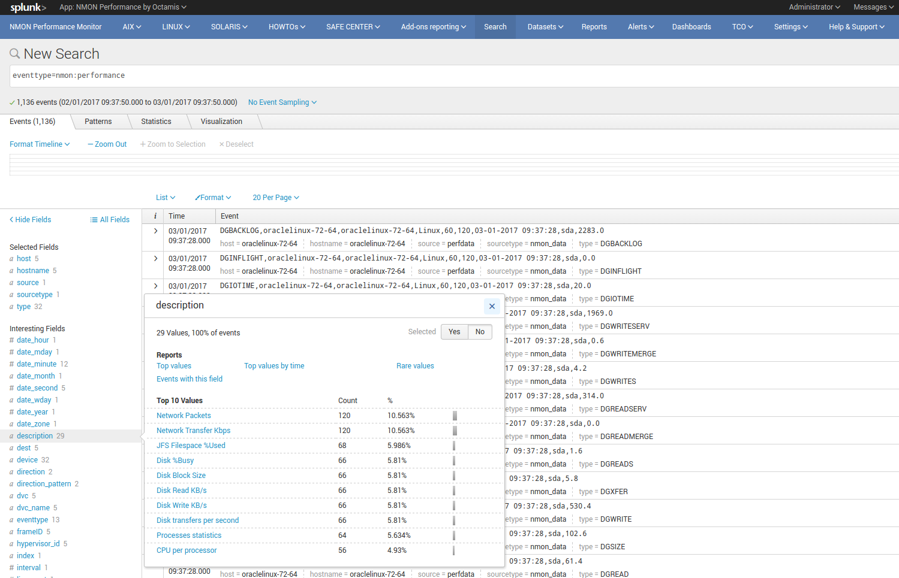

-------------
nmon_baseline
-------------

**Nmon Baseline (nmon_baseline): Key system metrics from the Nmon KV Store Baseline**

The Nmon KV Store baseline is a feature that provides an advanced analysis of historical past data charted versus real time data to help detecting unexpected or unusual system resources usage.

**The key concept is quite simple:**

Every week (scheduled each Sunday starting at midnight by default), scheduled reports will generate data for different metrics and store the result in kvstore collections:

* CPU (CPU_ALL, LPAR)
* Real and Virtual Memory (MEM)
* Disks I/O per second (DISKXFER)

These reports will generate statistics per day of the week and per 5 minutes step of 3 statistics results for each metric per server: lower (perc05), Average and upper (perc95)

At the end, results are being stored in different kvstore Collections on search heads. (2016 records per server and per kvstore)

Specific macros called within the Baseline interface will retrieve current (or custom if you select your own time range) statistics for these metrics and selected host
The macro will evaluate statistics per day of the week and per minute (data is being retrieved from indexers using data model acceleration)

The lookup command being called within the macro will retrieve stored values within the KV Store for associated days of week and minute to generate the metric baseline (eg. compare Mondays over Mondays, Tuesdays over Tuesdays…)
This operation will fully occurs on search head within generating unnecessary loads for indexers

Finally, if the selected time range runs over the future (default of baseline interface starts at beginning of the day and finishes at the end of the current day), the baseline will be charted over the future in 2 available mode: Full Baseline using the predict rendering with lower, average and upper, of the Simple baseline which will only generate the Average baseline serie

**List of kvtore Collections:**

*Here are kvstore Collections and corresponding lookup table references:*

+-------------------------------+-----------------------------+----------------------------------------------------------+
| kvstore collection            |   lookup name               |     baseline generation report name                      |
+===============================+=============================+==========================================================+
| kv_nmon_baseline_CPU_ALL      |   nmon_baseline_CPU_ALL     |     Generate NMON Baseline KV Collection for CPU_ALL     |
+-------------------------------+-----------------------------+----------------------------------------------------------+
| kv_nmon_baseline_LPAR         |   nmon_baseline_LPAR        |     Generate NMON Baseline KV Collection for LPAR        |
+-------------------------------+-----------------------------+----------------------------------------------------------+
| kv_nmon_baseline_MEM	        |   nmon_baseline_MEM	      |     Generate NMON Baseline KV Collection for MEM         |
+-------------------------------+-----------------------------+----------------------------------------------------------+
| kv_nmon_baseline_DISKXFER     |   nmon_baseline_DISKXFER    |     Generate NMON Baseline KV Collection for DISKXFER    |
+-------------------------------+-----------------------------+----------------------------------------------------------+

*Note that only the LPAR kvstore and related report are specific for Power systems, if you are not using such systems, these objects can be safety deactivated.*

**Here are some examples of the baseline charting:**

.. image:: img/baseline1.png
   :alt: baseline1.png
   :align: center

.. image:: img/baseline2.png
   :alt: baseline2.png
   :align: center

--------------------
filesystem_excluding
--------------------

The lookup table "filesystem_excluding" is file lookup that will contain mount point of file systems to be excluded from file system alerting.

The alert "NMON - File System % usage exceeds 90% (5 consecutive minutes minimal duration)" will exclude any mount point listed in this lookup table from its analysis.
Note that this lookup table is case insensitive, can contain wildcards of pattern to be excluded (such as *cdrom*).

**upgrade resiliency caution:**

If you customize this lookup table, you will need to back it up before upgrading, and recover it from your backup after the update.
This feature will probably be updated and improved in future releases!

.. _manage_frameID_mapping:

-----------------------
frameID mapping KVstore
-----------------------

**nmon_frameID_mapping: logically group hostname in the frameID field**

Since the release 1.8.4 of the Nmon core application, the frameID mapping has been improved and operates now against a KVstore collection.

The KVstore based lookup table "nmon_frameID_mapping" is generated automatically by the scheduled report "Generate NMON frameID mapping lookup table". (runs at Splunk startup and every hour by default)

Using the management interface available in the "Settings" application menu, you can directly edit and update the mapping within Splunk web:

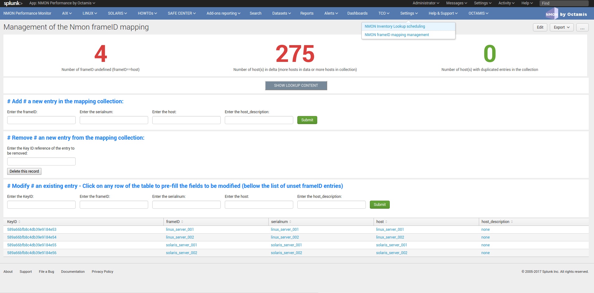

By default, the frameID value will be generated using the following rule:

* For AIX, the frameID gets its value from the host serial number (actually the PSeries serial number)
* For Linux, the frameID values is equal to the host name
* For Solaris, the frameID values is equal to the host name

Every time that runs the scheduled report, Splunk will automatically update and add the new values to the KVstore, preserving the existing content.

The frameID feature allows you to easily group the servers in logical containers, and provides an easier and improved selection for a better user experience.

**INFORMATION:**

When modifying the frameID lookup definition, this will be applied almost immediately for any operation at search time.

Interfaces using data models will as well immediately reflect changes, however you will have to rebuild the data model acceleration if you want these changes to be applied for previously indexed data.

************************
Main Configuration Files
************************

The nmon core application does not collect performance and configuration data, for these items please refer to the TA-nmon documentation:

http://ta-nmon.readthedocs.io

----------
props.conf
----------

**props.conf - nmon sourcetypes definition**

+++++++++++++++++++++++++++++++++++++
01 - Nmon Performance Data definition
+++++++++++++++++++++++++++++++++++++

**This stanza defines the nmon_data sourcetype wich contains Nmon Performance data.**

::

    [nmon_data]

    FIELD_DELIMITER=,
    FIELD_QUOTE="
    HEADER_FIELD_LINE_NUMBER=1

    # your settings
    INDEXED_EXTRACTIONS=csv
    NO_BINARY_CHECK=1
    SHOULD_LINEMERGE=false
    TIMESTAMP_FIELDS=ZZZZ
    TIME_FORMAT=%d-%m-%Y %H:%M:%S

    # set by detected source type
    KV_MODE=none
    pulldown_type=true

    # Overwritting default host field based on event data for nmon_data sourcetype (useful when managing Nmon central shares)
    TRANSFORMS-hostfield=nmon_data_hostoverride

This uses csv format defined by csv header, and time stamp definition adapted for generated data from raw nmon data file.

It is being used by associated input monitor in props.conf that consumes csv data from csv_repository.

++++++++++++++++++++++++++++++++++++++++++++++++++++
02 - Nmon Processing definition (output of nmon2csv)
++++++++++++++++++++++++++++++++++++++++++++++++++++

**This stanza sets the appropriated time format for indexing of nmon2csv converters.**

::

    [nmon_processing]

    TIME_FORMAT=%d-%m-%Y %H:%M:%S
    This sourcetype contains useful information about processing steps operated by converters, such as the list of Nmon section proceeded, the number of events per section, processing various information and more.

+++++++++++++++++++++++++++++++++++++++
03 - Nmon Configuration Data definition
+++++++++++++++++++++++++++++++++++++++

**This stanza defines the nmon_config sourcetype wich contains Nmon Configuration data.**

::

    [nmon_config]

    BREAK_ONLY_BEFORE=CONFIG,
    MAX_EVENTS=100000
    NO_BINARY_CHECK=1
    SHOULD_LINEMERGE=true
    TIME_FORMAT=%d-%b-%Y:%H:%M
    TIME_PREFIX=CONFIG,
    TRUNCATE=0

    # Overwritting default host field based on event data for nmon_data sourcetype (useful when managing Nmon central shares)
    TRANSFORMS-hostfield=nmon_config_hostoverride

Events stored within this sourcetype are large multi line events containing items available in AAA and BBB* sections of Nmon.

---------------
transforms.conf
---------------

**Notable configuration used in default transforms.conf:**

::

    ###########################################
    #			nmon data stanza
    ###########################################

    # Host override based on event data form nmon_data sourcetype

    [nmon_data_hostoverride]
    DEST_KEY = MetaData:Host
    REGEX = ^\"{0,1}[a-zA-Z0-9\_]+\"{0,1},\"{0,1}[a-zA-Z0-9\-\_\.]+\"{0,1},\"{0,1}([a-zA-Z0-9\-\_\.]+)\"{0,1},.+
    FORMAT = host::$1

    # New with 1.2.55, allows the perf data generation in json mode
    # rewrite the sourcetype to regular nmon_data

    [nmon_data_json_hostoverride]
    DEST_KEY = MetaData:Host
    REGEX = \"hostname\":\s\"([a-zA-Z0-9\-\_\.]+)\"
    FORMAT = host::$1

    [nmon_data_json_sourcetypeoverride]
    DEST_KEY = MetaData:Sourcetype
    REGEX = .*
    FORMAT = sourcetype::nmon_data

    # the following stanza will create **indexed time** fields, to be used when choosing the json search time extraction only
    # creating fields at indexing time is usually not recommended and not necessary
    # however, we want to be able to use the tstats command over some basic fields including Splunk meta but as well the basic fields in Nmon context: OStype, type

    [nmon_data_json_createindexed_OStype]
    REGEX = \"OStype\":\s\"(?<OStype>[^\"]*)\"
    WRITE_META = true
    FORMAT = OStype::$1
    DEFAULT_VALUE = NULL

    [nmon_data_json_createindexed_type]
    REGEX = \"type\":\s\"(?<type>[^\"]*)\"
    WRITE_META = true
    FORMAT = type::$1
    DEFAULT_VALUE = NULL

    ###########################################
    #			nmon config stanza
    ###########################################

    # Host override based on event data form nmon_config sourcetype

    [nmon_config_hostoverride]
    DEST_KEY = MetaData:Host
    REGEX = CONFIG\,[a-zA-Z0-9\-\:\.]+\,([a-zA-Z0-9\-\_\.]+)\,[a-zA-Z0-9\-\_\.]+
    FORMAT = host::$1

The reason for this is simple, when managing Nmon data that has been generated out of Splunk (so not by a Universal Forwarder or full Splunk instance runnning the Application), the "host" field which is a default Splunk field will have the value of the host that managed the data, and not the value of the real host that generated the Nmon data.

This will happens for example when using the Application in a central NFS repository scenario deployment.

Using the configuration above, Splunk will always and automatically rewrite the default host field based on the Nmon data, and not only on Splunk information

*********
Configure
*********

**Various configurations and advanced administration tasks**

---------------------------------------------------------------------------
01 - Manage Nmon Collection (generating Performance and Configuration data)
---------------------------------------------------------------------------

**Configuration, tips and advanced configuration about Nmon Raw data generation**

++++++++++++++++++++++++++++++
Edit AIX Nmon starting options
++++++++++++++++++++++++++++++

For AIX, you can manage the full list of Nmon options and control them from a central place using a "local/nmon.conf" configuration file.

Please refer to: http://ta-nmon.readthedocs.io/en/latest/nmon_config.html

**To manage AIX Nmon options (but the activation of NFS collection), you will:**

* Change the value of mode in your "local/nmon.conf" accorded to your needs
* Update your deployment servers
* The new package version will be pushed to clients, and next iteration of Nmon binaries will start using these values

+++++++++++++++++++++++++++++++++++++++++++++++++++++++++++
Activate the Performance Data collection for NFS Statistics
+++++++++++++++++++++++++++++++++++++++++++++++++++++++++++

The configuration by default will not collect NFS statistics for AIX / Linux (NFS statistics is currently not available on Solaris), its activation can be controlled through a "local/nmon.conf":

Please refer to: http://ta-nmon.readthedocs.io/en/latest/nmon_config.html

**To activate NFS collection, you will:**

* Change the value of mode in your "local/nmon.conf" accorded to your needs
* Update your deployment servers

The new package version will be pushed to clients, and next iteration of Nmon binaries will start using these values

++++++++++++++++++++++++++++++++++++++++++++++++++++++++++++++++++++++
Manage Nmon parallel run between Nmon collections to prevent data gaps
++++++++++++++++++++++++++++++++++++++++++++++++++++++++++++++++++++++

The nmon_helper.sh script will automatically manage a temporarily parallel run of 2 Nmon instances to prevent data gaps between collections.

Please refer to: http://ta-nmon.readthedocs.io/en/latest/nmon_config.html

**Things works the following way:**

* Each time the nmon_helper.sh runs, the age in seconds of the current instance is evaluated
* It also evaluates the expected time to live in seconds of an Nmon instance based on parameters (interval * snapshot)
* A margin in seconds is applied to the time to live value
* If the age of the current instance gets higher than the time to live less the margin, a new Nmon instance will be launched
* On next iteration of nmon_helper.sh script, only the new Nmon instance will be watched and the time to live counter gets reset
* During the parallel run, both instances will run and generate Nmon raw data, nmon2csv converters will prevent any duplicated events and only new data will be indexed
* During the parallel run, more data will be temporarily indexed
* When the time to live of the old Nmon instance reaches its end, the instance will terminate and the parallel run will be finished

**In default configuration, the parallel run uses a 4 minutes time margin (240 seconds) defined in default/nmon.conf, this value can be overwritten using a local/nmon.conf**

If you have gaps in data due to Nmon collections, then you may need to increase the endtime_margin value, on very big systems Nmon may require more time to start the data collection and the 4 minutes parallel run may not be enough.

To solve this, you can create a local/nmon.conf to include your custom endtime_margin and deploy the update.

Note that this feature can also be totally disabled by setting the endtime_margin to a "0" value.

The nmon_collect sourcetype will contains information about the parallel run, age in seconds of the Nmon current instance and time to live less the endtime margin.

.. _manage_volume_per_server:

+++++++++++++++++++++++++++++++++++++++++++++++++++++++++++++++
Manage the Volume of data generated by the Nmon Data collection
+++++++++++++++++++++++++++++++++++++++++++++++++++++++++++++++

Each Universal Forwarder running the TA-nmon add-on generates a volume of data which will vary depending on Nmon options sent at binary startup.
These settings can be totally managed from a central place using a "local/nmon.conf" configuration file.

Please refer to: http://ta-nmon.readthedocs.io/en/latest/nmon_config.html

**To manage the volume of data to be generated, you will:**

* Choose a different value for the "interval" variable (time between measures)
* Adapt the value for the "snapshot" variable (number of measures to be performed)

Since the branch 1.3.x of the TA-nmon, the recommended life cycle of nmon processes (computation of interval and snapshot) is 24 hours.

+++++++++++++++++++++++++++++++++++++++++++++++++++++++++++++++++++++++++++
Prioritization of embedded nmon binaries OR locally available nmon binaries
+++++++++++++++++++++++++++++++++++++++++++++++++++++++++++++++++++++++++++

**Using nmon.conf configuration file, you can decide to give priority to embedded binaries OR locally available binaries, you should consider giving the priority to embedded binaries versus binaries available on hosts, this feature offers several advantages:**

* Automatically use best Nmon binaries compiled for your systems and your architecture
* Manage from a central place binaries versions, updating results in updating only the TA-nmon add-on and pushing it to Deployment Servers

Since release 1.6.07, default configuration sets the priority to embedded binaries:

**To enforce the embedded binaries priority:**

* Create a "local/nmon.conf"
* Copy the parameter section "Linux_embedded_nmon_priority" from "default/nmon.conf" to your newly created "local/nmon.conf"

*Priority to embedded binaries (default):*

::

    Linux_embedded_nmon_priority="0"

*Priority to local binaries:*

::

    Linux_embedded_nmon_priority="1"

Update your deployment server and let the package be pushed to your clients

New iteration of Nmon will now use embedded binaries, to get information about the binary in use look in nmon_collect

+++++++++++++++++++++++++++++++++++++++++++++++++++++++++++++
Linux OS: Number of devices taken in charge at nmon boot time
+++++++++++++++++++++++++++++++++++++++++++++++++++++++++++++

**The maximum number of devices taken in charge by nmon at boot time can be controlled using the "nmon.conf" configuration file.**

By default 1500 devices maximum will be taken in charge, up to 3000 devices can be managed by the Application (current hard limit in nmon2csv.py/nmon2csv.pl), configure your "local/nmon.conf" file:

Please refer to: http://ta-nmon.readthedocs.io/en/latest/nmon_config.html

Take note that increasing the number of devices also increases processing and storage costs, but if you have more than 1500 devices and don't set this to a suitable value, Disks analysis would not be complete

* Set this value in your "local/nmon.conf"
* Update your Deloyment Servers
* Let your client have the new package pushed

On next iteration, the Nmon binary will start using the new option

+++++++++++++++++++++++++++++++++++++++++++++++++++++++++++++++++
Activate the Performance Data collection for Solaris VxVM Volumes
+++++++++++++++++++++++++++++++++++++++++++++++++++++++++++++++++

**The configuration by default will not collect Solaris VxVM, its activation can be controlled through a "local/nmon.conf":**

Please refer to: http://ta-nmon.readthedocs.io/en/latest/nmon_config.html

*default/nmon.conf related settings:*

::

    # CHange to "1" to activate VxVM volumes IO statistics
    Solaris_VxVM="0"

**To activate NFS collection, you will:**

* Change the value of mode in your "local/nmon.conf" accorded to your needs
* Update your deployment servers

The new package version will be pushed to clients, and next iteration of Nmon binaries will start using these values

--------------------------------------------------------------
02 - Manage Core Application: Mapping, Extraction, Restitution
--------------------------------------------------------------

**Manage the Core Application**

.. _custom_span:

++++++++++++++++++++++++++++
Custom Span definition macro
++++++++++++++++++++++++++++

NMON Performance Monitor uses an advanced search (eg. macro) to dynamically define the more accurate interval time definition possible within charts.

Splunk has a charting limit of 1000 points per series, an adapted span value (time interval) has to be defined if we want charts to be more accurate than Splunk automatically affects

This is why this custom macro is being defined based on analysing Time ranges supplied by users, see:

::

    $SPLUNK_HOME/etc/apps/nmon/default/macros.conf

Since the major release V1.7, the span management macro were renamed from "inline_customspan" to "nmon_span" for easier usage

**If you have a different minimal time interval than 60 seconds between 2 measures at the lower level, you can customize these macro to adapt them to your data. (as for an example if you generate NMON data with an other process than Splunk)**

*NOTE: This custom configuration has to be done on search heads only*

* Create an empty "local/macros.conf" configuration file
* Copy the full stanza of the macro "nmon_span" from "default/macros.conf" to "local/macros.conf", the original macros contains the following:

::

    [nmon_span]
    definition = [ search index="nmon" sourcetype="nmon_data" | head 1 | addinfo\
    | eval earliest=if(info_min_time == "0.000", info_search_time,info_min_time)\
    | eval latest=if(info_max_time == "+Infinity", info_search_time,info_max_time)\
    | eval searchStartTIme=strftime(earliest,"%a %d %B %Y %H:%M")\
    | eval searchEndTime=strftime(latest,"%a %d %B %Y %H:%M")\
    | eval Difference = (latest - earliest)\
    | eval span=case(\
    info_min_time == "0.000", "2m",\
    Difference > (3000*24*60*60),"4d",\
    Difference > (2000*24*60*60),"3d",\
    Difference > (1000*24*60*60),"2d",\
    Difference > (500*24*60*60),"1d",\
    Difference > (333*24*60*60),"12h",\
    Difference > (166*24*60*60),"8h",\
    Difference > (83*24*60*60),"4h",\
    Difference > (41*24*60*60),"2h",\
    Difference > (916*60*60),"1h",\
    Difference > (833*60*60),"55m",\
    Difference > (750*60*60),"50m",\
    Difference > (666*60*60),"45m",\
    Difference > (583*60*60),"40m",\
    Difference > (500*60*60),"35m",\
    Difference > (416*60*60),"30m",\
    Difference > (333*60*60),"25m",\
    Difference > (250*60*60),"20m",\
    Difference > (166*60*60),"15m",\
    Difference > (83*60*60),"10m",\
    Difference > (66*60*60),"5m",\
    Difference > (50*60*60),"4m",\
    Difference > (33*60*60),"3m",\
    Difference > (16*60*60),"2m",\
    Difference > (8*60*60),"1m",\
    Difference <= (8*60*60),"1m"\
    )\
    | eval spanrestricted=case(\
    info_min_time == "0.000", 2*60,\
    Difference > (916*60*60),60*60,\
    Difference > (833*60*60),55*60,\
    Difference > (750*60*60),50*60,\
    Difference > (666*60*60),45*60,\
    Difference > (583*60*60),40*60,\
    Difference > (500*60*60),35*60,\
    Difference > (416*60*60),30*60,\
    Difference > (333*60*60),25*60,\
    Difference > (250*60*60),20*60,\
    Difference > (166*60*60),15*60,\
    Difference > (83*60*60),10*60,\
    Difference > (66*60*60),5*60,\
    Difference > (50*60*60),4*60,\
    Difference > (33*60*60),180,\
    Difference > (16*60*60),120,\
    Difference > (8*60*60),60,\
    Difference <= (8*60*60),60\
    )\
    | eval span=case(spanrestricted < interval, interval, spanrestricted >= interval, span, isnull(interval), span)\
    | eval span=if(spanrestricted <= 60, "1m", span)\
    | return span ]
    iseval = 0

**They key is modifying that part of the macro code:**

::

    | eval span=if(spanrestricted <= 60, "1m", span)\

By default, if the value of spanrestricted is lower or equal to 60 seconds, a span value of 1 minute will be set

For example, if you want the span value to be never less than 4 minutes (the evaluation will still consider every value), you will set:

::

    | eval span=if(spanrestricted <= 240, "4m", span)\

**Which will give the full following code:**

::

    [nmon_span]
    definition = [ search index="nmon" sourcetype="nmon_data" | head 1 | addinfo\
    | eval earliest=if(info_min_time == "0.000", info_search_time,info_min_time)\
    | eval latest=if(info_max_time == "+Infinity", info_search_time,info_max_time)\
    | eval searchStartTIme=strftime(earliest,"%a %d %B %Y %H:%M")\
    | eval searchEndTime=strftime(latest,"%a %d %B %Y %H:%M")\
    | eval Difference = (latest - earliest)\
    | eval span=case(\
    info_min_time == "0.000", "2m",\
    Difference > (3000*24*60*60),"4d",\
    Difference > (2000*24*60*60),"3d",\
    Difference > (1000*24*60*60),"2d",\
    Difference > (500*24*60*60),"1d",\
    Difference > (333*24*60*60),"12h",\
    Difference > (166*24*60*60),"8h",\
    Difference > (83*24*60*60),"4h",\
    Difference > (41*24*60*60),"2h",\
    Difference > (916*60*60),"1h",\
    Difference > (833*60*60),"55m",\
    Difference > (750*60*60),"50m",\
    Difference > (666*60*60),"45m",\
    Difference > (583*60*60),"40m",\
    Difference > (500*60*60),"35m",\
    Difference > (416*60*60),"30m",\
    Difference > (333*60*60),"25m",\
    Difference > (250*60*60),"20m",\
    Difference > (166*60*60),"15m",\
    Difference > (83*60*60),"10m",\
    Difference > (66*60*60),"5m",\
    Difference > (50*60*60),"4m",\
    Difference > (33*60*60),"3m",\
    Difference > (16*60*60),"2m",\
    Difference > (8*60*60),"1m",\
    Difference <= (8*60*60),"1m"\
    )\
    | eval spanrestricted=case(\
    info_min_time == "0.000", 2*60,\
    Difference > (916*60*60),60*60,\
    Difference > (833*60*60),55*60,\
    Difference > (750*60*60),50*60,\
    Difference > (666*60*60),45*60,\
    Difference > (583*60*60),40*60,\
    Difference > (500*60*60),35*60,\
    Difference > (416*60*60),30*60,\
    Difference > (333*60*60),25*60,\
    Difference > (250*60*60),20*60,\
    Difference > (166*60*60),15*60,\
    Difference > (83*60*60),10*60,\
    Difference > (66*60*60),5*60,\
    Difference > (50*60*60),4*60,\
    Difference > (33*60*60),180,\
    Difference > (16*60*60),120,\
    Difference > (8*60*60),60,\
    Difference <= (8*60*60),60\
    )\
    | eval span=case(spanrestricted < interval, interval, spanrestricted >= interval, span, isnull(interval), span)\
    | eval span=if(spanrestricted <= 240, "4m", span)\
    | return span ]
    iseval = 0

Save the file, and update your search heads. (in sh cluster apply the bunde, in standalone restart)

+++++++++++++++++++++++++++++++++++++++++++++++++++
FRAME ID: Mapping hostnames with a Frame Identifier
+++++++++++++++++++++++++++++++++++++++++++++++++++

**In large deployment scenarios, mapping hostnames with their Frame Identifier can be very useful to help Analysis, or simply finding the required host.**

Before the version 1.8.4, the frameID feature was operated against an optional file based lookup table.

This is has been deprecated and it is now operated against a KVstore collection.

As well, an embedded interface is provided to edit and update the frameID mapping directly within Splunk web.

* See the detailed section: :ref:`manage_frameID_mapping`

**The old fashion file based feature configuration above is left for history purposes:**

Since Version 1.5.0, a Frame ID feature is included within interfaces, in default configuration the frame ID is mapped to the Serial Number of the host.

In AIX OS, the Serial Number is associated the PSeries Serial Number (in Pseries environments), in Linux / Solaris, this is equal to the hostname.

**You can customize the Frame Identifier using any external lookup table which will contains one field for the frameIDs, and one field containing hostnames.***

*To achieve this, please follow the configuration above:*

**1. Configure your table lookup in transforms.conf**

*Create a local/transforms.conf and set your lookup table:*

::

    [myframeidtable]
    filename = my_frameid_lookup.csv

**Example 1: Map Pseries with hostnames using the serial number field**

::

    PSERIES_NAME,serialnum
    PSERIESfoo,xxxxxxxxxxx
    PSERIESbar,xxxxxxxxxxx

**Example 2: Map frameID with hostnames (using the hostname field)**

::

    FRAME_NAME,hostname
    frame1,hostname1
    frame1,hostname2
    frame2,hostname3
    frame3,hostname4

**2. Map your hostnames with the frameID in props.conf**

*Create a local/props.conf and map your hosts within the nmon_data stanza:*

**Example 1: (Pseries with serial number field)**

::

    [nmon_data]
    LOOKUP-myframeidtable = myframeidtable serialnum AS serialnum OUTPUT PSERIES AS frameID

**Example 2: (frameID with hostnames)**

::

    [nmon_data]
    LOOKUP-myframeidtable = myframeidtable hostname OUTPUT FRAME_NAME AS frameID

NOTE: Use "OUTPUT" to generate the frameID field, don't use OUTPUTNEW which wont't overwrite the default frameID field

**3. Restart Splunk to apply settings**

**4. Rebuild Acceleration for Datamodel**

For each accelerated Data model, please rebuild the acceleration to update the frameID field. (Go in Pivot, manage datamodels, develop each data model and rebuild)

---------------------------------
03 - Manage Application Packaging
---------------------------------

**Manage Application Packaging**

.. _create_agent_py:

++++++++++++++++++++++++++++++++++++++++++++
create_agent.py: Create multiple TA packages
++++++++++++++++++++++++++++++++++++++++++++

**You may be interested in having different versions of the TA-nmon with the goal to manage different configurations, and target for example specific operating systems or versions with specific configurations.**

A Python script utility is provided to allow creating on demand custom TA-nmon packages ready to be deployed, the Python tool allows to:

* Create a new TA-nmon package with the name of your choice
* Customize the target index name if required (eg. for example if you use the customization tool to change the default index name
* Choose between Python Data Processing, or Perl Data Processing

This Python tool is available in the "resources" directory of the Nmon Core Application (as gzip file, uncompress the script before launching)

**Notice for updating the application: using this tool is upgrade resilient, you can create your package and repeat this operation for future release update**

**The tool requires Python 2.7.x or superior to operate, you can check your version with the following command:**

::

    python --version

::

    python create_agent.py

    create_agent.py

    This utility had been designed to allow creating customized agents for the Nmon Splunk Application, please follow these instructions:

    - Download the current release of Nmon App in Splunk Base: https://apps.splunk.com/app/1753
    - Uncompress the create_agent.py.gz script available in resources directory of the Application
    - Place the downloaded tgz Archive and this Python tool a temporary directory of your choice
    - Run the tool: ./create_agent.py and check for available options
    - After the execution, a new agent package will have been created in the resources directory
    - Extract its content to your Splunk deployment server, configure the server class, associated clients and deploy the agent
    - Don't forget to set the application to restart splunkd after deployment
    ./create_agent.py -h
    usage: create_agent.py [-h] [-f INFILE] [--indexname INDEX_NAME]
                           [--agentname TA_NMON] [--agentmode AGENTMODE]
                           [--version]

    optional arguments:
      -h, --help            show this help message and exit
      -f INFILE             Name of the Nmon Splunk APP tgz Archive file
      --indexname INDEX_NAME
                            Customize the Application Index Name (default: nmon)
      --agentname TA_NMON   Define the TA Agent name and root directory
      --agentmode AGENTMODE
                            Define the Data Processing mode, valid values are:
                            python,perl / Default value is python
      --version             show program's version number and exit

**Example of utilization: Create a custom TA package called "TA-nmon-perl" that will use "myindex" as the App index, and Perl as the Data processing language**

::

    python create_agent.py -f nmon-performance-monitor-for-unix-and-linux-systems_1514.tgz --agentname TA-nmon-perl --agentmode perl --indexname myindex

    Extracting tgz Archive: nmon-performance-monitor-for-unix-and-linux-systems_1514.tgz
    INFO: Extracting Agent tgz resources Archives
    INFO: Renaming TA-nmon default agent to TA-nmon-perl
    Achieving files transformation...
    Done.
    INFO: Customizing any reference to index name in files
    INFO: ************* Tar creation done of: TA-nmon-perl.tar.gz *************

    *** Agent Creation terminated: To install the agent: ***

     - Upload the tgz Archive TA-nmon-perl.tar.gz to your Splunk deployment server
     - Extract the content of the TA package in $SPLUNK_HOME/etc/deployment-apps/
     - Configure the Application (set splunkd to restart), server class and associated clients to push the new package to your clients

    Operation terminated.

.. _Nmon_SplunkApp_Customize_py:

++++++++++++++++++++++++++++++++++++++++++++++++++++++
Nmon_SplunkApp_Customize.py: Customize the Application
++++++++++++++++++++++++++++++++++++++++++++++++++++++

**If for some reason you need to customize the Nmon Splunk Application, A Python command line tool is provided in the resources directory which will help you easily achieving your customizations.**

The Python tool allows to:

* Customize the Application Index Name (deprecated since 1.8.4, prefer using the nmon pattern, see notes bellow)
* Customize the Application Root Directory (default: nmon)
* Customize the TA NMON Root Directory (default: TA-nmon)
* Customize the PA NMON Root Directory (default: PA-nmon)
* Customize the local CSV Repository (default:csv_repository)
* Customize the local Config Repository (default:config_repository)
* Focus on Linux OS only by hidding other systems specific views and setting a Linux navigation menu

Using this tool over releases, you can easily manage your customizations and update the Application as usual.

**Since the release 1.8.4, the application is compatible with any indexes starting with the pattern "nmon" (one or x indexes)**

As such, it is not required anymore to customize the application is you intend to use one or more custom indexes, as long as the indexes names start by "nmon".

This Python tool is available in the "resources" directory of the Nmon Core Application (as gzip file, uncompress the script before launching)

**Notice for updating the application: using this tool is upgrade resilient, you can create your package and repeat this operation for future release update**

**The tool requires Python 2.7.x or superior to operate, you can check your version with the following command:**

::

    python --version

**Launching the tool with no option:**

::

    python Nmon_SplunkApp_Customize.py

    If for some reason you need to customize the Nmon Splunk Application, please follow these instructions:

    - Download the current release of Nmon App in Splunk Base: https://apps.splunk.com/app/1753
    - Uncompress the Nmon_SplunkApp_Customize.py.gz
    - Place the downloaded tgz Archive and this Python tool in the directory of your choice
    - Run the tool: ./customize_indexname.py and check for available options

    After the execution, the Application (including TA-nmon and PA-nmon in resources) will have been customized and are ready to be used

**Getting help with available options:**

::

    python Nmon_SplunkApp_Customize.py --help

    usage: Nmon_SplunkApp_Customize.py [-h] [-f INFILE] [-i INDEX_NAME]
                                       [-r ROOT_DIR] [-a TA_NMON] [-p PA_NMON]
                                       [--csvrepo CSV_REPOSITORY]
                                       [--configrepo CONFIG_REPOSITORY]
                                       [--linux_only] [--version] [--debug]

    optional arguments:
      -h, --help            show this help message and exit
      -f INFILE             Name of the Nmon Splunk APP tgz Archive file
      -i INDEX_NAME         Customize the Application Index Name (default: nmon)
      -r ROOT_DIR           Customize the Application Root Directory (default:
                            nmon)
      -a TA_NMON            Customize the TA NMON Root Directory (default: TA-
                            nmon)
      -p PA_NMON            Customize the PA NMON Root Directory (default: PA-
                            nmon)
      --csvrepo CSV_REPOSITORY
                            Customize the local CSV Repository (default:
                            csv_repository)
      --configrepo CONFIG_REPOSITORY
                            Customize the local Config Repository (default:
                            config_repository)
      --linux_only          Deactivate objects for other operating systems than
                            Linux (AIX / Solaris), use thisoption if you only use
                            Linux and don't want non Linux related objects to be
                            visible.
      --version             show program's version number and exit
      --debug

Generic example of utilization
""""""""""""""""""""""""""""""

*Replace "nmon-performance-monitor-for-unix-and-linux-systems_xxx.tgz" with the exact name of the tgz archive*

::

    python Nmon_SplunkApp_Customize.py -f nmon-performance-monitor-for-unix-and-linux-systems_xxx.tgz -i my_custom_index -r my_custom_app -a my_custom_ta -p my_custom_pa --csvrepo my_custom_csvrepo --configrepo my_custom_configrepo
    Extracting tgz Archive: nmon-performance-monitor-for-unix-and-linux-systems_175.tgz
    Extracting tgz Archive: PA-nmon_1244.tgz
    Extracting tgz Archive: TA-nmon_1244.tgz
    Extracting tgz Archive: TA-nmon_selfmode_1244.tgz
    INFO: Changing the App Root Directory from default "nmon" to custom "my_custom_app"
    Achieving files transformation:
    INFO: Customizing any reference to default root directory in files
    Achieving files transformation:
    INFO: Customizing any reference to index name in files
    INFO: Customizing indexes.conf
    INFO: Customizing csv_repository to my_custom_csvrepo
    INFO: Customizing config_repository to my_custom_configrepo
    INFO: Removing tgz resources Archives
    INFO: Customizing the TA-nmon Root directory from the default TA-nmon to my_custom_ta
    INFO: ************* Tar creation done of: my_custom_ta_custom.tgz *************
    INFO: Removing tgz resources Archives
    INFO: Customizing the PA-nmon Root directory from the default PA-nmon to my_custom_pa
    INFO: ************* Tar creation done of: my_custom_pa_custom.tgz *************
    INFO: Creating the custom nmon_performance_monitor_custom.spl archive in current root directory
    INFO: ************* Tar creation done of: nmon_performance_monitor_custom.spl *************

    *** To install your customized packages: ***

     - Extract the content of nmon_performance_monitor_custom.spl to Splunk Apps directory of your search heads (or use the manager to install the App)
     - Extract the content of the PA package available in resources directory to your indexers
     - Extract the content of the TA package available in resources directory to your deployment server or clients

    Operation terminated.

Linux OS example: build an app for Linux OS support only
""""""""""""""""""""""""""""""""""""""""""""""""""""""""

::

    python Nmon_SplunkApp_Customize.py -f nmon-performance-monitor-for-unix-and-linux-systems_xxx.tgz --linux_only

    INFO: No custom index name were provided, using default "nmon" name for index
    INFO: No custom root directory of the nmon App core App were provided, using default "nmon" name for root directory
    INFO: No custom root directory of the TA-nmon were provided, using default "TA-nmon" name for TA-nmon root directory
    INFO: No custom root directory of the PA-nmon were provided, using default "PA-nmon" name for PA-nmon root directory
    INFO: No custom csv reposity directory were provided, using default "csv_repository" name for csv repository root directory
    INFO: No custom csv reposity directory were provided, using default "config_repository" name for csv repository root directory
    Extracting tgz Archive: nmon-performance-monitor-for-unix-and-linux-systems_175.tgz
    Extracting tgz Archive: PA-nmon_1244.tgz
    Extracting tgz Archive: TA-nmon_1244.tgz
    Extracting tgz Archive: TA-nmon_selfmode_1244.tgz
    INFO: Operating systems support, AIX operating system related objects have been deactivated
    INFO: Operating systems support, Solaris operating system related objects have been deactivated
    INFO: Linux only management, activate Linux only navigation
    INFO: Creating the custom nmon_performance_monitor_custom.spl archive in current root directory
    INFO: ************* Tar creation done of: nmon_performance_monitor_custom.spl *************

    *** To install your customized packages: ***

     - Extract the content of nmon_performance_monitor_custom.spl to Splunk Apps directory of your search heads (or use the manager to install the App)
     - Extract the content of the PA package available in resources directory to your indexers
     - Extract the content of the TA package available in resources directory to your deployment server or clients

    Operation terminated.

-----------------------------------------
04 - Scenarios of advanced customizations
-----------------------------------------

**Advanced Customization**

.. _split_by_datacenter:

++++++++++++++++++++++++++++++++++++++++++++++++++++
01 - Splitting index for different users populations
++++++++++++++++++++++++++++++++++++++++++++++++++++

**Vagrant testing:**

Easily test this deployment scenario with Vagrant and Ansible !

See: https://github.com/guilhemmarchand/splunk-vagrant-ansible-collections

*The goal:*

The goal of this scenario is to ingest nmon data coming from different data centers that will be managed by different Unix administrator teams.
As such, each user of those teams will be able to see and analyse only the data of the servers under their management.

For the demonstration purpose, we will assume:

* **Data center 1: datacenter_US**

    * **index name:** nmon_perf_unix_datacenter_US
    * **Technical addon name:** TA-nmon-datacenter-US
    * **role name for Unix admin users:** team-unix-admin-us

* **Data center 2: datacenter_UK**

    * **index name:** nmon_perf_unix_datacenter_UK
    * **Technical addon name:** TA-nmon-datacenter-UK
    * **role name for Unix admin users:** team-unix-admin-uk

**STEP 1: Prepare your indexers**

For the demonstration purpose, we assume having a single standalone indexer receiving data from both data centers, with the following indexes.conf:

::

    [nmon_perf_unix_datacenter_UK]
    coldPath = $SPLUNK_DB/nmon_perf_unix_datacenter_UK/colddb
    homePath = $SPLUNK_DB/nmon_perf_unix_datacenter_UK/db
    thawedPath = $SPLUNK_DB/nmon_perf_unix_datacenter_UK/thaweddb

    [nmon_perf_unix_datacenter_US]
    coldPath = $SPLUNK_DB/nmon_perf_unix_datacenter_US/colddb
    homePath = $SPLUNK_DB/nmon_perf_unix_datacenter_US/db
    thawedPath = $SPLUNK_DB/nmon_perf_unix_datacenter_US/thaweddb

**STEP 2: Prepare the TA-nmon packages**

We will want to have 2 different versions of the TA-nmon, one for each data center.

For the example purpose, I will assume you upload the tgz archive to /tmp

::

    mkdir $HOME/nmon_workingdir
    cd $HOME/nmon_workingdir
    tar -xvzf nmon-performance-monitor-for-unix-and-linux-systems_<VERSION>.tgz -C $HOME/nmon_workingdir
    cp nmon/resources/create_agent.py.gz .
    gunzip -v create_agent.py.gz

*Create the packages:*

::

    python create_agent.py --indexname nmon_perf_unix_datacenter_US --agentname TA-nmon-datacenter-US -f /tmp/nmon-performance-monitor-for-unix-and-linux-systems_<VERSION>.tgz
    python create_agent.py --indexname nmon_perf_unix_datacenter_UK --agentname TA-nmon-datacenter-UK -f /tmp/nmon-performance-monitor-for-unix-and-linux-systems_<VERSION>.tgz

*This will generate 2 TA-nmon packages to be deployed to each group of data center servers:*

::

    TA-nmon-datacenter-UK.tgz
    TA-nmon-datacenter-US.tgz

**STEP 3: Deploy the TA-nmon packages**

*Configure your deployment servers to deploy the packages to your servers:*

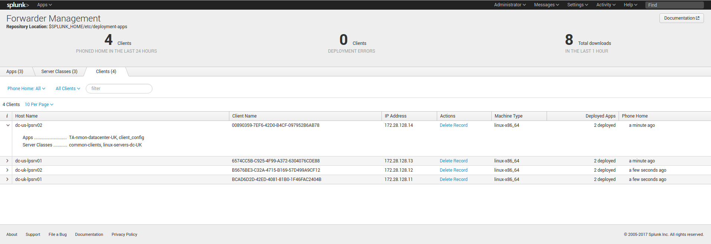

**STEP 4: On the search heads, configure the roles and users**

We will create 2 roles, each role inherits from the default user role and provides access to the relevant indexes.

Because by default the user role provides access to any indexes, you will want as well to restrict it:

*local authorized.conf content:*

::

    [role_team-unix-admin-us]
    importRoles = user
    srchIndexesAllowed = nmon_perf_unix_datacenter_US
    srchIndexesDefault = nmon_perf_unix_datacenter_US

    [role_team-unix-admin-uk]
    importRoles = user
    srchIndexesAllowed = nmon_perf_unix_datacenter_UK
    srchIndexesDefault = nmon_perf_unix_datacenter_UK

    # Restrict standard user role to main index only
    [role_user]
    srchIndexesAllowed = main

Finally, have your users belonging to the relevant roles, for the demonstration purpose:

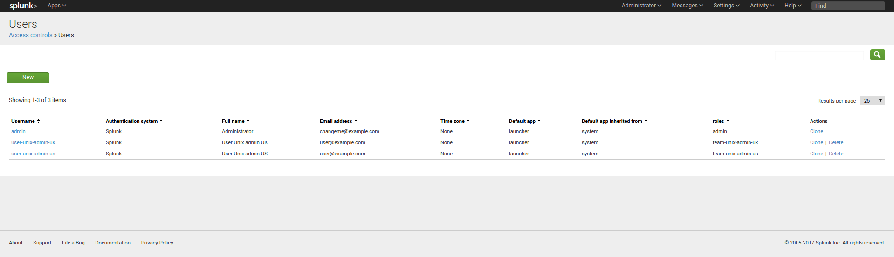

**FINAL: Splunk is ready**

A user belonging to the role "team-unix-admin-us" will only see and access to data from the US data center:

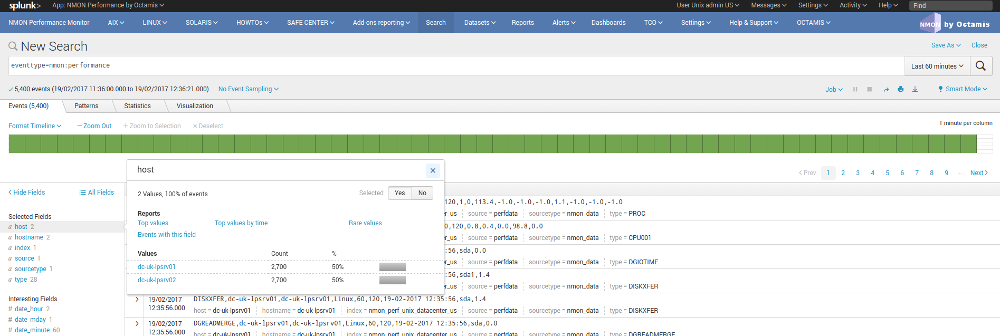

And a user belonging to the role "team-unix-admin-uk" will have access to servers from the UK data center only:

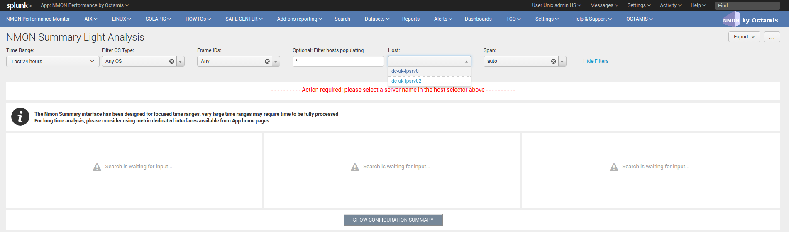

************
Troubleshoot
************

.. _trouble_guide:

--------------------------------------
01 - Troubleshooting guide from A to Z
--------------------------------------

**Troubleshooting guide for Nmon Performance Monitor**

So you've got trouble ? This guide will help in troubleshooting every piece of the Nmon Perf Application from the very beginning!

Note that this guide is oriented in distributed deployment scenario, such that it focuses on issues you may encounter between Splunk and end servers

+++++++++++++++++++++++++++++++++++++++
STEP 1: Checking Splunk internal events
+++++++++++++++++++++++++++++++++++++++

**Checking Splunk internal events from your remote host (Universal or Heavy Forwarders) to Splunk**

**In case of trouble with remote hosts , you should always start by verifying that you successfully receive Splunk internal events from them, this is a simple verification that validates:**

* That your remote hosts are able to send data to your indexers
* That your basic deployment items (such as outputs.conf) are correctly configured

**When a remote host running Splunk (Universal or Heavy forwarder) is connected to a Splunk infrastructure, it will always send its internal events into various internal indexes:**

* _internal
* _audit
* _introspection

**Between other log files, the main log you should care about is the "splunkd.log", you will find it in the "_internal" index, this is the data i strongly recommend to check**

**Ensure you successfully receive Splunk internal data:**

*INFORMATION: In default configuration, internal indexes cannot be accessed by standard users (unless Splunk admin gives the access rights), this step requires admin access or access authorization to internal indexes*

.. image:: img/trouble1.png
   :alt: trouble1.png
   :align: center

**Optionally focus on splunkd sourcetype and host(s) you are verifying:**

.. image:: img/trouble2.png
   :alt: trouble2.png
   :align: center

—> If you successfully found incoming events for your host(s), swith to step 2

—> If you can't find incoming events for your host(s), common root causes can be:

* Network connection failure between you host(s) and indexers (or intermediate collecters): Verify with a simple telnet connection test that you can access to destination IP and port(s)
* Bad information in outputs.conf (check IP / Port, syntax)
* No outputs.conf deployed to Universal or Heavy Forwarder

In such a case, connect directly to the host and verify messages in /opt/splunkforwarder/var/log/splunkd.log

++++++++++++++++++++++++++++++++++++
STEP 2: Verify the TA-nmon behaviors
++++++++++++++++++++++++++++++++++++

This section refers to the TA-nmon trouble shooting guide: http://ta-nmon.readthedocs.io/en/latest/troubleshoot.html

Expected running processes
""""""""""""""""""""""""""

Since the 1.3.x branch, you should find various processes running:

* 1 x nmon process (or 2 x nmon processes during the parallel interval)
* 1 x main Perl or Python fifo_reader process (or 2 x processes during the parallel interval)
* 1 x subshell fifo_reader process (or 2 x processes during the parallel interval)

*On a Linux box:*

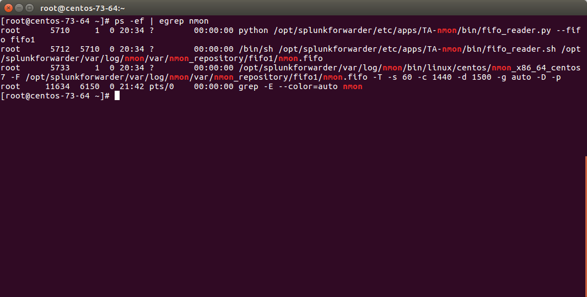

*On AIX, the nmon process will be called "topas-nmon"*

*On Solaris, the sarmon process will be called "sadc"*

Starting processes
""""""""""""""""""

If you run in trouble and want to troubleshoot the situation, the easiest approach is stopping Splunk, kill existing nmon process and run the tasks manually:

* Stop Splunk and kill the nmon process::

    ./splunk stop

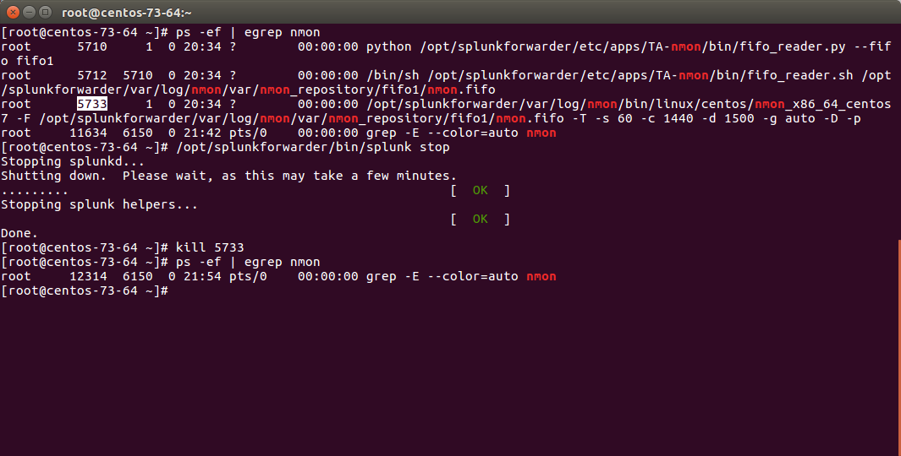

You will observe that killing the nmon process will automatically terminate the fifo_reader.pl|.py and the subshell fifo_reader.sh.
This the expected behavior, and mandatory.

If the processes do not stop, then your problem became mine and please open an issue !

* Now we can manually starting the processes, example::

    /opt/splunkforwarder/bin/splunk cmd /opt/splunkforwarder/etc/apps/TA-nmon/bin/nmon_helper.sh

*Please adapt the paths to your context*

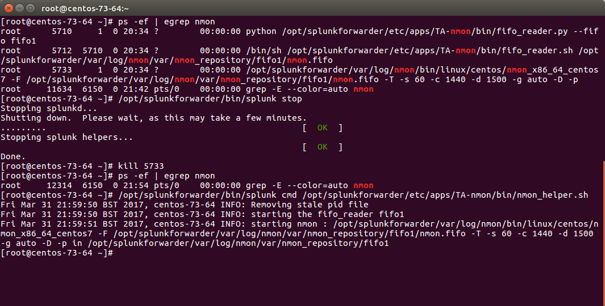

**Let's summarize what happened here:**

* nmon_helper.sh starts the fifo reader, if there is no fifo_reader running, the "fifo1" process will be started
* the fifo_reader.pl|.py starts a fifo_reader.sh process in the background
* nmon_helper.sh starts the nmon process which will write its data to the relevant fifo file
* the nmon process cannot start if the fifo_reader has not started

If something unexpected happens and that the fifo_reader and nmon process do not start normally, you may want to trouble shoot the nmon_helper.sh script.

You can do very easily by commenting out "# set -x", re-run the script and analyse the output. (you might need to add the set-x within the functions as well)

Checking fifo_reader processes
""""""""""""""""""""""""""""""

The fifo_reader processes will continuously read the fifo file writen by the nmon process, and generate various dat files that represent the different typologies of nmon data:

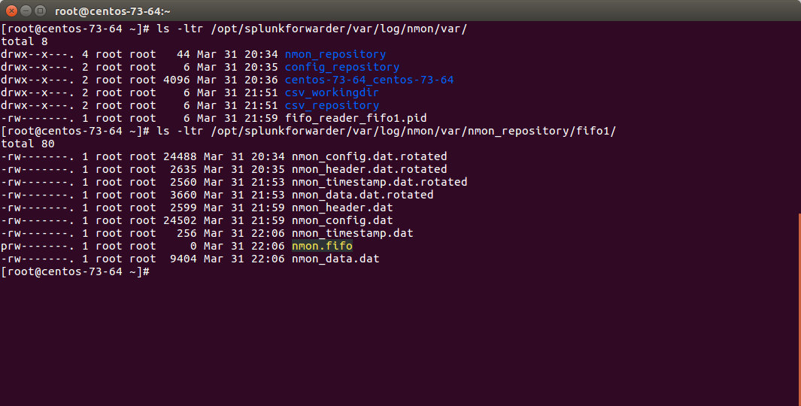

**How this it work?**

* The fifo_reader.sh reads every new line of data writen to the fifo file (named pipe) and sends the data to the fifo_reader.pl|.py
* The fifo_reader.pl|.py parses the lines and applies various regular expressions to decide where to write the data, depending on its content
* If there were existing *.dat files at the startup of the fifo_reader processes, those dat files are rotated and renamed to "*.rotated"
* The nmon.fifo is not regular file but a named pipe (observe the "prw-------"), its size will always be equal to 0

Checking the data parsing
"""""""""""""""""""""""""

**The parsing of those dat files is being achieved in 2 main steps:**

* The "bin/fifo_consumer.sh" script is started every 60 seconds by Splunk
* This script will check if an nmon_data.dat file exists and that its size is greater than 0
* If the size of the nmon_dat.data file equals to 0, then the fifo_consumer.sh has nothing to do and will exit this fifo file
* If the size is greater than 0 but its modification time (mtime) is less than 5 seconds, the script will loop until the condition is true
* The fifo_consumer.sh reads the dat file, recompose the nmon file and stream its content to the "bin/nmon2csh.sh" shell wrapper
* After this operation, the nmon_data.dat file will be empty for the next cycle
* The shell wrapper reads in stdin the data, and send it to the nmon2csv parser (bin/nmon2csv.pl|.py)
* The parser reads the nmon data, parses it and produces the final files to be indexed by Splunk

Easy no ;-)

You can easily run the fifo_consumer.sh manually::

    /opt/splunkforwarder/bin/splunk cmd /opt/splunkforwarder/etc/apps/TA-nmon/bin/fifo_consumer.sh

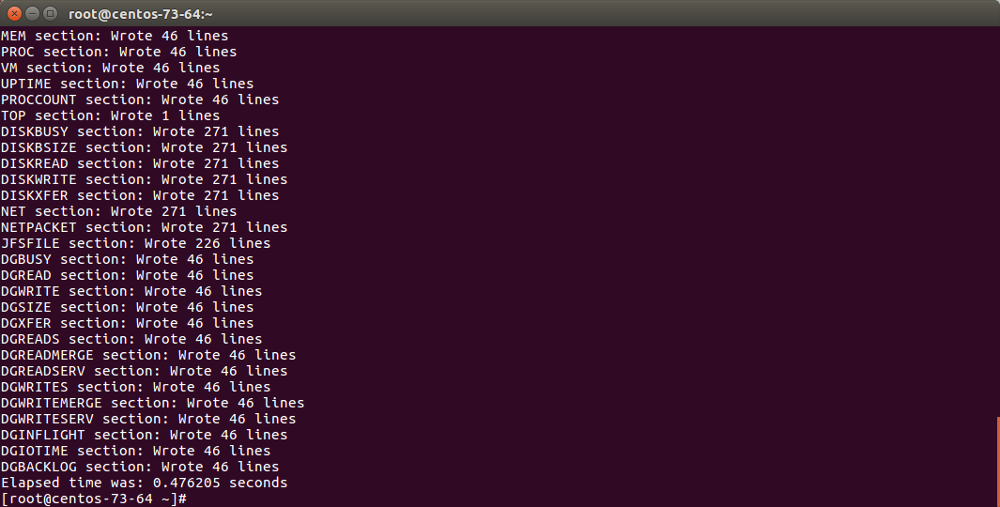

The files to be indexed by Splunk can be found in::

    $SPLUNK_HOME/var/log/nmon/var/csv_repository
    $SPLUNK_HOME/var/log/nmon/var/config_repository
    $SPLUNK_HOME/var/log/nmon/var/json_repository

Example:

.. image:: img/TA-nmon/troubleshoot6.png
   :alt: troubleshoot6.png
   :align: center

Checking Splunk indexing
""""""""""""""""""""""""

Splunk monitors those directories in "batch" mode, which means index and delete.

**Once you will have restarted Splunk, all the files will be consumed and disappear in a few seconds:**

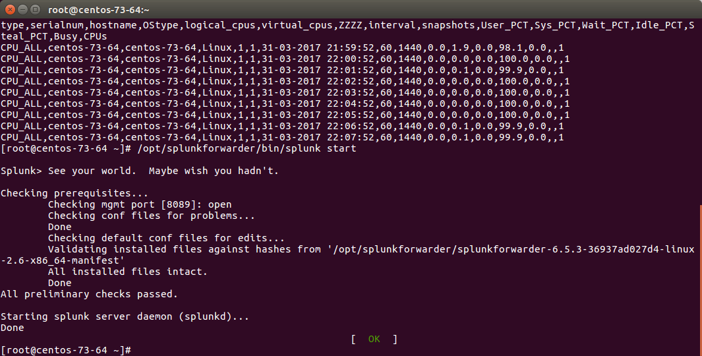

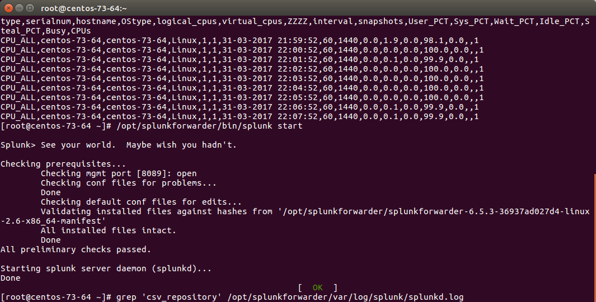

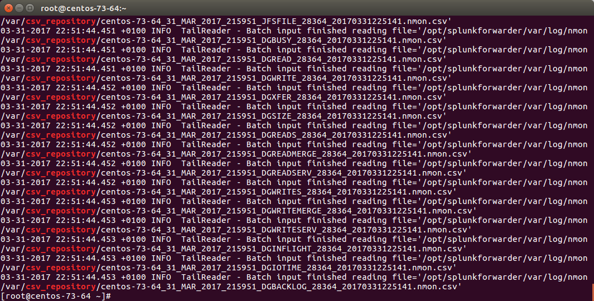

++++++++++++++++++++++++++++++++++++++++++
STEP 3: Nmon processing indexing in Splunk
++++++++++++++++++++++++++++++++++++++++++

**The activity of the TA-nmon "bin/nmon_helper.sh" is logged in Splunk: (startup of fifo_reader and nmon processes)**

::

    eventtype=nmon:collect

**The activity of the TA-nmon "bin/fifo_consumer.sh" and nmon2csv parsers is logged in Splunk:**

::

    eventtype=nmon:processing

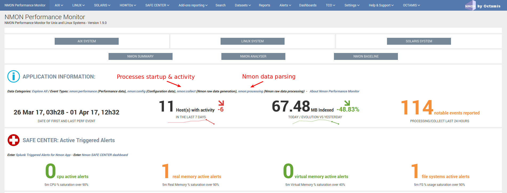

++++++++++++++++++++++++++++++++++++++++++++++++++++++
STEP 4: Verify Nmon Performance and Configuration data
++++++++++++++++++++++++++++++++++++++++++++++++++++++

**Next step of troubleshooting resides in verifying Performance data and Configuration data in Splunk:**

*Access to Performance raw events:*

.. image:: img/trouble13.png
   :alt: trouble13.png
   :align: center

**Access to Configuration raw events:**

.. image:: img/trouble14.png
   :alt: trouble14.png
   :align: center

**Example of host returning Performance events:**

.. image:: img/trouble15.png
   :alt: trouble15.png
   :align: center

**Example of host returning Configuration events:**

.. image:: img/trouble16.png
   :alt: trouble16.png
   :align: center

**INFORMATION:**

You will notice the existence of "host" and "hostname" fields, they are totally equivalent, "host" field is a default Splunk field (Metadata) and "hostname" is directly extracted from Nmon data for Performance and Configuration.
The "host" default field is overridden during indexing time to match Nmon data, this allows between other managing history nmon data transparently.

**If you are fine with the step, you will have validated that incoming Performance and Configuration events are correctly indexed by Splunk**

*Since the release V1.6.15, the OStype is generated directly in the raw data, before it was associated with the nmon_inventory lookup table. It is not necessary anymore to verify the lookup table as it cannot be anymore a root cause of error for data identification*

-------------------------------
02 - Debugging nmon2csv parsers
-------------------------------

**nmon2csv Python / Perl converters operations can be debugged by manually running the conversion process:**

If Splunk is running, stop Splunk:

::

    $ /opt/splunkforwarder/bin/splunk stop

Have an nmon file ready to test, if you don't have some to get the current copy in $SPLUNK_HOME/etc/apps/nmon/var/nmon_resposity when the Application is running

**Use the shell wrapper to let him decide which converter will be used:**

::

    $ cat my_file.nmon | /opt/splunkforwarder/etc/apps/TA-nmon/bin/nmon2csv.sh

**For Python version:**

::

    $ cat my_file.nmon | /opt/splunkforwarder/etc/apps/TA-nmon/bin/nmon2csv.py

**For Perl version:**

::

    $ cat my_file.nmon | /opt/splunkforwarder/etc/apps/TA-nmon/bin/nmon2csv.pl

The converter will output its processing steps and generate various csv files in csv_repository and config_repository

Note that you can achieve the same operation in the proper normal Splunk directory, but if you do so, you need to stop Splunk before as it would immediately index and delete csv files

*Additional Options*

**Some options can be used for testing purposes:**

::

    -debug

This option will show various debugging information like removal of events when running in real time mode.

::

    -mode [ colddata | realtime ]

This option will force the converter to use the colddata mode (the file is entirely proceeded without trying any operation to identify already proceeded data) or real time mode.

real mode is much more complex because we need to identify already proceeded events over each iteration of processing steps.

The real time option should be used when the purpose is simulating the same operation that would do Splunk managing live Nmon data

------------------------
03 - Troubleshooting FAQ
------------------------

**Problem: I have deployed the TA-nmon add-on to my hosts and i do not seem to receive data**

*Cause:*

root causes can be multiple:

* Universal Forwarder (or full instance) not sending data at all
* Nmon binary does not start
* Nmon raw data converter failure
* input scripts not activated
* Universal Forwarder not compatible (see requirements)
* Clients sending data directly to indexers lacking the PA-nmon add-on

**Resolution:**

Please read and execute the trouble shooting guide procedure: :any:`trouble_guide`

**Problem: Linux hosts are not identified as Linux Operating Systems**

*Cause:*

Linux configuration can be split at indexing time, this requires indexing time parsing operation that will fail if the the PA-nmon is not installed in indexers (or if the TA-nmon is not installed on intermediate Heavy Forwarders acting as Collectors in front of your indexers)

*Resolution:*

* Install the PA-nmon add-on on indexers (as it is required in installation manual) or the TA-nmon add-on if your are using Heavy Forwarders as collectors in front of your indexers
* Update the nmon_inventory lookup by running the generation report (see here)

**Problem: I have set frameID Mapping (see here) but past indexed data still have the original frameID value**

*Cause:*

Data Acceleration will keep the previously known values for frameID as long as they won't be rebuilt

*Resolution:*

Enter the data model manager: pivot > Manage
For each data model, click on Rebuild
