=========
Userguide
=========

************
Key concepts
************

The Nmon Performance application implements the nmon/sarmon binaries to generates rich and accurate performance data for your AIX, Linux and Solaris systems.

**Keys concepts of the app can be summarize as the following:**

* The nmon core application is deployed to the Splunk search head level
* The TA-nmon package available in the resources directory of the core app is deployed to *nix clients running the Splunk Universal Forwarder or full Splunk instance
* On search head / standalone instances, the core app can generate the nmon data without having to deploy the TA-nmon
* When the nmon_helper input script starts, it attempts find the best suitable binary for your system or can fallback to locally nmon binary available
* Once the nmon binary process has been started, the data collection begins until the current process ends. (each nmon process has a time to live)
* Every time the nmon data gets updated, Splunk read the nmon files and calls the nmon2csv parsers, the data gets structured and indexed in Splunk
* Performance metrics once indexed are immediately available in Splunk for analysis
* Every time a new nmon process is started, new configuration data will be generated and indexed in Splunk
* The nmon_inventory data (stored in the nmon_inventory lookup table) is generated every hour using efficient data model, it is being used to enrich the performance data and provide inventory interfaces

***********************
Data Types (sourcetype)
***********************

--------------------
sourcetype=nmon_data
--------------------

The "**nmon_data**" sourcetype available in the **eventtype=nmon:performance** contains all the data related to performance metrics of your systems.

In the nmon:performance data, the "key" is the **type** field.

This field contains the monitor identifier that matches a category of metrics, such as "type=CPU_ALL". (global CPU usage in percentage)

----------------------
sourcetype=nmon_config
----------------------

The "**nmon_config**" sourcetype available in the **eventtype=nmon:config** contains all the data related to the configuration of your systems.

These are the AAA and BBB* sections of nmon raw data, generated during the nmon binary startup.
The events are long multi-lines events stored per host, in default configuration these data will be extracted almost every 2 hours as the data will not change unless a new nmon process gets launched.

The nmon:config data is associated with the generation of the nmon_inventory lookup and the Nmon_Config data model.

-----------------------
sourcetype=nmon_collect
-----------------------

The "**nmon_collect**" sourcetype available in the **eventtype=nmon:collect** contains all the data related to the nmon processes generation on your systems.

These are the ouput of the input script "nmon_helper.sh" thats gets automatically launched by Splunk when deploying the Nmon App.
By default, the nmon_helper.sh script gets started every minute, its main job is to verify the status of the current nmon process, and start a new one if conditions requires it.

Many nmon starting options can be controlled through the "nmon.conf" configuration file during the deployment of the App.

--------------------------
sourcetype=nmon_processing
--------------------------

The "**nmon_processing**" sourceytpe available in the **eventtype=nmon:collect** contains all the data related to the nmon processing steps that converts nmon data into usable data for Splunk.

These are the ouput of nmon2csv Python and Perl parsers provided within the App.
Every time an existing raw nmon file is updated, or a new one gets created, Splunk will call parsers scripts and generate appropriated data.

---------------------
sourcetype=nmon_clean
---------------------

The "**nmon_clean**" sourceytpe available in the **eventtype=nmon:clean** contains all the data related to various cleaning steps operated by nmon_cleaner scripts.

These scripts are responsible in cleaning raw nmon data file periodically, and also cleaning csv raw data in case of an unexpected Splunk failure to prevent from filling the file system with unconsumed csv data.

********************
Lookups and KV Store
********************

.. _nmon_inventory:

--------------
nmon_inventory
--------------

**Nmon Inventory (nmon_inventory): Inventory Extraction of NMON data**

The Nmon Inventory data is an important piece of the Application, it is being used to provide useful inventory information about your servers with main configuration items. (CPU and memory configuration, uptime...)

*Since the major release V1.7, the nmon inventory data is stored in a KVstore collection*

The nmon_inventory data is build over the nmon_config sourcetype which contains the extraction of AAA and BBB* sections of Nmon:

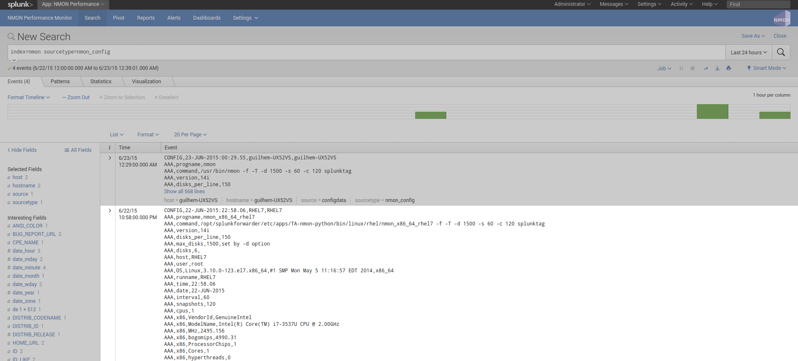

To build with efficiency the nmon_inventory data, the Application uses the accelerated data model "NMON Config - Inventory Items extracted from Nmon raw data" and intensive regular expressions:

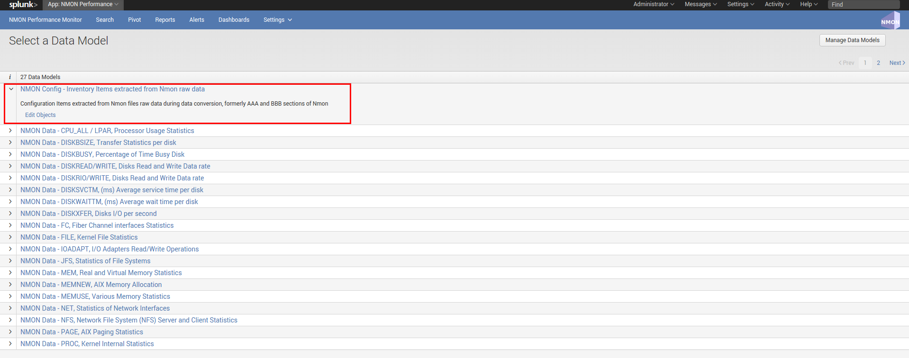

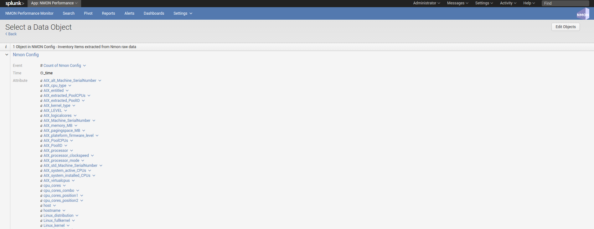

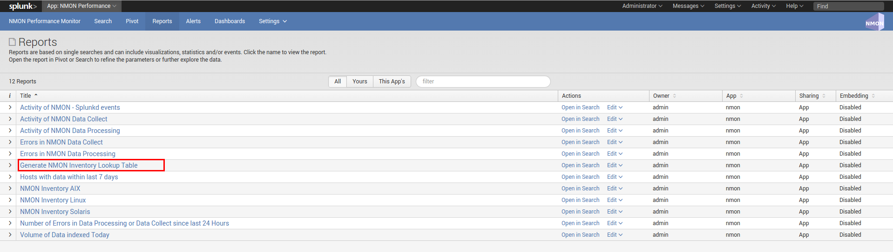

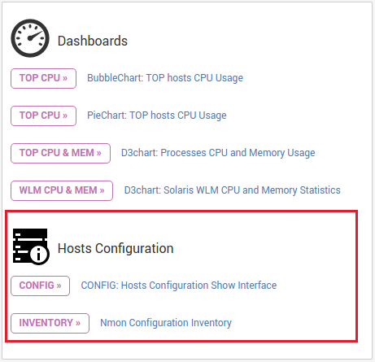

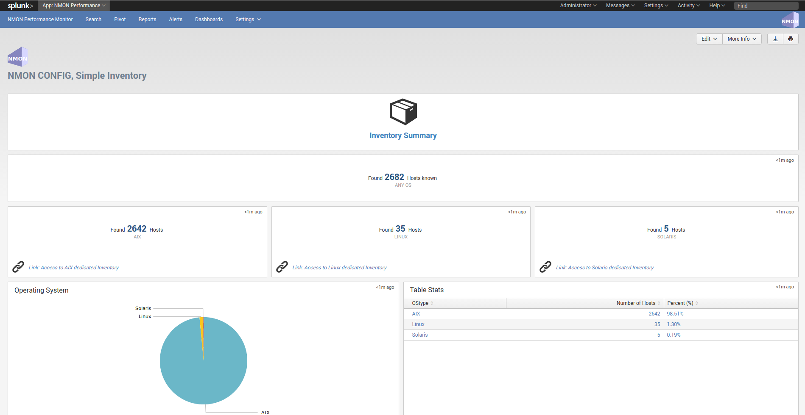

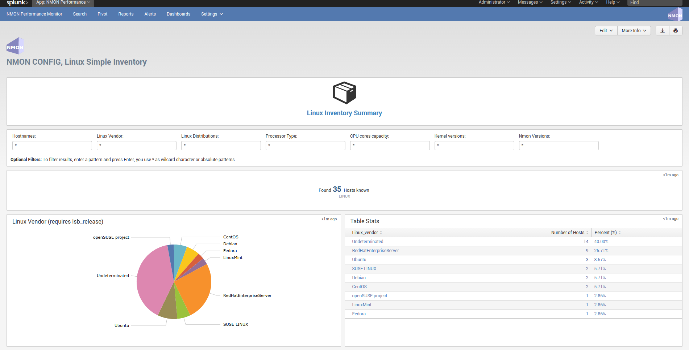

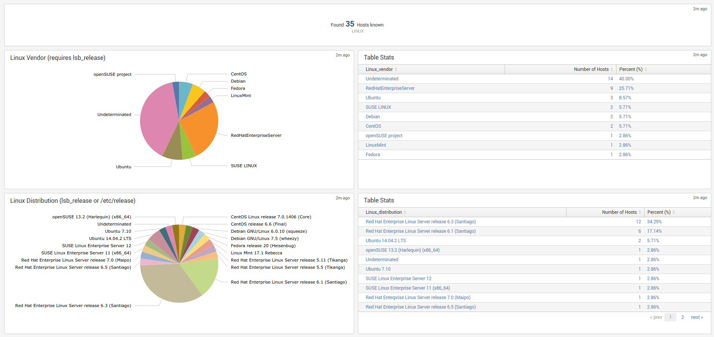

---------------
data_dictionary
---------------

**data-dictionary lookup : Dictionary of Nmon Application data**

The "data-dictionary" lookup is a csv file provided by the Application, it contains the definition of every piece of data available within the Application.

It is being used in the "Data Dictionary" interface to provide a extensible view of metrics and data available in the context of the application, with a hierarchy by type of operating system:

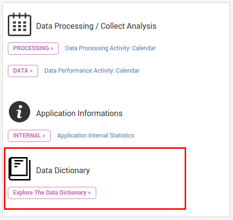

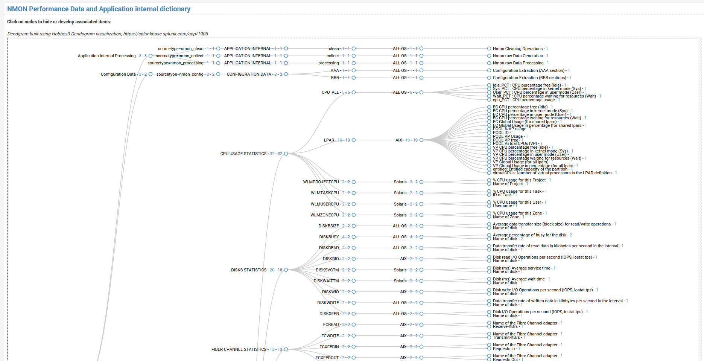

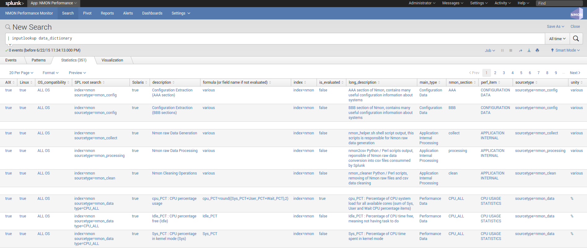

-------------
nmon_baseline
-------------

**Nmon Baseline (nmon_baseline): Key system metrics from the Nmon KV Store Baseline**

The Nmon KV Store baseline is a feature that provides an advanced analysis of historical past data charted versus real time data to help detecting unexpected or unusual system resources usage.

**The key concept is quite simple:**

Every week (scheduled each Sunday starting at midnight by default), scheduled reports will generate data for different metrics and store the result in kvstore collections:

* CPU (CPU_ALL, LPAR)
* Real and Virtual Memory (MEM)
* Disks I/O per second (DISKXFER)

These reports will generate statistics per day of the week and per 5 minutes step of 3 statistics results for each metric per server: lower (perc05), Average and upper (perc95)

At the end, results are being stored in different kvstore Collections on search heads. (2016 records per server and per kvstore)

Specific macros called within the Baseline interface will retrieve current (or custom if you select your own time range) statistics for these metrics and selected host
The macro will evaluate statistics per day of the week and per minute (data is being retrieved from indexers using data model acceleration)

The lookup command being called within the macro will retrieve stored values within the KV Store for associated days of week and minute to generate the metric baseline (eg. compare Mondays over Mondays, Tuesdays over Tuesdays…)
This operation will fully occurs on search head within generating unnecessary loads for indexers

Finally, if the selected time range runs over the future (default of baseline interface starts at beginning of the day and finishes at the end of the current day), the baseline will be charted over the future in 2 available mode: Full Baseline using the predict rendering with lower, average and upper, of the Simple baseline which will only generate the Average baseline serie

**List of kvtore Collections:**

*Here are kvstore Collections and corresponding lookup table references:*

+-------------------------------+-----------------------------+----------------------------------------------------------+
| kvstore collection            |   lookup name               |     baseline generation report name                      |
+===============================+=============================+==========================================================+
| kv_nmon_baseline_CPU_ALL      |   nmon_baseline_CPU_ALL     |     Generate NMON Baseline KV Collection for CPU_ALL     |
+-------------------------------+-----------------------------+----------------------------------------------------------+
| kv_nmon_baseline_LPAR         |   nmon_baseline_LPAR        |     Generate NMON Baseline KV Collection for LPAR        |
+-------------------------------+-----------------------------+----------------------------------------------------------+
| kv_nmon_baseline_MEM	        |   nmon_baseline_MEM	      |     Generate NMON Baseline KV Collection for MEM         |
+-------------------------------+-----------------------------+----------------------------------------------------------+
| kv_nmon_baseline_DISKXFER     |   nmon_baseline_DISKXFER    |     Generate NMON Baseline KV Collection for DISKXFER    |
+-------------------------------+-----------------------------+----------------------------------------------------------+

*Note that only the LPAR kvstore and related report are specific for Power systems, if you are not using such systems, these objects can be safety deactivated.*

**Here are some examples of the baseline charting:**

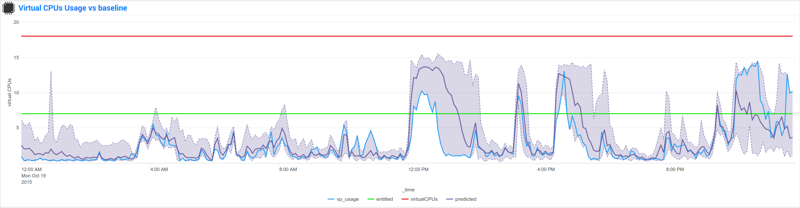

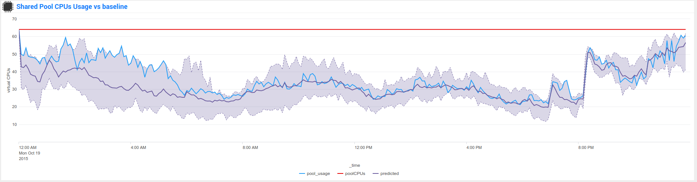

--------------------
filesystem_excluding
--------------------

The lookup table "filesystem_excluding" is file lookup that will contain mount point of file systems to be excluded from file system alerting.

The alert "NMON - File System % usage exceeds 90% (5 consecutive minutes minimal duration)" will exclude any mount point listed in this lookup table from its analysis.
Note that this lookup table is case insensitive, can contain wildcards of pattern to be excluded (such as *cdrom*).

**upgrade resiliency caution:**

If you customize this lookup table, you will need to back it up before upgrading, and recover it from your backup after the update.
This feature will probably be updated and improved in future releases!

************************
Main Configuration Files
************************

-----------
inputs.conf
-----------

Since the major release V1.7, all data generation pieces were migrated to the TA-nmon and PA-nmon add-on, these information are only valid for these add-on and the core application does not implement any input anymore

Here is the default configuration for inputs.conf file provided by the TA-nmon and PA-nmon technical add-ons.

Since the Application root directory will vary depending on the fact your running the Application on an indexer (PA-nmon) or Heavy / Universal Forwarder (TA-nmon), the normal root directory is being replace with the pattern "<root_directory>" in this configuration documentation.

See the configuration file provided within the Application to see original configuration.

Since the major release V1.7, and following Splunk requirements for certification criteria, the main working directory were migrated from $SPLUNK_HOME/var/run to $SPLUNK_HOME/var/log

+++++++++++++++++++++++++++
01 - Nmon raw data monitor:
+++++++++++++++++++++++++++

::

    [monitor://$SPLUNK_HOME/var/log/nmon/var/nmon_repository/*.nmon]

    disabled = false
    followTail = 0
    recursive = false
    index = nmon
    sourcetype = nmon_processing
    crcSalt = <SOURCE>

This input stanza configuration is responsible in managing nmon raw data files produced by nmon binaries, themselves launched by the nmon_helper.sh script.

Because a large part of the nmon raw data file won't change until a new file is being generated, the "crcSalt" option is required.

The input is associated with the "nmon_processing" configuration in props.conf.
When a new nmon file, or a current nmon file is updated, Splunk will output the content of the file to the converter script defined in props.conf.

++++++++++++++++++++++++++++++++++++++++
02 - Nmon Performance csv data indexing:
++++++++++++++++++++++++++++++++++++++++

::

    [batch://$SPLUNK_HOME/var/log/nmon/var/csv_repository/*nmon*.csv]

    disabled = false
    move_policy = sinkhole
    recursive = false
    crcSalt = <SOURCE>
    index = nmon
    sourcetype = nmon_data
    # source override: to prevent Metadata from having millions of entry, the source is overriden by default
    # You can disable this for trouble shooting purposes if required
    source = perfdata

This input monitor will index within Splunk csv data produced by nmon2csv Python or Perl converter.

Note that csv files are being indexed in "batch" mode, which means indexing and deleting files.

Under common circumstances (unless you are managing large number of nmon file for example with a NFS central nmon repositories), there shall never be any file here as they are indexed and deleted once generated.

++++++++++++++++++++++++++++++++++++++++++
03 - Nmon Configuration csv data indexing:
++++++++++++++++++++++++++++++++++++++++++

::

    [batch://$SPLUNK_HOME/var/log/nmon/var/config_repository/*nmon*.csv]

    disabled = false
    move_policy = sinkhole
    recursive = false
    crcSalt = <SOURCE>
    index = nmon
    sourcetype = nmon_config
    # source override: to prevent Metadata from having millions of entry, the source is overriden by default
    # You can disable this for trouble shooting purposes if required
    source = configdata

This input monitor will index within Splunk csv configuration data produced by nmon2csv Python or Perl converter.

This concerns the AAA and BBB* sections of nmon that contains configuration produced by the nmon binary.

Note that csv files are being indexed in "batch" mode, which means indexing and deleting files.

Nmon for Splunk will use these data to identify important information such as the type of Operating System (used to provide Operating System selector) and configuration data inventory. (see the lookup table nmon_inventory)

+++++++++++++++++++++++++++++++++
04 - nmon_helper.sh input script:
+++++++++++++++++++++++++++++++++

::

    [script://./bin/nmon_cleaner.sh --cleancsv]
    disabled = false
    index = nmon
    interval = 600
    source = nmon_cleaner
    sourcetype = nmon_clean

This input is responsible for launching nmon instances when required, it is associated with the nmon_helper.sh input script.

In default configuration, it is launched every minute, its activity is indexed within Splunk in the nmon_collect sourcetype.

---------
nmon.conf
---------

**Customizing Nmon related parameters**

Technical add-ons will allow you to configure various settings of parameters used at the nmon binary startup by using a local definition of "nmon.conf" file.

The "nmon.conf" file is located in the "default" directory of nmon / TA-nmon / PA-nmon Apps, it works in a "Splunk" fashion, to modify these settings, copy the default/non.conf to local/nmon.conf. (upgrade resilient)
This configuration file is sourced at starting time by the "nmon_helper.sh" input script which apply these settings.

**To set custom properties, create a local/nmon.conf file and set parameters:**

+++++++++++++++++++
INTERVAL & SNAPSHOT
+++++++++++++++++++

**A number of preset configurations are provided for proposal:**

::

    shortperiod_low

    interval="60"
    snapshot="10"

    shortperiod_middle

    interval="30"
    snapshot="20"

    shortperiod_high

    interval="20"
    snapshot="30"

    longperiod_low

    interval="240"
    snapshot="120"

    longperiod_middle

    interval="120"
    snapshot="120"

    longperiod_high

    interval="60"
    snapshot="120"

    The default mode is set to "longperiod_high", which is a good compromise between accuracy, CPU / licensing cost and operational intelligence, and should be relevant for very large deployment in Production environments

    # custom --> Set a custom interval and snapshot value, if unset short default values will be used (see custom_interval and custom_snapshot)

    # Default is longperiod_low
    mode="longperiod_low"
    A custom mode combining custom values for snapshot and interval can be set:

    mode="custom"

    # Refresh interval in seconds, Nmon will this value to refresh data each X seconds
    # UNUSED IF NOT SET TO custom MODE
    custom_interval="20"

    # Number of Data refresh occurrences, Nmon will refresh data X times
    # UNUSED IF NOT SET TO custom MODE
    custom_snapshot="90"
    Note that the CPU usage associated with Nmon and Splunk processing steps, the data volume to be generated and the licensing cost are a combination of these factors

++++++++++++++
NFS Statistics
++++++++++++++

**NFS options for AIX and Linux: Activate NFS statistics:**

NFS statistics generation is deactivated by default for AIX and Linux (NFS statistics are not applicable for Solaris)

To activate NFS statistics generation, you must activate this in a local/nmon.conf, as shown bellow:

::

    ### NFS OPTIONS ###

    # Change to "1" to activate NFS V2 / V3 (option -N) for AIX hosts
    AIX_NFS23="0"

    # Change to "1" to activate NFS V4 (option -NN) for AIX hosts
    AIX_NFS4="0"

    # Change to "1" to activate NFS V2 / V3 / V4 (option -N) for Linux hosts
    # Note: Some versions of Nmon introduced a bug that makes Nmon to core when activating NFS, ensure your version is not outdated
    Linux_NFS="0"

++++++++++++++++++++++++++++++++++++
End time marging (Nmon parallel run)
++++++++++++++++++++++++++++++++++++

Nmon processes generated by technical add-ons have specific time of live which is the computation of INTERVAL * SNAPSHOT.

Between two run of nmon collections, there can be several minutes required by nmon to collect configuration items before starting collecting performance metrics, moreover on very large systems.

For this reason, a parallel run of two nmon concurrent processes will occur a few minutes before the current process ends, which prevents from having gaps in charts and data.

This feature can be controlled by changing the value of the endtime_margin, and can also be totally deactivated if you like:

::

    ### VARIOUS COMMON OPTIONS ###

    # Time in seconds of margin before running a new iteration of Nmon process to prevent data gaps between 2 iterations of Nmon
    # the nmon_helper.sh script will spawn a new Nmon process when the age in seconds of the current process gets higher than this value

    # The endtime is evaluated the following way:
    # endtime=$(( ${interval} * ${snapshot} - ${endtime_margin} ))

    # When the endtime gets higher than the endtime_margin, a new Nmon process will be spawned
    # default value to 240 seconds which will start a new process 4 minutes before the current process ends

    # Setting this value to "0" will totally disable this feature

    endtime_margin="240"

+++++++++++++++++++++++++
Linux OS specific options
+++++++++++++++++++++++++

**Embedded nmon binaries versus locally available nmon binaries**

In default configuration, the "nmon_helper.sh" script will always give the priority to embedded nmon binary.

The Application has embedded binaries specifically compiled for almost every Linux OS and versions, such that you can manage from a center place nmon versions for all your Linux hosts!

The nmon_helper.sh script will proceed as above:

* Search for an embedded binary that suits processor architecture, Linux OS version (example: RHEL), that suite vendor version (example: RHEL 7) and vendor subversion (RHEL 7.1)
  Best result will be achieved using /etc/os-release file, if not available specific information file will be searched (example: /etc/issue, /etc/redhat-release, etc…)
* In the worst case (no binary found for vendor OS (example: Linux RHEL), the nmon_helper.sh search for generic binary that fits the local processor architecture
* If none of these options are possible, the script will search for nmon binary in PATH
* If this fails, the script exists in error, this information will stored in Splunk and shown in home page error counter

::

    ### LINUX OPTIONS ###

    # Change the priority applied while looking at nmon binary
    # by default, the nmon_helper.sh script will use any nmon binary found in PATH
    # Set to "1" to give the priority to embedded nmon binaries
    # Note: Since release 1.6.07, priority is given by default to embedded binaries
    Linux_embedded_nmon_priority="1"

**Unlimited capture**

Recently introduced, you can set nmon linux to run its mode of capture in unlimited mode, specially for the TOP section (processes) and block devices.

*CAUTION: This option is experimental and cause increasing volume of data to be generated*

::

    # Change the limit for processes and disks capture of nmon for Linux
    # In default configuration, nmon will capture most of the process table by capturing main consuming processes
    # You can set nmon to an unlimited number of processes to be captured, and the entire process table will be captured.
    # Note this will affect the number of disk devices captured by setting it to an unlimited number.
    # This will also increase the volume of data to be generated and may require more cpu overhead to process nmon data
    # The default configuration uses the default mode (limited capture), you can set bellow the limit number of capture to unlimited mode
    # Change to "1" to set capture of processes and disks to no limit mode
    Linux_unlimited_capture="0"

**Maximum number of disk devices**

The maximum number of disk devices to be taken in charge by nmon for Linux has to be set at starting time.

*Note that currently, nmon2csv parsers have a hard limit at 3000 devices*

::

    # Set the maximum number of devices collected by Nmon, default is set to 1500 devices
    # Increase this value if you have systems with more devices
    # Up to 3000 devices will be taken in charge by the Application (hard limit in nmon2csv.py / nmon2csv.pl)
    Linux_devices="1500"

+++++++++++++++++++++++++++
Solaris OS specific options
+++++++++++++++++++++++++++

**Using a local/nmon.conf file, you can for Solaris activate the generation of statistics for VxVM volumes:**

::

    ### SOLARIS OPTIONS ###

    # CHange to "1" to activate VxVM volumes IO statistics
    Solaris_VxVM="0"

**You can manage the activation / deactivation of UARG generation: (full commands arguments)**

::

    # UARG collection (new in Version 1.11), Change to "0" to deactivate, "1" to activate (default is activate)
    Solaris_UARG="1"

+++++++++++++++++++++++
AIX OS specific options
+++++++++++++++++++++++

**For AIX hosts, you can customize the full command line sent to nmon at launch time, at the exception of NFS options. (see previous section)**

::

    # Change this line if you add or remove common options for AIX, do not change NFS options here (see NFS options)
    # the -p option is mandatory as it is used at launch time to save instance pid
    AIX_options="-f -T -A -d -K -L -M -P -^ -p"

----------
props.conf
----------

**props.conf - nmon sourcetypes definition**

+++++++++++++++++++++++++++++++++++++++++++++++++++++++
01 - Nmon raw data source stanza to nmon2csv converters
+++++++++++++++++++++++++++++++++++++++++++++++++++++++

**These stanza are linked with the nmon_processing sourcetype wich contains the output of Nmon raw data conversion operated by nmon2csv converters.**

*TA-nmon:*

::

    [source::.../*.nmon]
    invalid_cause = archive
    unarchive_cmd = $SPLUNK_HOME/etc/apps/TA-nmon/bin/nmon2csv.sh --mode realtime
    sourcetype = nmon_processing
    NO_BINARY_CHECK = true

    [source::.../*.nmon.gz]
    invalid_cause = archive
    unarchive_cmd = gunzip | $SPLUNK_HOME/etc/apps/nmon/bin/nmon2csv.sh
    sourcetype = nmon_processing
    NO_BINARY_CHECK = true

*PA-nmon (clustered indexer):*

::

    [source::.../*.nmon]
    invalid_cause = archive
    unarchive_cmd = $SPLUNK_HOME/bin/splunk cmd $SPLUNK_HOME/etc/slave-apps/PA-nmon/bin/nmon2csv.sh --mode realtime
    sourcetype = nmon_processing
    NO_BINARY_CHECK = true

    [source::.../*.nmon.gz]
    invalid_cause = archive
    unarchive_cmd = gunzip | $SPLUNK_HOME/bin/splunk cmd $SPLUNK_HOME/etc/apps/nmon/bin/nmon2csv.sh
    sourcetype = nmon_processing
    NO_BINARY_CHECK = true

+++++++++++++++++++++++++++++++++++++
02 - Nmon Performance Data definition
+++++++++++++++++++++++++++++++++++++

**This stanza defines the nmon_data sourcetype wich contains Nmon Performance data.**

::

    [nmon_data]

    FIELD_DELIMITER=,
    FIELD_QUOTE="
    HEADER_FIELD_LINE_NUMBER=1

    # your settings
    INDEXED_EXTRACTIONS=csv
    NO_BINARY_CHECK=1
    SHOULD_LINEMERGE=false
    TIMESTAMP_FIELDS=ZZZZ
    TIME_FORMAT=%d-%m-%Y %H:%M:%S

    # set by detected source type
    KV_MODE=none
    pulldown_type=true

    # Overwritting default host field based on event data for nmon_data sourcetype (useful when managing Nmon central shares)
    TRANSFORMS-hostfield=nmon_data_hostoverride

This uses csv format defined by csv header, and time stamp definition adapted for generated data from raw nmon data file.

It is being used by associated input monitor in props.conf that consumes csv data from csv_repository.

++++++++++++++++++++++++++++++++++++++++++++++++++++
03 - Nmon Processing definition (output of nmon2csv)
++++++++++++++++++++++++++++++++++++++++++++++++++++

**This stanza sets the appropriated time format for indexing of nmon2csv converters.**

::

    [nmon_processing]

    TIME_FORMAT=%d-%m-%Y %H:%M:%S
    This sourcetype contains useful information about processing steps operated by converters, such as the list of Nmon section proceeded, the number of events per section, processing various information and more.

+++++++++++++++++++++++++++++++++++++++
04 - Nmon Configuration Data definition
+++++++++++++++++++++++++++++++++++++++

**This stanza defines the nmon_config sourcetype wich contains Nmon Configuration data.**

::

    [nmon_config]

    BREAK_ONLY_BEFORE=CONFIG,
    MAX_EVENTS=100000
    NO_BINARY_CHECK=1
    SHOULD_LINEMERGE=true
    TIME_FORMAT=%d-%b-%Y:%H:%M
    TIME_PREFIX=CONFIG,
    TRUNCATE=0

    # Overwritting default host field based on event data for nmon_data sourcetype (useful when managing Nmon central shares)
    TRANSFORMS-hostfield=nmon_config_hostoverride

Events stored within this sourcetype are large multi line events containing items available in AAA and BBB* sections of Nmon.

---------------
transforms.conf
---------------

**Notable configuration used in default transforms.conf will concern the host default field override:**

::

    ###########################################
    #            nmon data stanza                        #
    ###########################################

    # Host override based on event data form nmon_data sourcetype

    [nmon_data_hostoverride]
    DEST_KEY = MetaData:Host
    REGEX = ^[a-zA-Z0-9\_]+\,[a-zA-Z0-9\-\_\.]+\,([a-zA-Z0-9\-\_\.]+)\,.+
    FORMAT = host::$1

    ###########################################
    #            nmon config stanza                    #
    ###########################################

    # Host override based on event data form nmon_config sourcetype

    [nmon_config_hostoverride]
    DEST_KEY = MetaData:Host
    REGEX = CONFIG\,[a-zA-Z0-9\-\:\.]+\,([a-zA-Z0-9\-\_\.]+)\,[a-zA-Z0-9\-\_\.]+
    FORMAT = host::$1

The reason for this is simple, when managing Nmon data that has been generated out of Splunk (so not by a Universal Forwarder or full Splunk instance runnning the Application), the "host" field which is a default Splunk field will have the value of the host that managed the data, and not the value of the real host that generated the Nmon data.

This will happens for example when using the Application in a central NFS repository scenario deployment.

Using the configuration above, Splunk will always and automatically rewrite the default host field based on the Nmon data, and not only on Splunk information

*********
Configure
*********

**Various configurations and advanced administration tasks**

---------------------------------------------------------------------------
01 - Manage Nmon Collection (generating Performance and Configuration data)
---------------------------------------------------------------------------

**Configuration, tips and advanced configuration about Nmon Raw data generation**

++++++++++++++++++++++++++++++
Edit AIX Nmon starting options
++++++++++++++++++++++++++++++

For AIX, you can manage the full list of Nmon options and control them from a central place using a "local/nmon.conf" configuration file:

default/nmon.conf related settings:

::

    ### AIX COMMON OPTIONS ###

    # Change this line if you add or remove common options for AIX, do not change NFS options here (see NFS options)
    # the -p option is mandatory as it is used at launch time to save instance pid
    AIX_options="-f -T -A -d -K -L -M -P -^ -p"

**To manage AIX Nmon options (but the activation of NFS collection), you will:**

* Change the value of mode in your "local/nmon.conf" accorded to your needs
* Update your deployment servers
* The new package version will be pushed to clients, and next iteration of Nmon binaries will start using these values

+++++++++++++++++++++++++++++++++++++++++++++++++++++++++++
Activate the Performance Data collection for NFS Statistics
+++++++++++++++++++++++++++++++++++++++++++++++++++++++++++

The configuration by default will not collect NFS statistics for AIX / Linux (NFS statistics is currently not available on Solaris), its activation can be controlled through a "local/nmon.conf":

*default/nmon.conf related settings:*

::

    ### NFS OPTIONS ###

    # Change to "1" to activate NFS V2 / V3 (option -N) for AIX hosts
    AIX_NFS23="0"

    # Change to "1" to activate NFS V4 (option -NN) for AIX hosts
    AIX_NFS4="0"

    # Change to "1" to activate NFS V2 / V3 / V4 (option -N) for Linux hosts
    # Note: Some versions of Nmon introduced a bug that makes Nmon to core when activating NFS, ensure your version is not outdated
    Linux_NFS="0"

**To activate NFS collection, you will:**

* Change the value of mode in your "local/nmon.conf" accorded to your needs
* Update your deployment servers

The new package version will be pushed to clients, and next iteration of Nmon binaries will start using these values

++++++++++++++++++++++++++++++++++++++++++++++++++++++++++++++++++++++
Manage Nmon parallel run between Nmon collections to prevent data gaps
++++++++++++++++++++++++++++++++++++++++++++++++++++++++++++++++++++++

Since the Version 1.6.05, the nmon_helper.sh script will automatically manage a temporarily parallel run of 2 Nmon instances to prevent data gaps between collections.

**Things works the following way:**

* Each time the nmon_helper.sh runs, the age in seconds of the current instance is evaluated
* It also evaluates the expected time to live in seconds of an Nmon instance based on parameters (interval * snapshot)
* A margin in seconds is applied to the time to live value
* If the age of the current instance gets higher than the time to live less the margin, a new Nmon instance will be launched
* On next iteration of nmon_helper.sh script, only the new Nmon instance will be watched and the time to live counter gets reset
* During the parallel run, both instances will run and generate Nmon raw data, nmon2csv converters will prevent any duplicated events and only new data will be indexed
* During the parallel run, more data will be temporarily indexed
* When the time to live of the old Nmon instance reaches its end, the instance will terminate and the parallel run will be finished

**In default configuration, the parallel run uses a 4 minutes time margin (240 seconds) defined in default/nmon.conf, this value can be overwritten using a local/nmon.conf:**

::

    ### VARIOUS COMMON OPTIONS ###

    # Time in seconds of margin before running a new iteration of Nmon process to prevent data gaps between 2 iterations of Nmon
    # the nmon_helper.sh script will spawn a new Nmon process when the age in seconds of the current process gets higher than this value

    # The endtime is evaluated the following way:
    # endtime=$(( ${interval} * ${snapshot} - ${endtime_margin} ))

    # When the endtime gets higher than the endtime_margin, a new Nmon process will be spawned
    # default value to 240 seconds which will start a new process 4 minutes before the current process ends

    # Setting this value to "0" will totally disable this feature

    endtime_margin="240"

If you have gaps in data due to Nmon collections, then you may need to increase the endtime_margin value, on very big systems Nmon may require more time to start the data collection and the 4 minutes parallel run may not be enough.

To solve this, you can create a local/nmon.conf to include your custom endtime_margin and deploy the update.

Note that this feature can also be totally disabled by setting the endtime_margin to a "0" value.

The nmon_collect sourcetype will contains information about the parallel run, age in seconds of the Nmon current instance and time to live less the endtime margin.

+++++++++++++++++++++++++++++++++++++++++++++++++++++++++++++++
Manage the Volume of data generated by the Nmon Data collection
+++++++++++++++++++++++++++++++++++++++++++++++++++++++++++++++

Each Universal Forwarder running the TA-nmon add-on generates a volume of data which will vary depending on Nmon options sent at binary startup.
These settings can be totally managed from a central place using a "local/nmon.conf" configuration file.

**default/nmon.conf related settings:**

::

    ### NMON COLLECT OPTIONS ###

    # The nmon_helper.sh input script is set by default to run every 60 seconds
    # If Nmon is not running, the script will start Nmon using the configuration above

    # The default mode for Nmon data generation is set to "longperiod_low" which is the most preservative mode to limit the CPU usage due the Nmon/Splunk processing steps
    # Feel free to test available modes or custom mode to set better options that answer your needs and requirements

    # The "longperiod_high" mode is a good compromise between accuracy, CPU / licensing cost and operational intelligence, and should relevant for very large deployment in Production environments

    # Available modes for proposal bellow:

    #    shortperiod_low)
    #            interval="60"
    #            snapshot="10"

    #    shortperiod_middle)
    #            interval="30"
    #            snapshot="20"

    #    shortperiod_high)
    #            interval="20"
    #            snapshot="30"

    #    longperiod_low)
    #            interval="240"
    #            snapshot="120"

    #    longperiod_middle)
    #            interval="120"
    #            snapshot="120"

    #    longperiod_high)
    #            interval="60"
    #            snapshot="120"

    # Benchmarking of January 2015 with Version 1.5.0 shows that:

    # longperiod_middle --> CPU usage starts to notably increase after 4 hours of Nmon runtime

    # custom --> Set a custom interval and snapshot value, if unset short default values will be used (see custom_interval and custom_snapshot)

    # Default is longperiod_high
    mode="longperiod_high"

    # Refresh interval in seconds, Nmon will this value to refresh data each X seconds
    # UNUSED IF NOT SET TO custom MODE
    custom_interval="60"

    # Number of Data refresh occurrences, Nmon will refresh data X times
    # UNUSED IF NOT SET TO custom MODE
    custom_snapshot="120"

As explained above, in default configuration Nmon binaries will use an interval value of 60 secondes (time between 2 measures for each Performance metric) and a snapshot value of 120 iterations.

This will asks Nmon binary to run for 2 hours with a data granularity of 60 seconds

When Nmon binary completes its snapshot value, the process ends and a new Nmon process is launched by the nmon_helper.sh script

Increasing or decreasing the value of interval will influence the volume of data generated per end client, increasing or decreasing the value of snapshot will influence the processing CPU cost at client side

Various combination of interval / snapshot are provided for proposal

**To use a pre-configured mode, you will:**

* Change the value of mode in your "local/nmon.conf", example:

::

    mode="longperiod_low"

* Update your deployment servers
* The new package version will be pushed to clients, and next iteration of Nmon binaries will start using these values

**To use custom values for interval / snapshot, you will:**

* Set the mode to custom in your "local/nmon.conf"
* Set values for custom_interval and custom_snapshot, example:

::

    mode="custom"
    custom_interval="60"
    custom_snapshot="120"

* Update your deployment servers

The new package version will be pushed to clients, and next iteration of Nmon binaries will start using these values

+++++++++++++++++++++++++++++++++++++++++++++++++++++++++++++++++++++++++++
Prioritization of embedded nmon binaries OR locally available nmon binaries
+++++++++++++++++++++++++++++++++++++++++++++++++++++++++++++++++++++++++++

**Using nmon.conf configuration file, you can decide to give priority to embedded binaries OR locally available binaries, you should consider giving the priority to embedded binaries versus binaries available on hosts, this feature offers several advantages:**

* Automatically use best Nmon binaries compiled for your systems and your architecture
* Manage from a central place binaries versions, updating results in updating only the TA-nmon add-on and pushing it to Deployment Servers

Since release 1.6.07, default configuration sets the priority to embedded binaries:

**To enforce the embedded binaries priority:**

* Create a "local/nmon.conf"
* Copy the parameter section "Linux_embedded_nmon_priority" from "default/nmon.conf" to your newly created "local/nmon.conf"

*Priority to embedded binaries (default):*

::

    Linux_embedded_nmon_priority="0"

*Priority to local binaries:*

::

    Linux_embedded_nmon_priority="1"

Update your deployment server and let the package be pushed to your clients

New iteration of Nmon will now use embedded binaries, to get information about the binary in use look in nmon_collect

+++++++++++++++++++++++++++++++++++++++++++++++++++++++++++++
Linux OS: Number of devices taken in charge at nmon boot time
+++++++++++++++++++++++++++++++++++++++++++++++++++++++++++++

**The maximum number of devices taken in charge by nmon at boot time can be controlled using the "nmon.conf" configuration file.**

By default 1500 devices maximum will be taken in charge, up to 3000 devices can be managed by the Application (current hard limit in nmon2csv.py/nmon2csv.pl), configure your "local/nmon.conf" file:

::

    ### LINUX OPTIONS ###

    # Set the maximum number of devices collected by Nmon, default is set to 1500 devices
    # Increase this value if you have systems with more devices
    # Up to 3000 devices will be taken in charge by the Application (hard limit in nmon2csv.py / nmon2csv.pl)
    Linux_devices="1500"

Take note that increasing the number of devices also increases processing and storage costs, but if you have more than 1500 devices and don't set this to a suitable value, Disks analysis would not be complete

* Set this value in your "local/nmon.conf"
* Update your Deloyment Servers
* Let your client have the new package pushed

On next iteration, the Nmon binary will start using the new option

+++++++++++++++++++++++++++++++++++++++++++++++++++++++++++++++++
Activate the Performance Data collection for Solaris VxVM Volumes
+++++++++++++++++++++++++++++++++++++++++++++++++++++++++++++++++

**The configuration by default will not collect Solaris VxVM, its activation can be controlled through a "local/nmon.conf":**

*default/nmon.conf related settings:*

::

    # CHange to "1" to activate VxVM volumes IO statistics
    Solaris_VxVM="0"

**To activate NFS collection, you will:**

* Change the value of mode in your "local/nmon.conf" accorded to your needs
* Update your deployment servers

The new package version will be pushed to clients, and next iteration of Nmon binaries will start using these values

--------------------------------------------------------------
02 - Manage Core Application: Mapping, Extraction, Restitution
--------------------------------------------------------------

**Manage the Core Application**

.. _custom_span:

++++++++++++++++++++++++++++
Custom Span definition macro
++++++++++++++++++++++++++++

NMON Performance Monitor uses an advanced search (eg. macro) to dynamically define the more accurate interval time definition possible within charts.

Splunk has a charting limit of 1000 points per series, an adapted span value (time interval) has to be defined if we want charts to be more accurate than Splunk automatically affects

This is why this custom macro is being defined based on analysing Time ranges supplied by users, see:

::

    $SPLUNK_HOME/etc/apps/nmon/default/macros.conf

Since the major release V1.7, the span management macro were renamed from "inline_customspan" to "nmon_span" for easier usage

**If you have a different minimal time interval than 60 seconds between 2 measures at the lower level, you can customize these macro to adapt them to your data. (as for an example if you generate NMON data with an other process than Splunk)**

*NOTE: This custom configuration has to be done on search heads only*

* Create an empty "local/macros.conf" configuration file
* Copy the full stanza of the macro "nmon_span" from "default/macros.conf" to "local/macros.conf", the original macros contains the following:

::

    [nmon_span]
    definition = [ search index="nmon" sourcetype="nmon_data" | head 1 | addinfo\
    | eval earliest=if(info_min_time == "0.000", info_search_time,info_min_time)\
    | eval latest=if(info_max_time == "+Infinity", info_search_time,info_max_time)\
    | eval searchStartTIme=strftime(earliest,"%a %d %B %Y %H:%M")\
    | eval searchEndTime=strftime(latest,"%a %d %B %Y %H:%M")\
    | eval Difference = (latest - earliest)\
    | eval span=case(\
    info_min_time == "0.000", "2m",\
    Difference > (3000*24*60*60),"4d",\
    Difference > (2000*24*60*60),"3d",\
    Difference > (1000*24*60*60),"2d",\
    Difference > (500*24*60*60),"1d",\
    Difference > (333*24*60*60),"12h",\
    Difference > (166*24*60*60),"8h",\
    Difference > (83*24*60*60),"4h",\
    Difference > (41*24*60*60),"2h",\
    Difference > (916*60*60),"1h",\
    Difference > (833*60*60),"55m",\
    Difference > (750*60*60),"50m",\
    Difference > (666*60*60),"45m",\
    Difference > (583*60*60),"40m",\
    Difference > (500*60*60),"35m",\
    Difference > (416*60*60),"30m",\
    Difference > (333*60*60),"25m",\
    Difference > (250*60*60),"20m",\
    Difference > (166*60*60),"15m",\
    Difference > (83*60*60),"10m",\
    Difference > (66*60*60),"5m",\
    Difference > (50*60*60),"4m",\
    Difference > (33*60*60),"3m",\
    Difference > (16*60*60),"2m",\
    Difference > (8*60*60),"1m",\
    Difference <= (8*60*60),"1m"\
    )\
    | eval spanrestricted=case(\
    info_min_time == "0.000", 2*60,\
    Difference > (916*60*60),60*60,\
    Difference > (833*60*60),55*60,\
    Difference > (750*60*60),50*60,\
    Difference > (666*60*60),45*60,\
    Difference > (583*60*60),40*60,\
    Difference > (500*60*60),35*60,\
    Difference > (416*60*60),30*60,\
    Difference > (333*60*60),25*60,\
    Difference > (250*60*60),20*60,\
    Difference > (166*60*60),15*60,\
    Difference > (83*60*60),10*60,\
    Difference > (66*60*60),5*60,\
    Difference > (50*60*60),4*60,\
    Difference > (33*60*60),180,\
    Difference > (16*60*60),120,\
    Difference > (8*60*60),60,\
    Difference <= (8*60*60),60\
    )\
    | eval span=case(spanrestricted < interval, interval, spanrestricted >= interval, span, isnull(interval), span)\
    | eval span=if(spanrestricted <= 60, "1m", span)\
    | return span ]
    iseval = 0

**They key is modifying that part of the macro code:**

::

    | eval span=if(spanrestricted <= 60, "1m", span)\

By default, if the value of spanrestricted is lower or equal to 60 seconds, a span value of 1 minute will be set

For example, if you want the span value to be never less than 4 minutes (the evaluation will still consider every value), you will set:

::

    | eval span=if(spanrestricted <= 240, "4m", span)\

**Which will give the full following code:**

::

    [nmon_span]
    definition = [ search index="nmon" sourcetype="nmon_data" | head 1 | addinfo\
    | eval earliest=if(info_min_time == "0.000", info_search_time,info_min_time)\
    | eval latest=if(info_max_time == "+Infinity", info_search_time,info_max_time)\
    | eval searchStartTIme=strftime(earliest,"%a %d %B %Y %H:%M")\
    | eval searchEndTime=strftime(latest,"%a %d %B %Y %H:%M")\
    | eval Difference = (latest - earliest)\
    | eval span=case(\
    info_min_time == "0.000", "2m",\
    Difference > (3000*24*60*60),"4d",\
    Difference > (2000*24*60*60),"3d",\
    Difference > (1000*24*60*60),"2d",\
    Difference > (500*24*60*60),"1d",\
    Difference > (333*24*60*60),"12h",\
    Difference > (166*24*60*60),"8h",\
    Difference > (83*24*60*60),"4h",\
    Difference > (41*24*60*60),"2h",\
    Difference > (916*60*60),"1h",\
    Difference > (833*60*60),"55m",\
    Difference > (750*60*60),"50m",\
    Difference > (666*60*60),"45m",\
    Difference > (583*60*60),"40m",\
    Difference > (500*60*60),"35m",\
    Difference > (416*60*60),"30m",\
    Difference > (333*60*60),"25m",\
    Difference > (250*60*60),"20m",\
    Difference > (166*60*60),"15m",\
    Difference > (83*60*60),"10m",\
    Difference > (66*60*60),"5m",\
    Difference > (50*60*60),"4m",\
    Difference > (33*60*60),"3m",\
    Difference > (16*60*60),"2m",\
    Difference > (8*60*60),"1m",\
    Difference <= (8*60*60),"1m"\
    )\
    | eval spanrestricted=case(\
    info_min_time == "0.000", 2*60,\
    Difference > (916*60*60),60*60,\
    Difference > (833*60*60),55*60,\
    Difference > (750*60*60),50*60,\
    Difference > (666*60*60),45*60,\
    Difference > (583*60*60),40*60,\
    Difference > (500*60*60),35*60,\
    Difference > (416*60*60),30*60,\
    Difference > (333*60*60),25*60,\
    Difference > (250*60*60),20*60,\
    Difference > (166*60*60),15*60,\
    Difference > (83*60*60),10*60,\
    Difference > (66*60*60),5*60,\
    Difference > (50*60*60),4*60,\
    Difference > (33*60*60),180,\
    Difference > (16*60*60),120,\
    Difference > (8*60*60),60,\
    Difference <= (8*60*60),60\
    )\
    | eval span=case(spanrestricted < interval, interval, spanrestricted >= interval, span, isnull(interval), span)\
    | eval span=if(spanrestricted <= 240, "4m", span)\
    | return span ]
    iseval = 0

Save the file, and update your search heads. (in sh cluster apply the bunde, in standalone restart)

+++++++++++++++++++++++++++++++++++++++++++++++++++
FRAME ID: Mapping hostnames with a Frame Identifier
+++++++++++++++++++++++++++++++++++++++++++++++++++

**In large deployment scenarios, mapping hostnames with their Frame Identifier can be very useful to help Analysis, or simply finding the required host.**

Since Version 1.5.0, a Frame ID feature is included within interfaces, in default configuration the frame ID is mapped to the Serial Number of the host.

In AIX OS, the Serial Number is associated the PSeries Serial Number (in Pseries environments), in Linux / Solaris, this is equal to the hostname.

**You can customize the Frame Identifier using any external lookup table which will contains one field for the frameIDs, and one field containing hostnames.***

*To achieve this, please follow the configuration above:*

**1. Configure your table lookup in transforms.conf**

*Create a local/transforms.conf and set your lookup table:*

::

    [myframeidtable]
    filename = my_frameid_lookup.csv

**Example 1: Map Pseries with hostnames using the serial number field**

::

    PSERIES_NAME,serialnum
    PSERIESfoo,xxxxxxxxxxx
    PSERIESbar,xxxxxxxxxxx

**Example 2: Map frameID with hostnames (using the hostname field)**

::

    FRAME_NAME,hostname
    frame1,hostname1
    frame1,hostname2
    frame2,hostname3
    frame3,hostname4

**2. Map your hostnames with the frameID in props.conf**

*Create a local/props.conf and map your hosts within the nmon_data stanza:*

**Example 1: (Pseries with serial number field)**

::

    [nmon_data]
    LOOKUP-myframeidtable = myframeidtable serialnum AS serialnum OUTPUT PSERIES AS frameID

**Example 2: (frameID with hostnames)**

::

    [nmon_data]
    LOOKUP-myframeidtable = myframeidtable hostname OUTPUT FRAME_NAME AS frameID

NOTE: Use "OUTPUT" to generate the frameID field, don't use OUTPUTNEW which wont't overwrite the default frameID field

**3. Restart Splunk to apply settings**

**4. Rebuild Acceleration for Datamodel**

For each accelerated Data model, please rebuild the acceleration to update the frameID field. (Go in Pivot, manage datamodels, develop each data model and rebuild)

---------------------------------
03 - Manage Application Packaging
---------------------------------

**Manage Application Packaging**

++++++++++++++++++++++++++++++++++++++++++++
create_agent.py: Create multiple TA packages
++++++++++++++++++++++++++++++++++++++++++++

**You may be interested in having different versions of the TA-nmon with the goal to manage different configurations, and target for example specific operating systems or versions with specific configurations.**

A Python script utility is provided to allow creating on demand custom TA-nmon packages ready to be deployed, the Python tool allows to:

* Create a new TA-nmon package with the name of your choice
* Customize the target index name if required (eg. for example if you use the customization tool to change the default index name
* Choose between Python Data Processing, or Perl Data Processing

This Python tool is available in the "resources" directory of the Nmon Core Application (as gzip file, uncompress the script before launching)

::

    ./create_agent.py

    create_agent.py

    This utility had been designed to allow creating customized agents for the Nmon Splunk Application, please follow these instructions:

    - Download the current release of Nmon App in Splunk Base: https://apps.splunk.com/app/1753
    - Uncompress the create_agent.py.gz script available in resources directory of the Application
    - Place the downloaded tgz Archive and this Python tool a temporary directory of your choice
    - Run the tool: ./create_agent.py and check for available options
    - After the execution, a new agent package will have been created in the resources directory
    - Extract its content to your Splunk deployment server, configure the server class, associated clients and deploy the agent
    - Don't forget to set the application to restart splunkd after deployment
    ./create_agent.py -h
    usage: create_agent.py [-h] [-f INFILE] [--indexname INDEX_NAME]
                           [--agentname TA_NMON] [--agentmode AGENTMODE]
                           [--version]

    optional arguments:
      -h, --help            show this help message and exit
      -f INFILE             Name of the Nmon Splunk APP tgz Archive file
      --indexname INDEX_NAME
                            Customize the Application Index Name (default: nmon)
      --agentname TA_NMON   Define the TA Agent name and root directory
      --agentmode AGENTMODE
                            Define the Data Processing mode, valid values are:
                            python,perl / Default value is python
      --version             show program's version number and exit

**Example of utilization: Create a custom TA package called "TA-nmon-perl" that will use "myindex" as the App index, and Perl as the Data processing language**

::

    ./create_agent.py -f nmon-performance-monitor-for-unix-and-linux-systems_1514.tgz --agentname TA-nmon-perl --agentmode perl --indexname myindex

    Extracting tgz Archive: nmon-performance-monitor-for-unix-and-linux-systems_1514.tgz
    INFO: Extracting Agent tgz resources Archives
    INFO: Renaming TA-nmon default agent to TA-nmon-perl
    Achieving files transformation...
    Done.
    INFO: Customizing any reference to index name in files
    INFO: ************* Tar creation done of: TA-nmon-perl.tar.gz *************

    *** Agent Creation terminated: To install the agent: ***

     - Upload the tgz Archive TA-nmon-perl.tar.gz to your Splunk deployment server
     - Extract the content of the TA package in $SPLUNK_HOME/etc/deployment-apps/
     - Configure the Application (set splunkd to restart), server class and associated clients to push the new package to your clients

    Operation terminated.

+++++++++++++++++++++++++++++++++++++++++++++++++++++++
Nmon_SplunkApp_Customize.py: Customize the Application
+++++++++++++++++++++++++++++++++++++++++++++++++++++++

**If for some reason you need to customize the Nmon Splunk Application, A Python command line tool is provided in the resources directory which will help you easily achieving your customizations.**

The Python tool allows to:

* Customize the Appication Index Name (default: nmon)
* Customize the Application Root Directory (default: nmon)
* Customize the TA NMON Root Directory (default: TA-nmon)
* Customize the PA NMON Root Directory (default: PA-nmon)
* Customize the local CSV Repository (default:csv_repository)
* Customize the local Config Repository (default:config_repository)

Using this tool over releases, you can easily manage your customizations and update the Application as usual.

This Python tool is available in the "resources" directory of the Nmon Core Application (as gzip file, uncompress the script before launching)

::

    ./Nmon_SplunkApp_Customize.py

    If for some reason you need to customize the Nmon Splunk Application, please follow these instructions:

    - Download the current release of Nmon App in Splunk Base: https://apps.splunk.com/app/1753
    - Uncompress the Nmon_SplunkApp_Customize.py.gz
    - Place the downloaded tgz Archive and this Python tool in the directory of your choice
    - Run the tool: ./customize_indexname.py and check for available options

    After the execution, the Application (including TA-nmon and PA-nmon in resources) will have been customized are ready to be used
    ./Nmon_SplunkApp_Customize.py -h

    usage: Nmon_SplunkApp_Customize.py [-h] [-f INFILE] [-i INDEX_NAME]
                                       [-r ROOT_DIR] [-a TA_NMON] [-p PA_NMON]
                                       [--csvrepo CSV_REPOSITORY]
                                       [--configrepo CONFIG_REPOSITORY]
                                       [--version]

    optional arguments:
      -h, --help            show this help message and exit
      -f INFILE             Name of the Nmon Splunk APP tgz Archive file
      -i INDEX_NAME         Customize the Appication Index Name (default: nmon)
      -r ROOT_DIR           Customize the Application Root Directory (default:
                            nmon)
      -a TA_NMON            Customize the TA NMON Root Directory (default: TA-
                            nmon)
      -p PA_NMON            Customize the PA NMON Root Directory (default: PA-
                            nmon)
      --csvrepo CSV_REPOSITORY
                            Customize the local CSV Repository (default:
                            csv_repository)
      --configrepo CONFIG_REPOSITORY
                            Customize the local Config Repository (default:
                            config_repository)
      --version             show program's version number and exit

**Example of utilization:**

::

    ./Nmon_SplunkApp_Customize.py -f nmon-performance-monitor-for-unix-and-linux-systems_146.tgz -i my_custom_index -r my_custom_app -a my_custom_ta -p my_custom_pa --csvrepo my_custom_csvrepo --configrepo my_custom_configrepo
    Extracting tgz Archive: nmon-performance-monitor-for-unix-and-linux-systems_146.tgz
    INFO: Changing the App Root Directory frm default "nmon" to custom "my_custom_app"
    Achieving files transformation:
    INFO: Customizing any reference to default root directory in files
    Achieving files conversion
    INFO: Customizing any reference to index name in files
    INFO: Customizing indexes.conf
    INFO: Customizing csv_repository to my_custom_csvrepo
    INFO: Customizing config_repository to my_custom_configrepo
    INFO: Removing tgz resources Archives
    INFO: Customizing the TA-nmon Root directory from the default TA-nmon to my_custom_ta
    INFO: Tar creation done of: my_custom_ta_custom.tar.gz
    INFO: Customizing the PA-nmon Root directory from the default PA-nmon to my_custom_pa
    INFO: Tar creation done of: my_custom_pa_custom.tar.gz
    INFO: Creating the custom nmon_performance_monitor_custom.spl archive in current root directory
    INFO: Tar creation done of: nmon_performance_monitor_custom.spl
    Operation terminated.

-----------------------------------------
04 - Scenarios of advanced customizations
-----------------------------------------

**Advanced Customization**

++++++++++++++++++++++++++++++++++++++++++++
01 - Splitting index by Environment scenario
++++++++++++++++++++++++++++++++++++++++++++

**Customization scenario: Split indexes**

*The goal:*

Split the default main Nmon index into multiple indexes to fit different needs, such as having Production data into a dedicated index (with its own retention) and others environment in an other dedicated index
Every Universal Forwarder will send data to using a custom TA package depending on their environment, indexer(s) target(s) can be same indexers for all environments, or dedicated indexer(s) per environment
The main Application will be customized to be able to manage data from different indexes using a logical index naming (all indexes must share the same starting prefix)

**Indexes:**

* Production data will be stored in "nmon_prod" index
* Qualification data will be stored in "nmon_qua" index

Both indexes can be searched by the main Nmon Application

Indexer(s) can be dedicated by environment, or manage all environment and can run in standalone or clusters

**Start:**

**Step 1: Extract Python customization tools**

* Download the App here:

https://splunkbase.splunk.com/app/1753/

* Extract the content of the archive in a temporary directory:

For the example purpose, i will assume you upload the tgz archive to /tmp

::

    cd /tmp
    tar -xvzf nmon-performance-monitor-for-unix-and-linux-systems_<VERSION>.tgz

Create a working directory, copy and extract Python tools:

CAUTION: Python tools requires Python 2.7.x version

::

    mkdir $HOME/nmon_workingdir && cd $HOME/nmon_workingdir
    cp /tmp/nmon/resources/Nmon_SplunkApp_Customize.py.gz .
    cp /tmp/nmon/resources/create_agent.py.gz .
    gunzip -v *.gz

**Step 2: Create the custom global (core) Application package (for search heads) and PA packages (for indexers)**

Let's create a package for the application to use "nmon_*" as the index declaration:

::

    ./Nmon_SplunkApp_Customize.py -i nmon_* -f /tmp/nmon-performance-monitor-for-unix-and-linux-systems_<VERSION>.tgz
    Sample processing output:

    INFO: No custom root directory of the nmon App core App were provided, using default "nmon" name for root directory
    INFO: No custom root directory of the TA-nmon were provided, using default "TA-nmon" name for TA-nmon root directory
    INFO: No custom root directory of the PA-nmon were provided, using default "PA-nmon" name for PA-nmon root directory
    INFO: No custom csv reposity directory were provided, using default "csv_repository" name for csv repository root directory
    INFO: No custom csv reposity directory were provided, using default "config_repository" name for csv repository root directory
    Extracting tgz Archive: /media/BIGDATA/Software_Deposit/Splunk/nmon/nmon-performance-monitor-for-unix-and-linux-systems_1606.tgz
    Extracting tgz Archive: PA-nmon_V1.2.27.tar.gz
    Extracting tgz Archive: TA-nmon_V1.2.27.tar.gz
    Achieving files transformation:
    INFO: Customizing any reference to index name in files
    INFO: Customizing indexes.conf
    INFO: Creating the custom nmon_performance_monitor_custom.spl archive in current root directory
    INFO: ************* Tar creation done of: nmon_performance_monitor_custom.spl *************

    *** To install your customized packages: ***

     - Extract the content of nmon_performance_monitor_custom.spl to Splunk Apps directory of your search heads (or use the manager to install the App)
     - Extract the content of the PA package available in resources directory to your indexers
     - Extract the content of the TA package available in resources directory to your deployment server or clients

    Operation terminated.

**The Application package to be deployed in search heads is available within the working directory:**

::

    /tmp/nmon_workingdir/nmon_performance_monitor_custom.spl

**Depending on your architecture:**

*Splunk single instance (same server for indexer / search head role):*

* Edit the default indexes.conf to match final index names:
* Edit nmon/default/indexes.conf

Correct the provided index (nmon_*) and create other index(es), example:

::

    [nmon_prod]
    coldPath = $SPLUNK_DB/nmon_prod/colddb
    homePath = $SPLUNK_DB/nmon_prod/db
    thawedPath = $SPLUNK_DB/nmon_prod/thaweddb

    [nmon_qua]
    coldPath = $SPLUNK_DB/nmon_qua/colddb
    homePath = $SPLUNK_DB/nmon_qua/db
    thawedPath = $SPLUNK_DB/nmon_qua/thaweddb

Manually re-package:

::

    tar -cvzf nmon nmon_performance_monitor_custom.spl

Store the spl package a final directory:

::

    mkdir /tmp/nmon_finaldir
    mv /tmp/nmon_workingdir/nmon_performance_monitor_custom.spl /tmp/nmon_finaldir/

Dedicated indexer(s) per environment (indexers for Prod, indexers for Qua), standalone or in cluster:

**First Store the spl package a final directory, this package is ready to be deployed in search heads:**

::

    mkdir /tmp/nmon_finaldir
    mv /tmp/nmon_workingdir/nmon_performance_monitor_custom.spl /tmp/nmon_finaldir/

Re-run the process to create the first PA package, for nmon_prod index:

::

    rm -rf nmon nmon*.spl
    ./Nmon_SplunkApp_Customize.py -i nmon_prod -p PA-nmon-prod -f /tmp/nmon-performance-monitor-for-unix-and-linux-systems_<VERSION>.tgz

**Store the PA package to final directory:**

::

    mv /tmp/nmon_workingdir/nmon/resources/PA-nmon-prod_custom.tar.gz /tmp/nmon_finaldir/

Re-run the process to create the second PA package, for nmon_qua index:

::

    rm -rf nmon nmon*.spl
    ./Nmon_SplunkApp_Customize.py -i nmon_prod -p PA-nmon-qua -f /tmp/nmon-performance-monitor-for-unix-and-linux-systems_<VERSION>.tgz

**Store the PA package to final directory:**

::

    mv /tmp/nmon_workingdir/nmon/resources/PA-nmon-qua_custom.tar.gz /tmp/nmon_finaldir/

**These 2 packages are ready to be deployed on each typology of indexers (Prod and Qua):**

::

    PA-nmon-prod_custom.tar.gz
    PA-nmon-qua_custom.tar.gz

**Dedicated indexer(s) for all environments, standalone or in cluster:**

First Store the spl package a final directory, this package is ready to be deployed in search heads:

::

    mkdir /tmp/nmon_finaldir
    mv /tmp/nmon_workingdir/nmon_performance_monitor_custom.spl /tmp/nmon_finaldir/

Re-run the process to create the PA package, if indexers generates performance data (on by default), data will be stored in nmon_prod:

::

    rm -rf nmon nmon*.spl
    ./Nmon_SplunkApp_Customize.py -i nmon_prod -p PA-nmon-prod -f /tmp/nmon-performance-monitor-for-unix-and-linux-systems_<VERSION>.tgz

**Add the nmon_qua index, edit the indexes.conf file and re-package:**

::

    cd nmon/resources/

**Edit PA-nmon-prod/default/indexes.conf:**

::

    [nmon_prod]
    coldPath = $SPLUNK_DB/nmon_prod/colddb
    homePath = $SPLUNK_DB/nmon_prod/db
    thawedPath = $SPLUNK_DB/nmon_prod/thaweddb
    repFactor = auto

    [nmon_qua]
    coldPath = $SPLUNK_DB/nmon_qua/colddb
    homePath = $SPLUNK_DB/nmon_qua/db
    thawedPath = $SPLUNK_DB/nmon_qua/thaweddb
    repFactor = auto

**Re-package:**

::

    tar -cvzf PA-nmon-prod PA-nmon-prod_custom.tar.gz

**Store the PA package to final directory:**

::

    mv /tmp/nmon_workingdir/nmon/resources/PA-nmon-prod_custom.tar.gz /tmp/nmon_finaldir/

**This PA package is ready to be deployed in indexers:**

::

    PA-nmon-prod_custom.tar.gz

**Step 3: Create TA packages to be deployed in Universal Forwarders clients**

We will create 2 packages, 1 for Production clients and 1 for Qualification:

Clean working directory:

::

    cd /tmp/nmon_workingdir
    rm -rf nmon nmon*.spl

**Create the Production TA package:**

::

    ./create_agent.py --indexname nmon_prod --agentname TA-nmon-prod -f /tmp/nmon-performance-monitor-for-unix-and-linux-systems_1606.tgz

    Extracting tgz Archive: /media/BIGDATA/Software_Deposit/Splunk/nmon/nmon-performance-monitor-for-unix-and-linux-systems_1606.tgz
    INFO: Extracting Agent tgz resources Archives
    INFO: Renaming TA-nmon default agent to TA-nmon-prod
    Achieving files transformation...
    Done.
    INFO: Customizing any reference to index name in files
    INFO: ************* Tar creation done of: TA-nmon-prod.tar.gz *************

    *** Agent Creation terminated: To install the agent: ***

     - Upload the tgz Archive TA-nmon-prod.tar.gz to your Splunk deployment server
     - Extract the content of the TA package in $SPLUNK_HOME/etc/deployment-apps/
     - Configure the Application (set splunkd to restart), server class and associated clients to push the new package to your clients

    Operation terminated.

**Create the Qualification TA package:**

::

    ./create_agent.py --indexname nmon_qua --agentname TA-nmon-qua -f /tmp/nmon-performance-monitor-for-unix-and-linux-systems_1606.tgz

    Extracting tgz Archive: /media/BIGDATA/Software_Deposit/Splunk/nmon/nmon-performance-monitor-for-unix-and-linux-systems_1606.tgz
    INFO: Extracting Agent tgz resources Archives
    INFO: Renaming TA-nmon default agent to TA-nmon-qua
    Achieving files transformation...
    Done.
    INFO: Customizing any reference to index name in files
    INFO: ************* Tar creation done of: TA-nmon-qua.tar.gz *************

    *** Agent Creation terminated: To install the agent: ***

     - Upload the tgz Archive TA-nmon-qua.tar.gz to your Splunk deployment server
     - Extract the content of the TA package in $SPLUNK_HOME/etc/deployment-apps/
     - Configure the Application (set splunkd to restart), server class and associated clients to push the new package to your clients

    Operation terminated.

**We have now 2 TA packages ready to be deployed:**

::

    TA-nmon-prod.tar.gz
    TA-nmon-qua.tar.gz

**Move these packages to the final directory:**

::

    mv /tmp/nmon_workingdir/TA-nmon*.tar.gz /tmp/nmon_finaldir/

**Step 4: Deployment**

Now that all your custom packages are ready, proceed to deployment the same way as usual, review deployment documentations if required

************
Troubleshoot
************

.. _trouble_guide:

--------------------------------------
01 - Troubleshooting guide from A to Z
--------------------------------------

**Troubleshooting guide for Nmon Performance Monitor**

So you've got trouble ? This guide will help in troubleshooting every piece of the Nmon Perf Application from the very beginning!

Note that this guide is oriented in distributed deployment scenario, such that it focuses on issues you may encounter between Splunk and end servers

+++++++++++++++++++++++++++++++++++++++
STEP 1: Checking Splunk internal events
+++++++++++++++++++++++++++++++++++++++

**Checking Splunk internal events from your remote host (Universal or Heavy Forwarders) to Splunk**

**In case of trouble with remote hosts , you should always start by verifying that you successfully receive Splunk internal events from them, this is a simple verification that validates:**

* That your remote hosts are able to send data to your indexers
* That your basic deployment items (such as outputs.conf) are correctly configured

**When a remote host running Splunk (Universal or Heavy forwarder) is connected to a Splunk infrastructure, it will always send its internal events into various internal indexes:**

* _internal
* _audit
* _introspection

**Between other log files, the main log you should care about is the "splunkd.log", you will find it in the "_internal" index, this is the data i strongly recommend to check**

**Ensure you successfully receive Splunk internal data:**

*INFORMATION: In default configuration, internal indexes cannot be accessed by standard users (unless Splunk admin gives the access rights), this step requires admin access or access authorization to internal indexes*

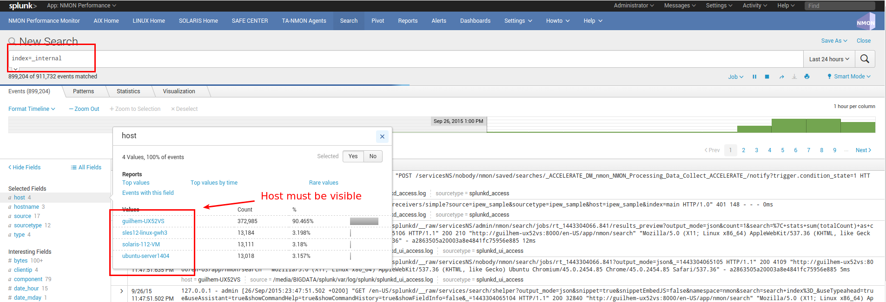

**Optionally focus on splunkd sourcetype and host(s) you are verifying:**

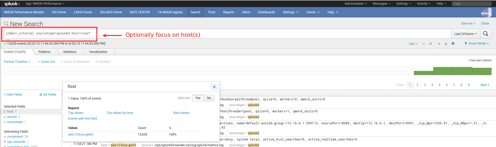

—> If you successfully found incoming events for your host(s), swith to step 2

—> If you can't find incoming events for your host(s), common root causes can be:

* Network connection failure between you host(s) and indexers (or intermediate collecters): Verify with a simple telnet connection test that you can access to destination IP and port(s)
* Bad information in outputs.conf (check IP / Port, syntax)
* No outputs.conf deployed to Universal or Heavy Forwarder

In such a case, connect directly to the host and verify messages in /opt/splunkforwarder/var/log/splunkd.log

++++++++++++++++++++++++++++++++++++++++++++++++++++++++++
STEP 2: Verify Nmon Data Collect (Binary starting process)
++++++++++++++++++++++++++++++++++++++++++++++++++++++++++

**The first level directly related to Nmon Perf App starts with the "nmon_collect", this is process that will start Nmon binary on remote hosts.**

This relies on the "input" script "nmon_helper.sh" which is scheduled to run every minute by default.

**The output of nmon_helper.sh script is logged within the sourcetype=nmon_collect:**

::

    eventtype=nmon:collect

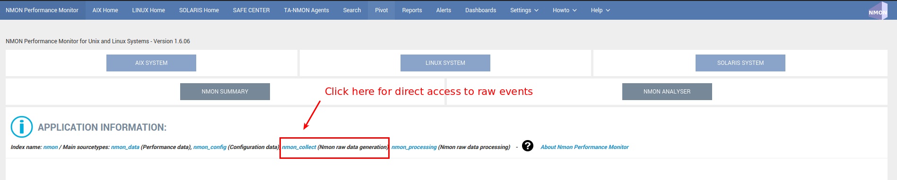

Search for host(s) you are troubleshooting:

.. image:: img/trouble4.png
   :alt: trouble4.png
   :align: center

The nmon process must be visible on the remote host, example:

.. image:: img/trouble5.png
   :alt: trouble5.png
   :align: center

The nmon_helper.sh generates directory structure under $SPLUNK_HOME/var/run/nmon - The nmon raw data file is stored under nmon_repository - the nmon.pid file contains the PID number of the current running Nmon binary

**For debugging purposes, the nmon_helper.sh can be run manually using the following command:**

::

    /opt/splunkforwarder/bin/splunk cmd /opt/splunkforwarder/etc/apps/TA-nmon/bin/nmon_helper.sh

*Example:*

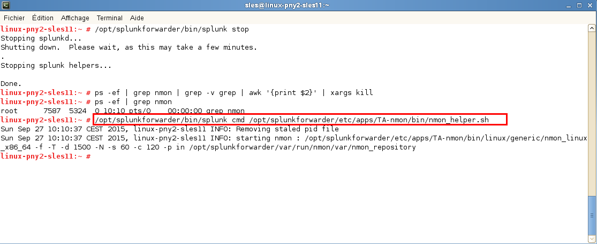

If this step is Ok, this validates that the Nmon binary is able to start and generates Nmon raw data as expected and required

+++++++++++++++++++++++++++++++++++++++++++++++++++++++++++++++++++++++++++++++
STEP 3: Verify Nmon Data Processing (conversion of Nmon raw data into csv flaw)
+++++++++++++++++++++++++++++++++++++++++++++++++++++++++++++++++++++++++++++++

**Next step of verification relies on verifying the Nmon processing which converts Nmon raw data for Splunk:**

* Every time the nmon raw data file is updated, Splunk automatically streams the content of the file to the "nmon2csv.sh" shell wrapper
* The "nmon2csv.sh" shell wrapper will stream the data to the Python "nmon2csv.py" converter or the Perl "nmon2csv.pl" converter
* This will generate required data into $SPLUNK_HOME/var/run/nmon/var

**The output of nmon processing is logged within the sourcetype=nmon_processing:**

::

    index=nmon sourcetype=nmon_processing

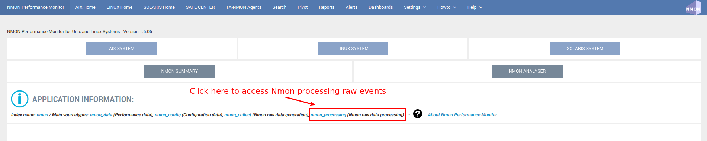

**Search for host(s) you are troubleshooting:**

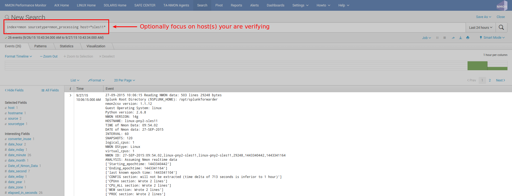

Many useful information are automatically logged to inform about the nmon processing step, such like sections processed and number of events generated per monitor

**Related internal events can also be very useful for troubleshooting purposes, if the nmon processing steps fails for some reasons (such as unsatisfied Perl dependencies or interpreter incompatibility) these information will be automatically logged by splunkd in Splunk internal events:**

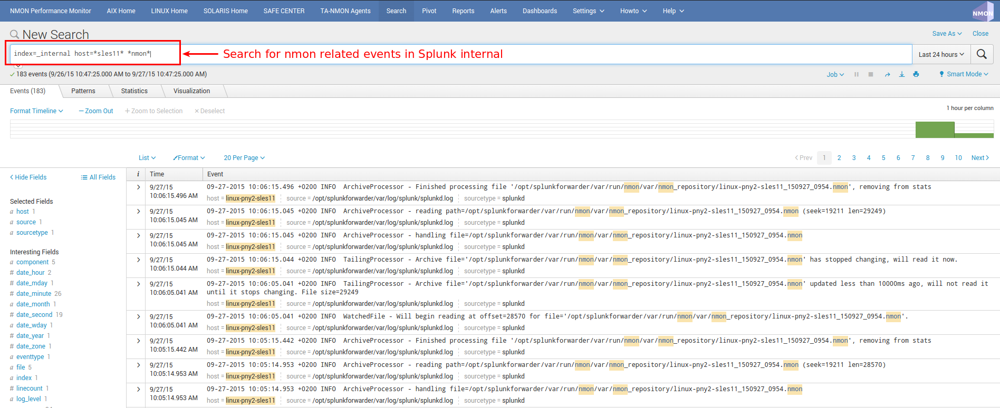

*Notice that every time the nmon raw file is read by Splunk, each step of data processing is logged*

**Manual processing for debugging purposes:**

You can easily manually debug the nmon processing step by running following commands:

::

    cat <raw data file> | /opt/splunkforwarder/bin/splunk cmd /opt/splunkforwarder/etc/apps/TA-nmon/bin/nmon2csv.sh

Note that as csv files generated by the Nmon processing step are automatically consumed, the easiest way to troubleshoot is stopping Splunk and running the above command

**Example of debug operation stopping Splunk:**

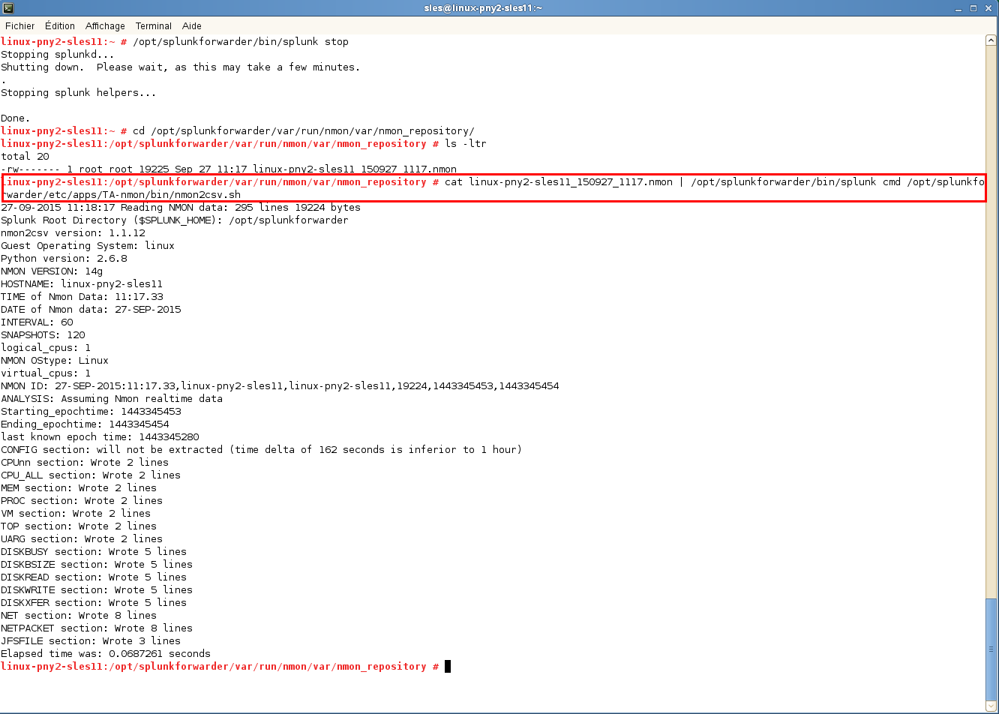

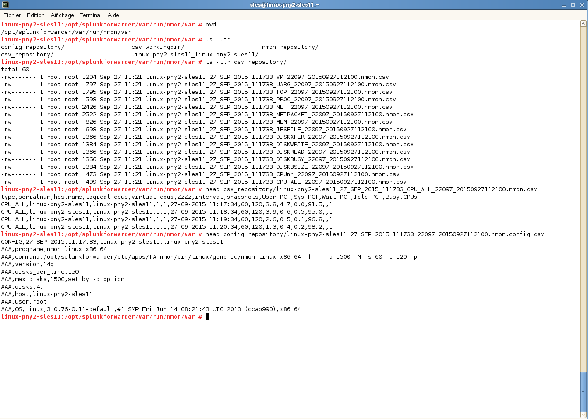

**After this manual troubleshoot verification, start Splunk and notice that csv files generated are automatically deleted by Splunk (batch mode indexing):**

.. image:: img/trouble12.png
   :alt: trouble12.png
   :align: center

**If this step is Ok, then you have verified that Splunk is able to correctly call nmon2csv scripts, that the conversion script is working fine and generating data as expected and finally that Splunk automatically manages files and delete them upon indexing**

++++++++++++++++++++++++++++++++++++++++++++++++++++++
STEP 4: Verify Nmon Performance and Configuration data
++++++++++++++++++++++++++++++++++++++++++++++++++++++

**Next step of troubleshooting resides in verifying Performance data and Configuration data in Splunk:**

*Access to Performance raw events:*

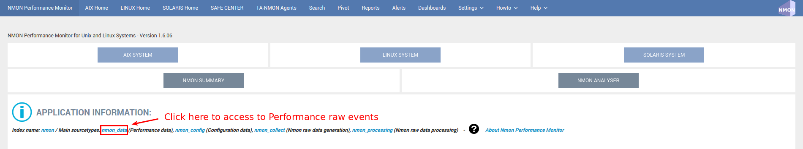

**Access to Configuration raw events:**

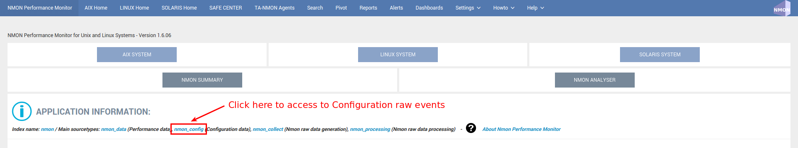

**Example of host returning Performance events:**

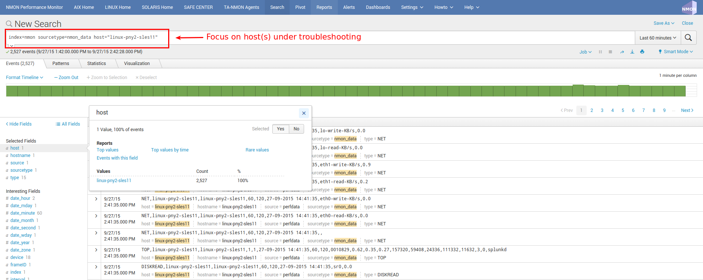

**Example of host returning Configuration events:**

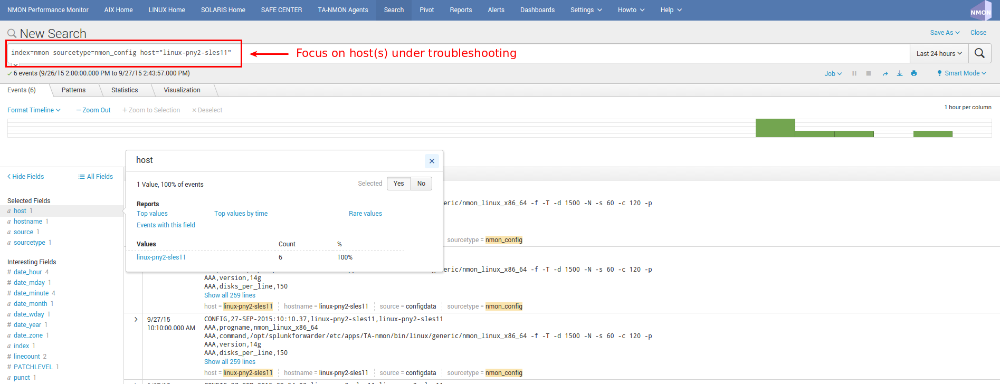

**INFORMATION:**

You will notice the existence of "host" and "hostname" fields, they are totally equivalent, "host" field is a default Splunk field (Metadata) and "hostname" is directly extracted from Nmon data for Performance and Configuration.
The "host" default field is overridden during indexing time to match Nmon data, this allows between other managing history nmon data transparently.

**If you are fine with the step, you will have validated that incoming Performance and Configuration events are correctly indexed by Splunk**

*Since the release V1.6.15, the OStype is generated directly in the raw data, before it was associated with the nmon_inventory lookup table. It is not necessary anymore to verify the lookup table as it cannot be anymore a root cause of error for data identification*

-------------------------------
02 - Debugging nmon2csv parsers
-------------------------------

**nmon2csv Python / Perl converters operations can be debugged by manually running the conversion process:**

**This can easily be achieved, either on nmon / TA-nmon / PA-nmon Application:**

Create a temporary location for csv files, such like the normal directory structure of the App, example:

::

    $ mkdir -p /tmp/nmon2csv_debug/etc/apps/nmon
    $ mkdir -p /tmp/nmon2csv_debug/var/run/nmon

Have an nmon file ready to test, if you don't have some to get the current copy in $SPLUNK_HOME/etc/apps/nmon/var/nmon_resposity when the Application is running

Initiate conversion steps:

Adapt paths if you want to debug the nmon / TA-nmon / PA-nmon App and the type of Splunk instance (standard, light forwarder, heavy forwarder, peer node…), the following example will reproduce the conversion step for the standard Application:

::

    $ cd /tmp/nmon2csv_debug

    $ export SPLUNK_HOME="/tmp/nmon2csv_debug"

**Use the shell wrapper to let him decide which converter will be used:**

::

    $ cat my_file.nmon | /opt/splunk/etc/apps/nmon/bin/nmon2csv.sh

**For Python version:**

::

    $ cat my_file.nmon | /opt/splunk/etc/apps/nmon/bin/nmon2csv.py

**For Perl version:**

::

    $ cat my_file.nmon | /opt/splunk/etc/apps/nmon/bin/nmon2csv.pl

The converter will output its processing steps and generate various csv files in csv_repository and config_repository

Note that you can achieve the same operation in the proper normal Splunk directory, but if you do so, you need to stop Splunk before as it would immediately index and delete csv files

*Additional Options*

**Some options can be used for testing purposes:**

::

    -debug

This option will show various debugging information like removal of events when running in real time mode.

::

    -mode [ colddata | realtime ]

This option will force the converter to use the colddata mode (the file is entirely proceeded without trying any operation to identify already proceeded data) or real time mode.

real mode is much more complex because we need to identify already proceeded events over each iteration of processing steps.

The real time option should be used when the purpose is simulating the same operation that would do Splunk managing live Nmon data

------------------------
03 - Troubleshooting FAQ
------------------------

**Problem: I have deployed the TA-nmon add-on to my hosts and i do not seem to receive data**

*Cause:*

root causes can be multiple:

* Universal Forwarder (or full instance) not sending data at all
* Nmon binary does not start
* Nmon raw data converter failure
* input scripts not activated
* Universal Forwarder not compatible (see requirements)
* Clients sending data directly to indexers lacking the PA-nmon add-on

**Resolution:**

Please read and execute the trouble shooting guide procedure: :any:`trouble_guide`

**Problem: Linux hosts are not identified as Linux Operating Systems**

*Cause:*

Linux configuration can be split at indexing time, this requires indexing time parsing operation that will fail if the the PA-nmon is not installed in indexers (or if the TA-nmon is not installed on intermediate Heavy Forwarders acting as Collectors in front of your indexers)

*Resolution:*

* Install the PA-nmon add-on on indexers (as it is required in installation manual) or the TA-nmon add-on if your are using Heavy Forwarders as collectors in front of your indexers
* Update the nmon_inventory lookup by running the generation report (see here)

**Problem: I have set frameID Mapping (see here) but past indexed data still have the original frameID value**

*Cause:*

Data Acceleration will keep the previously known values for frameID as long as they won't be rebuilt

*Resolution:*

Enter the data model manager: pivot > Manage
For each data model, click on Rebuild

*******
Upgrade
*******

.. _upgrade_standalone:

--------------------------------
01 - Upgrade Standalone Instance
--------------------------------

**Upgrade or Update the Nmon Splunk App in a Splunk standalone instance**

*Updating the Nmon App on a minor release or upgrade to a major new release is totally transparent and uses Splunk standard.*

**IMPORTANT:** As for any other Splunk Application, do never modify configuration files in the default directory but create your own copy in the local directory, such that updating the Application will not overwrite your custom settings

**To update or upgrade Nmon Splunk App in a standalone installation, you can:**

* Use the Splunk App manage builtin, Splunk automatically notifies you when a new version is available, the update can be done on the air through the Manager
* Download the new version on Splunk base https://splunkbase.splunk.com/app/1753/ and use the Manager to proceed to update
* Uncompress directly the content of the tar.gz archive in $SPLUNK_HOME/etc/apps and restart Splunk

.. _upgrade_distributed:

-----------------------------------
02 - Upgrade Distributed Deployment
-----------------------------------

**Upgrade or Update the Nmon Splunk App in a Splunk Distributed Deployment**

Updating the Nmon App on a minor release or upgrade to a major new release is totally transparent and uses Splunk standard.

*IMPORTANT: As for any other Splunk Application, do never modify configuration files in the default directory but create your own copy in the local directory, such that updating the Application will not overwrite your custom settings*

**Updating the Application in a Distributed Deployment context follows the same tracking than initial deployment, with three major pieces of the App:**

.. image:: img/steps_summary_distributed.png
   :alt: steps_summary_distributed.png
   :align: center

**So, proceed in the order:**

* Update PA-nmon
* Update Nmon Core App
* Update TA-nmon and reload your deployment server to update your end clients

Please consult the Distributed Deployment manual to get details instructions of each step for upgrade: :any:`distributed_deployment_guide`

.. _update_from_version_prior_17:

-----------------------------------------------------------------------------
03 - Additional upgrade notes - Migrating from release prior to Version 1.7.x
-----------------------------------------------------------------------------

**Upgrade notes**

**The release V1.7.x is a major release of the Nmon Performance Monitor application, follow this procedure when migrating from an existing installation running a version previous to the V1.7.x.**

**SUMMARY OF MAJOR CHANGES**

* The Nmon core application does not create anymore the "nmon" index at installation time (for app certification purposes), the index must be declared manually
* The Nmon core application does not implement anymore performance and configuration, if you want to get performance of your search heads you must deploy the TA-nmon
* The TA-nmon working directory has been migrated from $SPLUNK_HOME/var/run to $SPLUNK_HOME/var/log for certification purposes
* The nmon_inventory lookup table is now stored in a KVstore collection, after upgrade you must re-generate the nmon inventory data to fill the KVstore (or wait for the next auto iteration)
* Different old components were removed from the core application (such a the django views), extracting using tar will not clean these files
* The span definition macro "custom_inlinespan" where renamed to "nmon_span" for easier usage, if you used to customize the minimal span value previously, you must update your local configuration (the original macro were left in case of users would be using it, but it is not used anymore in views)

**FILES AND DIRECTORY THAT WERE REMOVED FROM THE CORE APPLICATION**

Bellow is the list of files and directory that were removed in the Version 1.7.x, at the end of your update you can clean these files with no issue.

*If you are running standalone search head, remove them from:*

::

    $SPLUNK_HOME/etc/apps/nmon

If you are running a Search Head Cluster, remove them the deployer and apply the bundle configuration to the search head

::

    $SPLUNK_HOME/etc/shcluster/apps/nmon

**FILES AND DIRECTORIES TO BE REMOVED:**

* nmon/bin
* nmon/django
* nmon/default/inputs.conf
* nmon/default/inputs.conf_forWindows
* nmon/default/indexes.conf
* nmon/lookups/nmon_inventory.csv
* nmon/samples

*All these files, directories and sub-directories can be removed safety.*

**PRE-CHECK - HAVE YOU DECLARED YOUR INDEX ?**

As explained bellow, the nmon core application does create anymore the "nmon" index at startup time.

The reason comes from Splunk certification requirements as this task should be managed by administrators.

If you running in Indexer cluster, then your index has necessarily be declared and you are not concerned.

If you running standalone instances, ensure you have set your index explicitly, you can create the "nmon" index the local/ directory of the Nmon core application for example.

**STEP 1. UPDATE THE CORE APPLICATION**

If you are running on a standalone installation only, you should declare the "nmon" index manually before upgrading, or at least before restarting.

Refer to the standalone installation guide: :any:`standalone_deployment_guide`

If you running the PA-nmon or an indexer cluster where you have already manually declared the nmon index, you are not affected by this change.

**Apply the installation procedure following your configuration, checkout:**

* Upgrade a standalone server: :any:`upgrade_standalone`
* Upgrade a distributed deployment: any:`upgrade_distributed`

**inputs.conf**

Clean the default/inputs.conf and local/inputs.conf on the search head
If you were generating performance and configuration data at the search head level using the Nmon core application, you should delete these files as they are not useful anymore.

**RUNNING SPLUNK 6.3 ?**

This release has limited compatibility with Splunk 6.3, if your running on Splunk 6.3:

* Download and update the Nmon Performance application
* If does not exit, create a local/ui/views and copy compatibility mode versions of the following views from default to local, such that these views will overcharge defaults views:

*Example:*

::

    cd /opt/splunk/etc/apps/nmon
    mkdir -p local/data/ui/views

    cp -p default/data/ui/views/Dashboard_bulletcharts_compat.xml local/data/ui/views/Dashboard_bulletcharts.xml
    cp -p default/data/ui/views/Nmon_Summary_compat.xml local/data/ui/views/Nmon_Summary.xml
    cp -p default/data/ui/views/UI_Nmon_CPU_ALL_compat.xml local/data/ui/views/UI_Nmon_CPU_ALL.xml
    cp -p default/data/ui/views/UI_Nmon_CPUnn_compat.xml local/data/ui/views/UI_Nmon_CPUnn.xml
    cp -p default/data/ui/views/UI_Nmon_MEM_LINUX_compat.xml local/data/ui/views/UI_Nmon_MEM_LINUX.xml
    cp -p default/data/ui/views/UI_RT_Nmon_CPU_ALL_compat.xml local/data/ui/views/UI_RT_Nmon_CPU_ALL.xml

**If you are using a search head cluster, these modification will take place in the SHC deployer:**

::

    cd /opt/splunk/etc/shcluster/apps/nmon

*Restart Splunk or deploy the sh cluster bundle if running a search head cluster*

**STEP 2. DEPLOY THE TA-NMON ON SEARCH HEADS IF RELEVANT**

Since the release V1.7.4, you must deploy the TA-nmon on the search head level if you want to collect performance and configuration data from the search heads

This will be easily achieved by the the deploying the TA-nmon along with the Nmon core application on the SHC deployer, checkout: :any:`distributed_deployment_guide`

**STEP 3. CHECKOUT YOUR LOCAL CONFIGURATION ACCORDING TO MAJOR CHANGES**

According to the summary of major changes, you may have to:

* Review your local/macros.conf if you are using a custom minimal value for the span definition, see :any:`custom_span`
* Manually re-generate the nmon inventory data by running the "Generate NMON Inventory Lookup Table" report, for more information, see: :any:`nmon_inventory`

