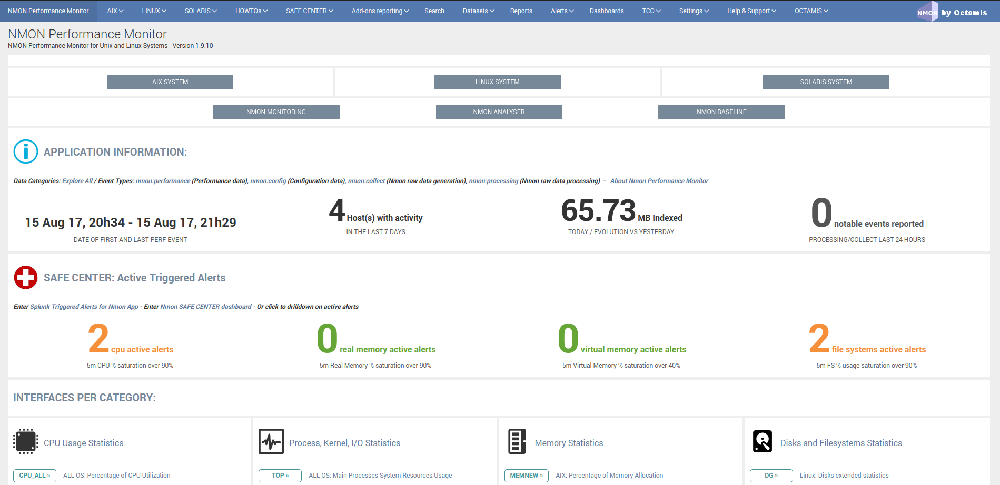
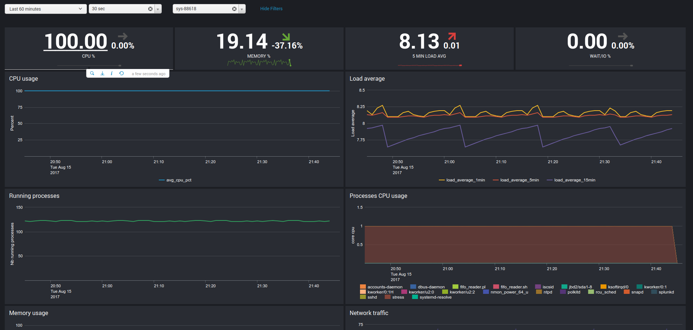

################
Eventgen testing
################

Testing Nmon performance with evengen
=====================================

**Splunk Evengen is a pretty good and straightforward way to test the application.**

Starting the TA-nmon version 1.3.28 and TA-nmon-hec version 1.3.32, we provide sample data for 2 AIX and 2 Linux servers.
The data has been generated on IBM Power Development Cloud servers.

Finally, we use to run a system stress tool on 1 server of each category, such that you will have quickly active alerts and system statistic anomalies.

**Eventgen will generate data for:**

* performance metrics (sourcetype=nmon_data / eventtype=nmon:performance)
* configuration data (sourcetype=nmon_config / eventtype-nmon:config)

Additional data normally available within the application is related to the nmon data collection and will not be generated by Eventgen.

Get it working in 30 seconds
============================

* Have a Splunk instance up and running
* Download the current eventgen version from https://github.com/splunk/eventgen
* Install the eventgen application, you should name the application directory as:

::

    $SPLUNK_HOME/etc/apps/SA-Eventgen

* If not done already, install the Nmon Performance application (obvious!)
* Install either the TA-nmon or the TA-nmon-hec on this instance
* Create an index called "nmon"
* Restart Splunk

**Immediately after Splunk restart, eventgen starts to generate nmon data, as visible from the application home page:**

**Example of a server running with abnormal load:**

