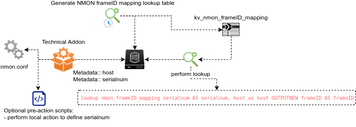
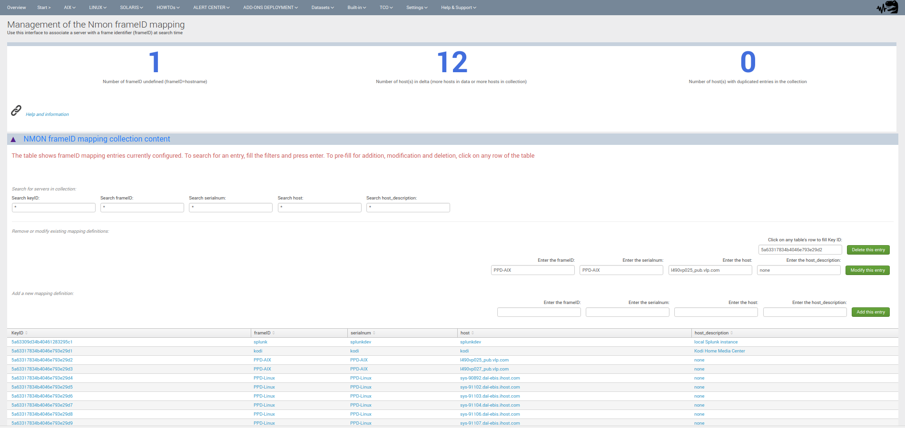

.. _frameID_mapping:

##########################
frameID mapping management
##########################

**frameID mapping overview:**

The "frameID" feature is used within the application to programmatically link servers with a logical identifier, aka the frame identifier.

The frameID mapping is first natively achieved against the serial number value retrieved from Nmon data, plus several other options which are exposed in this documentation.

**Using frameID allows:**

- filtering for servers more effectively within any human interface of the application
- managing alerting thresholds and exclusions based on the frameID template
- for analytic purposes operated against the frameID and server associations, like performing capacity planning analytics using this logical grouping

**The frameID value can be configured by several options:**

- at raw level using default values retrieved by Nmon, valuable for AIX operating systems only (the serial number will be the serial number from the frame hosting the partition)
- at raw level using static definition in nmon.conf
- at raw level using dynamic definition in nmon.conf configured by a pre-action script
- at search time level using the frameID mapping KVstore collection and Splunk lookup feature

All these options are described in detail within the present documentation.

=======================================
frameID mapping lookup table generation
=======================================

First, The application has a scheduled report called "Generate NMON frameID mapping lookup table".

The purpose of this scheduled report is generating and updating the KVstore collection that defines the frameID mapping.

The report is scheduled by default to run every hour against the last 7 seven days of raw data using the high performance **mcatalog** command.

Due to its high level of optimisation, its cost in term of Splunk resources is negligible.

=====================
Default frameID value
=====================

**Without any kind of configuration, the default value for the serial number (serialnum) used automatically to define the frameID field value will be:**

- for AIX: serial number of the frame hosting the partition at Nmon binary startup
- for Linux: equal to the hostname value
- for Solaris: equal to the hostname value

As such, the default frameID mapping is valuable essentially for AIX systems, if your using Linux OS and/or Solaris OS, it is highly recommended to perform your own mapping such that you can get benefits from the feature.

================================================================
frameID value at raw level with nmon.conf and pre-action scripts
================================================================

As exposed in nmon.conf, you can statically configure the frameID mapping using a custom option in the nmon.conf configuration file.

This feature is driven by:

::

    #####################
    # frameID definition:
    #####################

    # The frameID definition is an enrichment mechanism used within the application to associate a given host with a given frame identifier
    # By default, the mapping is operated against the value of "serialnum" which is defined at the raw level by nmon binaries

    # On AIX systems, the serialnum value is equal to the serial number of the frame hosting the partition
    # On Linux and Solaris systems, the serialnum is equal to the value of the hostname

    # Using this option allows you to override the serialnum value by a static value defined in the nmon.conf configuration file
    # nmon.conf precedence allows defining the serialnum value on per deployment basis (local/nmon.conf) or on a per server basis (/etc/nmon.conf)

    # default is:
    # override_sys_serialnum="0"
    # which lets nmon set the serialnum value

    # Set this value to:
    # override_sys_serialnum="1"
    # to activate the serialnum override based on the value defined in:

    # override_sys_serialnum_value="<sting>"
    # Acceptable values for <string> are letters (lower and upper case), numbers and "-" / "_"

    override_sys_serialnum="0"
    override_sys_serialnum_value="none"

**Most likely, this feature is interesting being used in conjonction with a pre-action script.**

pre-action scripts
------------------

A pre-action script is literally nothing more than a home made script that can be set and run automatically by the Technical Addon, and specially run by the nmon_helper.sh script.

pre-actions scripts should be stored in:

::

    TA-nmon/bin/pre_action_scripts/

**Any pre-action script deployed must be named with ".sh" extension and must be executable by the Unix user owning the Splunk processes.**

A pre-action script could be defined to set the frameID based on:

- A conditional operation based of the server hostname if you have a naming convention that can be used
- Any command that run on the server to retrieve the information to be used as the serial number value

**Review the TA-nmon/bin/pre_action_scripts/README for example and more information.**

==========================================================
frameID mapping at search time with the KVstore collection
==========================================================

**A KVstore collection and its associated lookup are available to define the frameID mapping at search time.**

+--------------------------------+-------------------------------+--------------------------------------------+
| KVstore collection             | Lookup name                   | Expected fields                            |
+================================+===============================+============================================+
| kv_nmon_frameID_mapping        | nmon_frameID_mapping          | serialnum, frameID, host, host_description |
+--------------------------------+-------------------------------+--------------------------------------------+

**The following macro is being used to perform the frameID mapping at search time:**

::

    #########################################
    # frameID mapping
    #########################################

    [mapping_frameID]
    definition = lookup nmon_frameID_mapping host as host OUTPUT frameID\
    | eval frameID=if(isnull(frameID), host, frameID)
    iseval = 0

**Finally, a configuration interface is provided to perform the mapping collection:**

::

    Menu Settings / FRAMEID mapping enrichment

**The mapping interface allows you to:**

- View the current lookup table content
- Modify any entry and field values
- Add or delete any entry

**Finally, all human interfaces provide selection filtering against the frameID, automatic lookup is achieved at search time for Nmon events data, and alerting thresholds and exceptions will use the frameID value to perform their tasks.**
