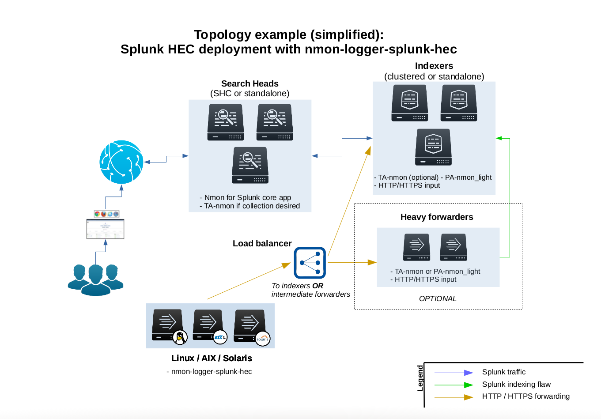
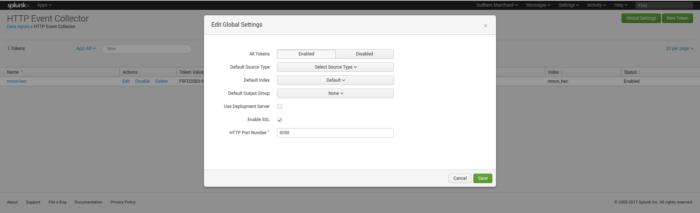
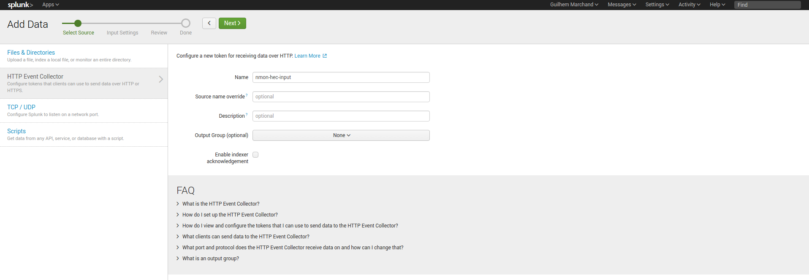
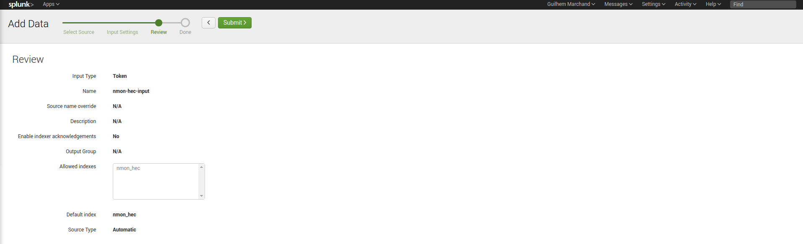

===================================
Splunk HEC / nmon-logger deployment
===================================

**Since the version 1.9.10, the nmon-logger for Splunk HEC provides a 100% agent less configuration using the Splunk http input:**

.. _hec_deployment:

**This deployment provides the following features:**

* **clients easy set up:** the nmon-logger is provided as deb/rpm package, easy and fast deployment
* **server easy set up:** Splunk http input is easy to configure and implement
* **100% agent less:** the nmon-logger uses only native system features (cron, logrotate...)
* **secure:** Splunk http traffic can easily be encrypted via SSL and integrated into any DMZ or similar restricted networking layer
* **resilient and scalable:** using load balancers and multiple nodes provides resiliency and horizontal scalability
* **network friendly:** as Web service, it can be easily used across wide networks and over the Internet
* **easy management:** since the http input is managed on a token basis, you can easily configure different token to ingest the data into different indexes without any package modification or complexity

*****************
Deployment matrix
*****************

+--------------------------------------------+---------------------+---------------------+---------------------+---------------------+
| Splunk Instance                            | Core App            | PA-nmon_light       | TA-nmon             | nmon-logger         |
| (role)                                     |                     |                     |                     |                     |
+============================================+=====================+=====================+=====================+=====================+
| Search head (single or clustered)          |     X               |                     |    X (optional)     |                     |
+--------------------------------------------+---------------------+---------------------+---------------------+---------------------+
| Indexer (single or clustered)              |                     |    X                |    X (optional)     |                     |
+--------------------------------------------+---------------------+---------------------+---------------------+---------------------+
| Master node                                |                     |                     |    X (optional)     |                     |
+--------------------------------------------+---------------------+---------------------+---------------------+---------------------+
| Deployment servers                         |                     |                     |    X (optional)     |                     |
+--------------------------------------------+---------------------+---------------------+---------------------+---------------------+
| Heavy Forwarder                            |                     |                     |    X                |                     |
+--------------------------------------------+---------------------+---------------------+---------------------+---------------------+
| Universal Forwarder                        |                     |                     |    X                |                     |
+--------------------------------------------+---------------------+---------------------+---------------------+---------------------+
| Client servers                             |                     |                     |    X                |    X                |
+--------------------------------------------+---------------------+---------------------+---------------------+---------------------+

**Notes:**

* there are indexing time parsing configurations, the PA-nmon_light or the TA-nmon (or both) must be deployed on the host running the http input

**Fast testing using Vagrant and Ansible:**

If you are interested in a very fast and automated way to test the Nmon Performance Application with an rsyslog deployment, checkout the provided configuration using the excellent Vagrant (https://www.vagrantup.com/) and Ansible configuration management (http://docs.ansible.com/ansible/index.html)

* Checkout: https://github.com/guilhemmarchand/nmon-logger/tree/master/vagrant-ansible-demo-splunk-hec

In about 5 minutes, have a running and automated deployment working !

*******************************************
Download the nmon-logger-splunk-hec package
*******************************************

**The nmon-logger-splunk-hec** package is available in the Github repository of the nmon-logger:

* https://github.com/guilhemmarchand/nmon-logger

The nmon-logger is provided as a deb and rpm package for Linux OS, it has been tested against:

* Ubuntu (x86 and Powerpc)
* Debian (x86)
* CentOS (x86)
* RHEL (x86 and Powerpc)
* Suse (x86 and Powerpc)
* OpenSuse (x86)

*************************************************
Activate the Splunk http input and create a token
*************************************************

**The Splunk configuration is really straightforward, it is all about:**

* Activating and the http input: configuring the http port, choosing between http and https
* Creating a token for the nmon data (1 token for all data, but you can create multiple tokens for different servers deployement)

**Notes:**

* http and https are supported
* indexer acknowledgment is not currently supported (configured per token)
* the nmon-logger will not explicitly specify an index, you choose the index to be used on a per token basis
* Any index name starting by "nmon" is natively taken in charge by the Nmon Performance application
* If you choose a different index name that does not match the rule above, you just need to customize the eventtypes.conf and macros.conf of the Nmon app
* it is not required to define any sourcetype / source by default

**In a nutshell:**

.. image:: img/hec_deployment_screen2.png
   :alt: hec_deployment_screen2.png
   :align: center

**Configuration files:**

* "$SPLUNK_HOME/etc/apps/splunk_http_input/local/inputs.conf":

::

    [http]
    disabled = 0

* "$SPLUNK_HOME/etc/apps/<appname>/local/inputs.conf":

*Notes: replace <appname> with the application context where you want to store the configuration inputs.conf file*

::

    # inputs.conf

    # Enable the HEC
    [http]
    disabled = 0
    enableSSL = 1

    # HEC endpoint for clients
    [http://nmon-hec-input]
    disabled = 0
    index = nmon_hec
    indexes = nmon_hec
    token = CEE56643-BA2D-48EE-94EF-AD0909718B2A

*****************************************
Deploying the nmon-logger to your servers
*****************************************

This is package (no arch) to be deployed, which is obviously straight forward:

**deb based OS:**

::

    dpkg -i nmon-logger-splunk-hec-*.deb

**rpm based OS:**

::

    rpm -i nmon-logger-splunk-hec-*.rpm

**Notes:**

- Host running SeLinux (likely RHEL for instance) need to have the "permissive mode" enabled for the rpm installation or the groupadd operation might fail:

::

    sudo setenforce 0

***************************
Configuring the nmon-logger
***************************

The data collection starts 1 minute maximum after the package deployment, as long as you don't have configured the URL and token, the data is only generated locally on the file system.

**Create a local directory:**

::

    mkdir /etc/nmon-logger/local

**Create a local/nmon.conf and insert your URL / Token:**

*/etc/nmon-logger/local/nmon.conf, example:*

::

    # HEC server configuration

    nmon2csv_options="--mode fifo --silent --splunk_http_url https://192.168.33.100:8088/services/collector/event --splunk_http_token CEE56643-BA2D-48EE-94EF-AD0909718B2A"

**Et voila!**

Once the nmon-logger package is configured and if the networking configuration is properly configured, Splunk will start receiving data through the http input !
