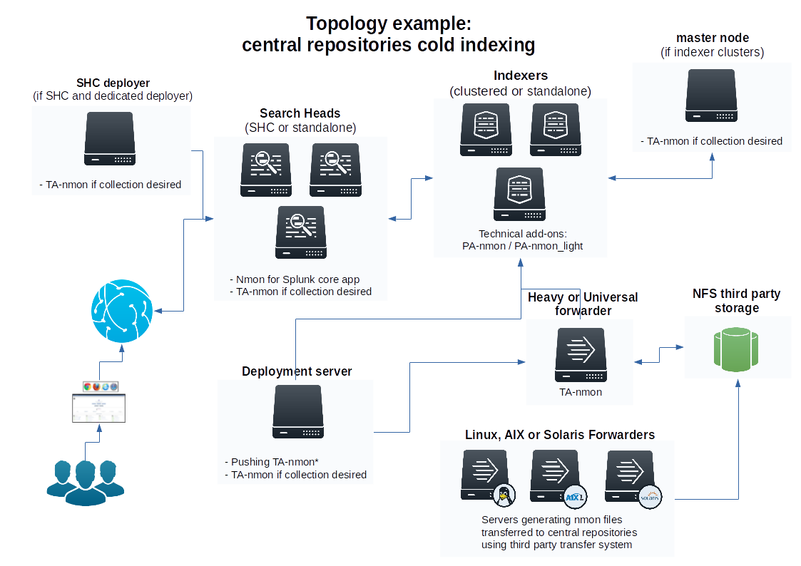

==================================
Managing Nmon Central Repositories
==================================

A common scenario of Nmon Splunk App resides in using the Application to manage large and massive collections of cold Nmon raw data that have been generated out of Splunk.

**Topology example:**

Such a configuration is quite easy to achieve, the only requirement is having a Splunk instance (Heavy or Universal Forwarder) having custom input monitors to watch for your Nmon files. (most of the time they would be hosted in NFS shares).

*INFORMATION: The application can now manage cold and hot Nmon data even when centralized in a common place (see above)*

Indexing Nmon data generated ouf of Splunk
""""""""""""""""""""""""""""""""""""""""""

The Application can manage multiple custom input monitors to automatically index your collection of Nmon raw data files:

It is important to create a custom input in a "local/inputs.conf" such that it does not get overwritten when the Application gets updated.

**Here are some examples of monitor configuration:**

::

    [monitor:///mnt/NFS-SHARE/nmon-repository/*/*nmon]
    disabled = false
    index = nmon
    sourcetype = nmon_processing
    crcSalt = <SOURCE>

**Or an alternative version using whitelist and manage any nmon files in sub folders:**

::

    [monitor:///mnt/NFS-SHARE/nmon-repository/]
    disabled = false
    whitelist = \.nmon$
    index = nmon
    sourcetype = nmon_processing
    crcSalt = <SOURCE>

**And even:**

::

    [monitor:///mnt/NFS-SHARE/nmon-repository/.../*.nmon]
    disabled = false
    index = nmon
    sourcetype = nmon_processing
    crcSalt = <SOURCE>

**If you are synchronizing HOT nmon data:**

**After adding the input, please restart Splunk.**

Immediately after restart, the App should start managing available Nmon files, look in the nmon_processing sourcetype to get the current activity of the Nmon processing steps:

::

    index=nmon sourcetype=nmon_processing

Or open the report: "Activity of NMON Data Processing"
