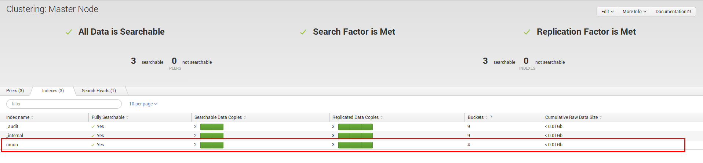
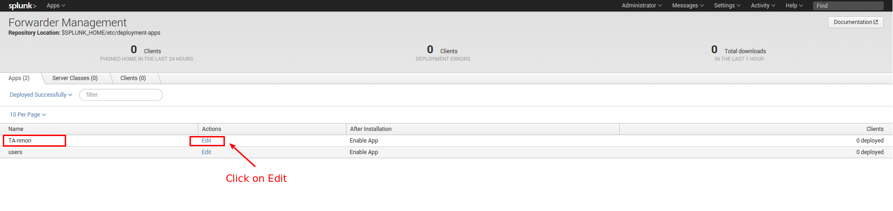
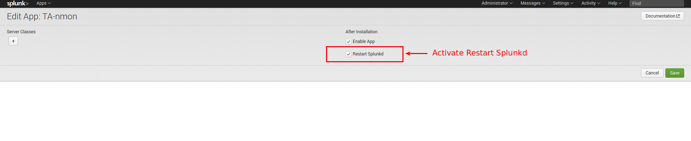
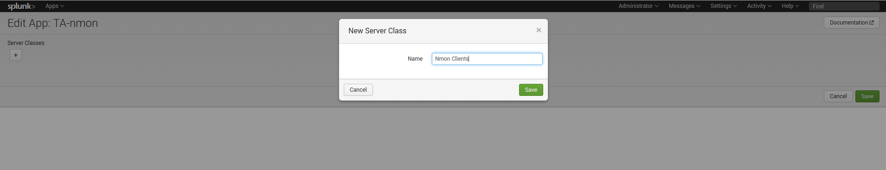
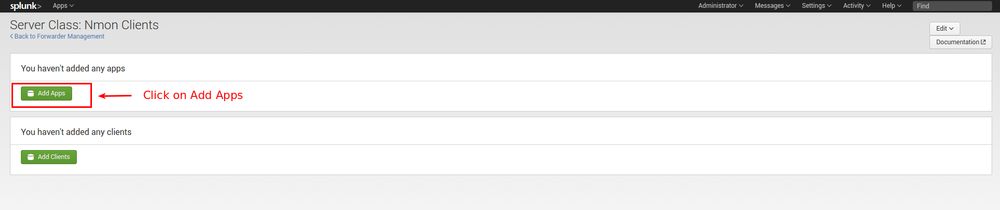
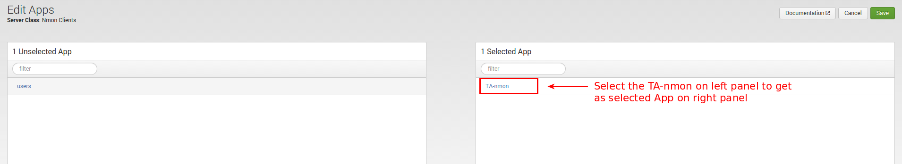
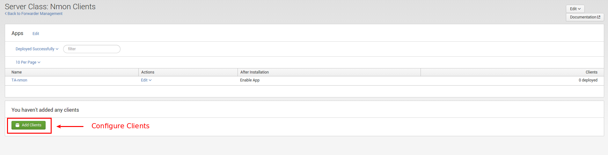
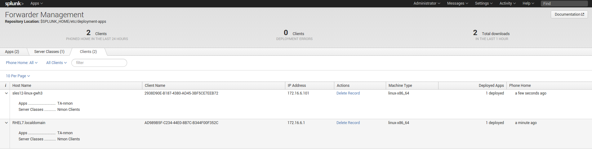
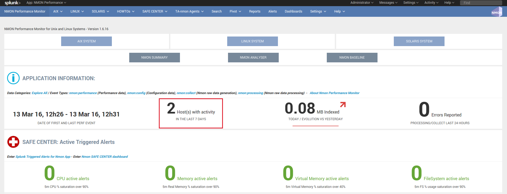
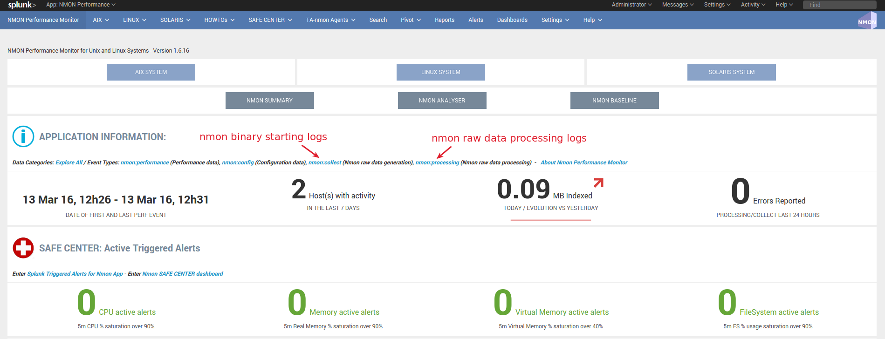

================================
Deploy to distributed deployment
================================

.. _distributed_deployment_guide:

----------------------------------------
Installation for distributed deployments
----------------------------------------

**Distributed deployment matrix:**

+--------------------------------------------+------------+----------+---------------------+
| Splunk Instance                            | Core App   | PA-nmon  | TA-nmon             |
| (role description)                         |            |          |                     |
+============================================+============+==========+=====================+
| Search head (single instance or clustered) |     X      |          |    X (optional)     |
+--------------------------------------------+------------+----------+---------------------+
| Indexer (single instance or clustered)     |            |    X     |                     |
+--------------------------------------------+------------+----------+---------------------+
| Master node                                |            |          |    X (optional)     |
+--------------------------------------------+------------+----------+---------------------+
| Deployment servers                         |            |          |    X (optional)     |
+--------------------------------------------+------------+----------+---------------------+
| Heavy Forwarder                            |            |          |    X                |
+--------------------------------------------+------------+----------+---------------------+
| Universal Forwarder                        |            |          |    X                |
+--------------------------------------------+------------+----------+---------------------+

*The TA-nmon provides nmon performance and configuration collection for the host than runs the add-on, which is optional*

**The following installation tutorial covers all aspects of a distributed deployment scenario:**

* Standalone indexers
* Single site or multi site indexer clusters
* Standalone search heads
* Search heads in a sh cluster

*Note: Search heads in sh pooling deployment is a deprecated behavior, and has been replaced advantageously by sh clusters*

.. image:: img/steps_summary_distributed.png
   :alt: steps_summary_distributed.png
   :align: center

1. Deploying the PA-nmon on indexers
------------------------------------

1.1. Deploying the PA-nmon on clustered indexers (single site or multi site)
^^^^^^^^^^^^^^^^^^^^^^^^^^^^^^^^^^^^^^^^^^^^^^^^^^^^^^^^^^^^^^^^^^^^^^^^^^^^

We will assume your indexers are already operational, in the case of a new installation, remember to activate port receiving to allow the indexer to retrieve data.

If required (eg. new installation), this can be easily achieved:

**in CLI:**

::

    /opt/splunk/bin/splunk enable listen 9997
    Where 9997 (default) will be the receiving port for Splunk Forwarder connections

Deploying the PA-nmon on clustered indexers
"""""""""""""""""""""""""""""""""""""""""""

*ALL THESE ACTION MUST BE DONE ON THE MASTER NODE*

**Download the Application tar.gz archive from:**

https://splunkbase.splunk.com/app/1753/

**Extract the content of the archive on your master node in a temporary directory, example:**

::

    cd /tmp/
    <upload the archive here>

    tar -xvzf nmon-performance-monitor-for-unix-and-linux-systems*.tgz

The PA-nmon is a tar.gz archive located in the "resources" of the core Application

It must be uncompressed and installed in the Master Node in $SPLUNK_HOME/etc/master_apps/ (where $SPLUNK_HOME refers to the root directory of your Splunk installation)

::

    cd /opt/splunk/etc/master/apps

    tar -xvzf /tmp/nmon/resources/PA-nmon*.tar.gz

In default configuration, the PA-nmon is able to generate Nmon Performance data. (which is why the PA-nmon contains file inputs and script inputs)

*if you don't want this, you can create a local/inputs.conf to deactivate these features:*

::

    cd /opt/splunk/etc/master_apps/PA-nmon

    mkdir local

    cp -p default/inputs.conf local/

    <edit local/inputs.conf>

    <replace:>

    disabled = false

    <by:>

    disabled = true

**Publish the cluster bundle to indexers, this implies an automatic rolling restart of indexers:**

::

    splunk apply cluster-bundle

**To see the current status of the indexer cluster:**

*In CLI:*

::

    splunk show cluster-bundle-status

*In Splunk Web, connected to the master node console:*

Settings --> Indexer Clustering

**Upon Rolling Restart of the indexer cluster, and if the local data performance collecting is activated, a new clustered index will be available in the indexer clustering console from the Master node:**

1.2. Deploying the PA-nmon on standalone indexers
^^^^^^^^^^^^^^^^^^^^^^^^^^^^^^^^^^^^^^^^^^^^^^^^^

*ALL THESE ACTION MUST BE DONE FOR EACH STANDALONE INDEXER*

**Download the Application tar.gz archive from:**

https://splunkbase.splunk.com/app/1753/

Extract the content of the archive on your indexer in a temporary directory, example:

::

    cd /tmp/

    <upload the archive here>

    tar -xvzf nmon-performance-monitor-for-unix-and-linux-systems*.tgz

The PA-nmon is a tar.gz archive located in the "resources" of the core Application

It must be uncompressed and installed in the indexer in $SPLUNK_HOME/etc/apps/ (where $SPLUNK_HOME refers to the root directory of Splunk installation)

::

    cd /opt/splunk/etc/apps

    tar -xvzf /tmp/nmon/resources/PA-nmon*.tar.gz

In default configuration, the PA-nmon is able to generate Nmon Performance data. (which is why the PA-nmon contains file inputs and script inputs)

*if you don't want this, you can create a local/inputs.conf to deactivate these features:*

::

    cd /opt/splunk/etc/apps/PA-nmon

    mkdir local

    cp -p default/inputs.conf local/

    <edit local/inputs.conf>

    <replace:>

    disabled = false

    <by:>

    disabled = true

If you want to get Performance data to be generated automatically by the Application on your standalone indexers, you must set a custom configuration of props.conf (only applicable for standalone indexers):

::

    cd /opt/splunk/etc/apps/PA-nmon

    mkdir local

    cp -p default/props.conf local/

    <edit local/props.conf>

    <replace:>

    unarchive_cmd = $SPLUNK_HOME/bin/splunk cmd $SPLUNK_HOME/etc/slave-apps/PA-nmon/bin/nmon2csv.sh

    <by:>

    unarchive_cmd = $SPLUNK_HOME/bin/splunk cmd $SPLUNK_HOME/etc/apps/PA-nmon/bin/nmon2csv.sh

    And:

    unarchive_cmd = gunzip | $SPLUNK_HOME/bin/splunk cmd $SPLUNK_HOME/etc/slave-apps/PA-nmon/bin/nmon2csv.sh

    By:

    unarchive_cmd = gunzip | $SPLUNK_HOME/bin/splunk cmd $SPLUNK_HOME/etc/apps/nmon/bin/nmon2csv.sh

**Restart the indexer:**

::

    splunk restart

2. Deploying the Core App and TA-nmon to search heads
-----------------------------------------------------

2.1. Deploying the Nmon Core in a sh cluster
^^^^^^^^^^^^^^^^^^^^^^^^^^^^^^^^^^^^^^^^^^^^

*ALL THESE ACTION MUST BE DONE ON THE SHC DEPLOYER*

**Download the Application tar.gz archive from:**

https://splunkbase.splunk.com/app/1753/

Upload the archive to the search head in a temporary directory, example:

::

    cd /tmp/

    <upload archive here>

NOTE: For more information about search head clustering and application deployment, see:

http://docs.splunk.com/Documentation/Splunk/latest/DistSearch/PropagateSHCconfigurationchanges

On the SHC deployer, the configuration bundle resides under the $SPLUNK_HOME/etc/shcluster directory.
The set of files under that directory constitutes the configuration bundle.

The directory has this structure:

::

    $SPLUNK_HOME/etc/shcluster/
         apps/
              <app-name>/
              <app-name>/
              ...
         users/

Extract the content of the core Application (the tar archive you downloaded from Splunk base) to the "apps" directory.

**Since the release V1.7, the core application does not generate anymore nmon data, if you want to get performance and configuration data from your search heads, extract the content of the TA-nmon addon to the "apps" directory.**

::

    cd /opt/splunk/etc/shcluster/apps/
    tar -xvf /tmp/nmon-performance-monitor-for-unix-and-linux-systems_*.tgz
    tar -xvf /opt/splunk/etc/shcluster/apps/nmon/resources/TA-nmon*.tgz

Finally push the configuration bundle to publish the Nmon core application to all search heads:

::

    splunk apply shcluster-bundle -target <URI>:<management_port> -auth <username>:<password>

2.2. Deploying the Nmon Core in independent search heads or search heads in sh pooling
^^^^^^^^^^^^^^^^^^^^^^^^^^^^^^^^^^^^^^^^^^^^^^^^^^^^^^^^^^^^^^^^^^^^^^^^^^^^^^^^^^^^^^

**For each search head:**

Download the Application tar.gz archive from:

https://splunkbase.splunk.com/app/1753/

Upload the archive to the search head in a temporary directory, example:

::

    cd /tmp/

    <upload archive here>

Uncompress the content of the tar.gz archive in $SPLUNK_HOME/etc/apps/ (where $SPLUNK_HOME refers to the Application root directory)

::

    tar -xvzf nmon-performance-monitor-for-unix-and-linux-systems*.tgz

**Since the release V1.7, the core application does not generate anymore nmon data, if you want to get performance and configuration data from your search heads, extract the content of the TA-nmon addon to the "apps" directory.**

::

    cd /opt/splunk/etc/apps/
    tar -xvf /opt/splunk/etc/shcluster/apps/nmon/resources/TA-nmon*.tgz

**Restart each search head manually:**

::

    splunk restart

3. Deploying the TA-nmon
------------------------

The next step is to deploy the TA-nmon in every machine that must be monitored.

The following tutorial asssumes you will be using the Splunk deployment server to publish the TA-nmon package to clients,
but it also totally possible to deply the TA-nmon by any deployment tool of your choice like Pupet or Ansible.

3.1 Preparing the TA-nmon on deployment servers
^^^^^^^^^^^^^^^^^^^^^^^^^^^^^^^^^^^^^^^^^^^^^^^

*ALL THESE ACTION MUST BE DONE ON INSTANCE(S) ACTING AS DEPLOYMENT SERVERS*

**Download the Application tar.gz archive from:**

https://splunkbase.splunk.com/app/1753/

Extract the content of the archive on your indexer in a temporary directory, example:

::

    cd /tmp/

    <upload the archive here>

    tar -xvzf nmon-performance-monitor-for-unix-and-linux-systems*.tgz

The TA-nmon is a tar.gz archive located in the "resources" of the core Application

It must be uncompressed and installed in $SPLUNK_HOME/etc/deployment-apps/ (where $SPLUNK_HOME refers to the root directory of Splunk installation)

::

    cd /opt/splunk/etc/deployment-apps

    tar -xvzf /tmp/nmon/resources/TA-nmon_*.tar.gz

Then , ask the deployment server to update its configuration:

::

    /opt/splunk/bin/splunk reload deploy-server

3.2. Configuring the deployment server to push the TA-nmon to Universal Forwarders
^^^^^^^^^^^^^^^^^^^^^^^^^^^^^^^^^^^^^^^^^^^^^^^^^^^^^^^^^^^^^^^^^^^^^^^^^^^^^^^^^^

**Connecting Universal Forwarders to the Deployment Server:**

If this is a new installation or if you haven't already, you must connect your Universal Forwarders clients to your deployment server:

*in CLI:*

::

    /opt/splunkforwarder/bin/splunk set-poll <mydeploymentserver>:8089

Where <mydeploymentserver> corresponds to the hostname of your Deployment Server

For more information, see:

http://docs.splunk.com/Documentation/Splunk/latest/Forwarding/Setupforwardingandreceiving

**Deploying forwarding configuration (outputs.conf) to Universal Forwarders clients:**

Most of the time in an existing deployment of Universal Forwarders, you will probably want to host the copy of the configuration "outputs.conf" in a dedicated configuration (eg. application) being pushed to all connected clients.

*For more information, see:*

http://docs.splunk.com/Documentation/Splunk/latest/Forwarding/Setupforwardingandreceiving

*You can also host the outputs.conf within the TA-nmon package, such as:*

::

    cd /opt/splunk/etc/deployment-apps/TA-nmon

    mkdir local

    <create outputs.conf and set the list of indexers and desired options, example>

    [tcpout]
    defaultGroup = indexer_pool

    [tcpout:indexer_pool]
    server=splunk-peer1:9997,splunk-peer2:9997,splunk-peer3:9997
    autoLB = true

The next step will reside in configuring the Deployment Server to push the TA-nmon to connected clients, by creating the associated server class and linked application

*ALL THESE ACTION MUST BE DONE ON INSTANCE(S) ACTING AS DEPLOYMENT SERVERS IN SPLUNK WEB*

**Connect to Splunk Web of your Deployment Server**

Access the Forwarder Management Interface (Settings —> Forwarder Management)

Follow these steps examples to set up a server class that will push to clients the TA-nmon package

*Edit the TA-nmon application:*

*Ensure to activate "restart splunkd":

*Create a new server class:*

*Associate the TA-nmon with the server class:*

*And finally add required clients:*

*A few minutes later, you will start collecting data from your hosts, refresh the Application Home page and you should see the number of hosts in activity being increased:*

*You can check nmon binary starting logs and processing logs in associated eventtypes:*

3.3. Deploying TA-nmon on master node, deployment server for performance data generation
^^^^^^^^^^^^^^^^^^^^^^^^^^^^^^^^^^^^^^^^^^^^^^^^^^^^^^^^^^^^^^^^^^^^^^^^^^^^^^^^^^^^^^^^

**For other nodes that won't have the TA-nmon published automatically (such as the master node and deployment servers), you will need to manually install the TA-nmon addon.**

It must be uncompressed and installed in $SPLUNK_HOME/etc/apps/ (where $SPLUNK_HOME refers to the root directory of Splunk installation)

::

    cd /opt/splunk/etc/apps

    tar -xvzf /tmp/nmon/resources/TA-nmon_*.tar.gz

**And restart:**

::

    splunk restart

