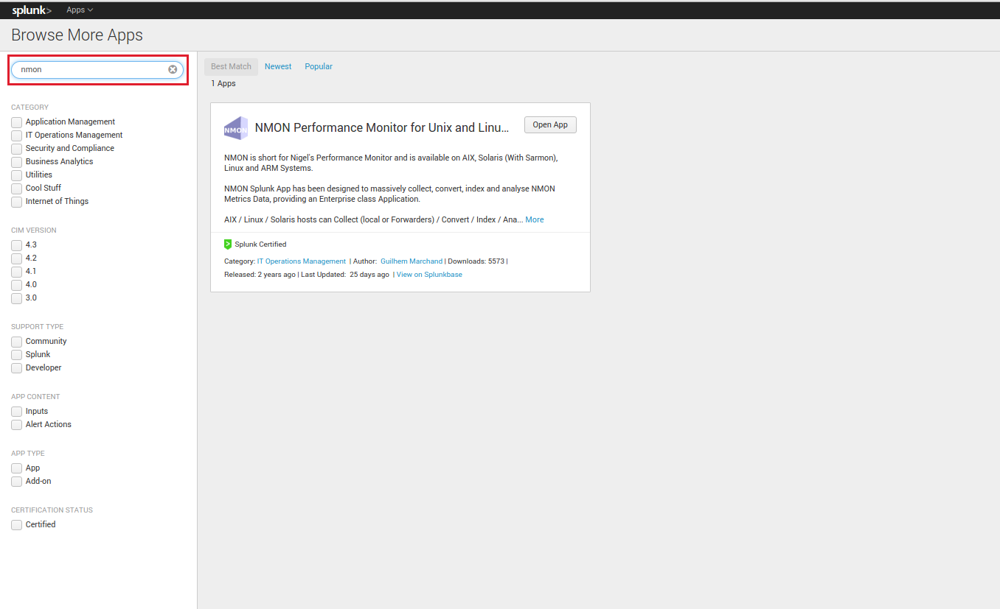
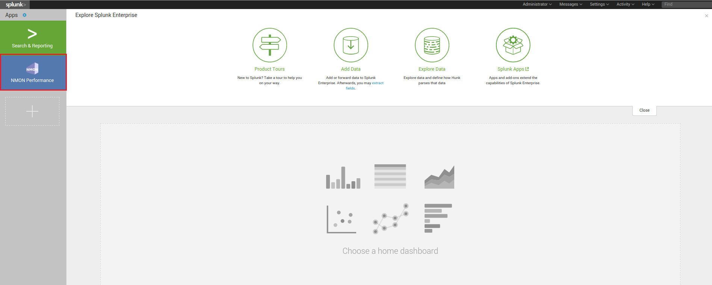
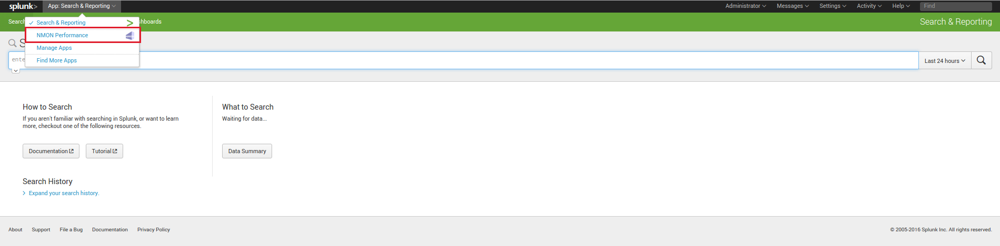

================================
Deploy to single server instance
================================

.. _standalone_deployment_guide:

------------------------------------
Installation for standalone instance
------------------------------------

**Standalone deployment: A single Splunk instance does all**

*Software components:*

* **Core App**: This is the full package you download in Splunk Base (tgz archive)

* **PA-nmon**: Available in the resources directory of the Core App (tgz archive)

* **PA-nmon_light**: Available in the resources directory of the Core App (tgz archive)

* **TA-nmon**: Available in the resources directory of the Core App (tgz archive)

+------------------------+------------+---------------+-------------------+
| Splunk Instance        | Core App   | PA-nmon       | TA-nmon           |
| (role description)     |            | (and derived) |                   |
+========================+============+===============+===================+
| Standalone             |     X      |               | X (optional)      |
+------------------------+------------+---------------+-------------------+

*optional: The TA-nmon provides nmon performance and configuration collection for the host than runs the add-on, which is optional*

VIDEO TUTORIAL
==============

**Checkout this video demo:** https://www.youtube.com/watch?v=-0H-CJDIGDI

Installing with Splunk Web
==========================

**You can install the Application directly within Splunk Application management:**

1. Access the Application manager:

*Application Menu > Manage Apps*

2. Browse online for Nmon Performance Monitor App and follow Splunk standard app installation:

**Search for "nmon":**

Manual installation
===================

1. Download the tgz archive of Nmon Performance in Splunk Base:

https://splunkbase.splunk.com/app/1753

*See the Download page for more information and options*

2. Unarchive

*To install the application, simply unarachive the tgz file in the apps directory of Splunk, example:*

::

    cd /opt/splunk/etc/apps/
    tar -xvf nmon-performance-monitor-for-unix-and-linux-systems_*.tgz

3. And restart Splunk

::

    /opt/splunk/bin/splunk restart

Access the Application
======================

**After Splunk restart, you can directly access the application:**

**through its App icon:**

**Or the app menu bar:**

Generating performance and configuration data
=============================================

If you are running Splunk on **Linux, AIX or Solaris**, then you can generate Nmon performance data for the local machine running Splunk.

*Replace the TA-nmon_XXXX.tgz with current release of the TA-nmon:*

::

    cd /opt/splunk/etc/apps/
    tar -xvf /opt/splunk/etc/apps/nmon/resources/TA-nmon_XXXX.tgz

And restart Splunk:

::

    /opt/splunk/bin/splunk restart

