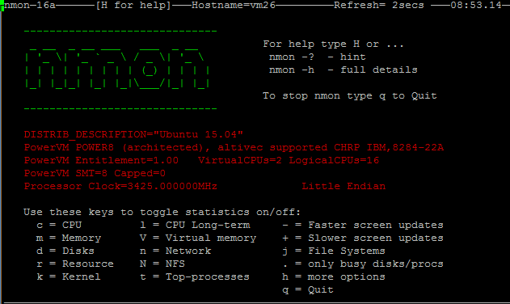

============
Introduction
============

**NMON is short for Nigel's Performance Monitor, it is available on AIX Systems, Solaris (with Sarmon), and Linux Systems.**

* nmon for Linux is open source under GPL: http://nmon.sourceforge.net

* nmon for AIX is not open source but is integrated into topas command from:

   * AIX 5.3 TL09
   * AIX 6.1 TL02

See: http://www.ibm.com/developerworks/wikis/display/WikiPtype/nmon

* nmon for Solaris (formerly sarmon) is open source and available for Solaris 10/11: http://www.geckotechnology.com/sarmon

This is a great "all in one" Performance Monitor tool that provides a very large amount of system performance information, and it can be used in different scenarios.

The first way to use NMON is running the "nmon" command in terminal, which opens a Real time monitoring terminal interface, giving you access to many system metrics within a single screen:

nmon is also very often used as a Capacity Planning and Performance tool by running the nmon process in a csv generating mode all along it's run time, for later cold Analyse.

**Here are some useful links about NMON:**

* http://nmon.sourceforge.net/pmwiki.php
* http://www.ibm.com/developerworks/aix/library/au-analyze_aix
* http://www-01.ibm.com/support/knowledgecenter/ssw_aix_71/com.ibm.aix.cmds4/nmon.htm
* http://www-01.ibm.com/support/knowledgecenter/ssw_aix_71/com.ibm.aix.cmds5/topas.htm
* http://nmon.sourceforge.net/pmwiki.php
* http://www.geckotechnology.com/fr/sarmon

Analysing NMON csv data is not easy because it has a very specific format Splunk cannot directly manage. (One big problem stands in the event time stamp identification which is very uncommon and defined by a non time stamp pattern)

This is why i decided to develop this App, based on my own professional experience in Unix systems Capacity Planning, to provide to anyone interested a powerful too to Analyse NMON data with an Enterprise Class Application.

************
How it works
************

**In a few words, here is how the App works:**

* After installation, the App is ready to be used, out of the Box

* The Application will create a dedicated index called "nmon"

Default installation has a file monitor that watches for any new nmon file located in $SPLUNK_HOME/var/nmon_repository (note: $SPLUNK_HOME refers to the Splunk root directory of your installation)

When a new file is found by Splunk Archive Processor (such as any monitored file or directory), Splunk will call a third party Python or Perl script

* Converter scripts "nmon2csv.py / nmon2csv.pl" will translate nmon performance data into multiple csv files in $SPLUNK_HOME/var/nmon/var/csv_repository

* Converter scripts "nmon2csv.py / nmon2csv.pl" will translate nmon configuration data into a single csv file in $SPLUNK_HOME/var/nmon/var/config_repository

These csv files are indexed by Splunk in "batch" mode, meaning index and delete (this is volatile data)

Once indexed, NMON Data is immediately available in various provided views and dashboards

*********************
Splunk Data structure
*********************

**Within the index nmon, the data is stored in several sourcetypes**

**Since the version 1.6.14, the application uses eventtypes**

---------
nmon_data
---------

Performance metrics data ordered by the key "type" which corresponds to the nmon section metric item (CPU_ALL, LPAR…)::

   index=nmon sourcetype=nmon_data

Eventtype:::

   eventtype=nmon:performance

-----------
nmon_config
-----------

Configuration data extracted by nmon2csv converters, corresponds to AAA and BBB* sections of nmon raw data::

   index=nmon sourcetype=nmon_config

Eventtype:::

   eventtype=nmon:config

------------
nmon_collect
------------

Output of the nmon_helper.sh script which is responsible for nmon instances launches::

   index=nmon sourcetype=nmon_collect

Eventtype:::

   eventtype=nmon:collect

---------------
nmon_processing
---------------

Output of nmon2csv Python and Perl converters (conversion of nmon raw data into csv data)::

   index=nmon sourcetype=nmon_processing

Eventtype:::

   eventtype=nmon:collect

----------
nmon_clean
----------

Output of the nmon_cleaner.sh script (interface to nmon_helper.py | nmon_helper.pl) which is responsible for nmon raw data file cleaning::

   index=nmon sourcetype=nmon_clean

Eventtype:::

   eventtype=nmon:clean

******************
Available packages
******************

**There are 3 main packages you need to consider:**

* The ***Nmon core*** Application: this is the whole package you download in Splunk App (directory called "nmon")

* The ***PA-nmon*** addon, available in the "resources" directory of the core App, this package is expected to be deployed in peer nodes of an indexer cluster
* The ***TA-nmon*** addon, available in the "resources" directory of the core App, can be deployed to any AIX / Linux / Solaris UF client, Heavy Forwarder instances, master node of a cluster, deployment server or standalone instances

The PA-nmon and TA-nmon packages are available in the **resources** directory of the Nmon core application you download in Splunk Base.

