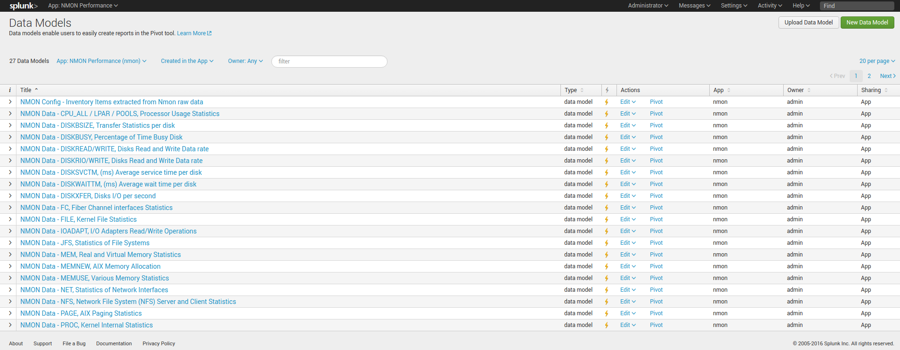
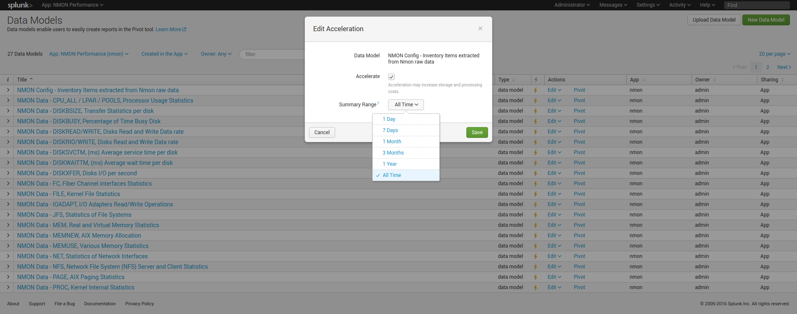
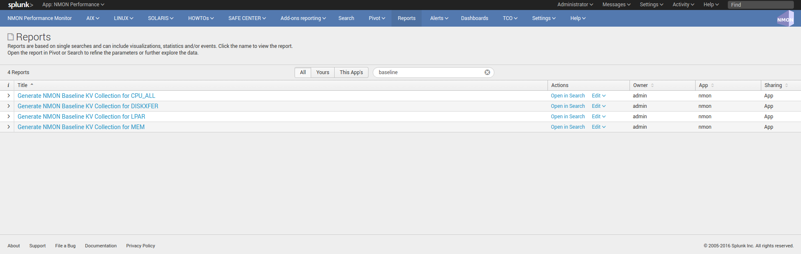

.. _large_scale_deployment:

=====================================
Large scale deployment considerations
=====================================

**If you are planing to deploy Nmon in a large scale scenario for thousands of servers, please read carefully the following documentation.**

Nmon for Splunk Enterprise can easily be deployed to thousands and thousands of nodes, however there are things that should be considered to optimize at the best your Splunk and Nmon deployment.

The following items will help you controlling and optimizing your Nmon deployment at large scale.

Please also review the :ref:`total_cost_of_ownership` documentation.

Data model acceleration
"""""""""""""""""""""""

Accelerated data models are massively used in the application, this implementation provides exceptional performances of searches, and a great user experience.
However, data models have a cost in term of storage and system resources utilization for acceleration build and maintenance.

**Splunk certification requirements prohibit the default activation of data models acceleration.**

**Since version 1.9.12, none of the data models are accelerated by default, this is your responsibility to decide if you wish to do so, bellow are the recommended acceleration parameters:**

- metrics related data models accelerated over a period of 1 year
- non metrics data models accelerated over the last 30 days (Nmon config, Nmon processing)

*nmon/default/datamodels.conf*

::

    acceleration.earliest_time = -1y

Restricting the acceleration period will helping reducing:

- The amount of storage used per data model for the acceleration
- The amount of time required for initial build or total rebuild of the acceleration, as well as the amount of system resources (CPU, memory) that are temporarily required on indexers to build the acceleration

Note that The maintenance cost, which refers to operation that Splunk operates periodically to maintain the state of acceleration, will not necessary be different with a large or a small period.

Also, rolling restart of clustered indexers will generate a partial verification and/or rebuild of data model acceleration, with large set of data this can imply a temporarily high level of resource usage on indexers following the rolling restart.

Finally, take care not to reduce too much the acceleration period, searches out of the acceleration period are still possible but at the price of much more poor performances.

**Restricting the acceleration period of data models:**

*please refer to Splunk documentation:* https://docs.splunk.com/Documentation/Splunk/latest/Admin/Datamodelsconf

You can easily customize the acceleration period by creating a local copy of the datamodels.conf under the "local" directory.

Then, for each data model, ensure to set the required period, example with a 3 months period:

::

    acceleration.earliest_time = -3mon

Acceleration setting of data models can also be managed directly in Splunk Web:

*Settings / Data models:*

Indexes settings, retention and rolling buckets
"""""""""""""""""""""""""""""""""""""""""""""""

**Hot DB bucket size for large volume:**

If you are indexing 10GB or more per day, then you should set the maxDataSize, according to Splunk spec: https://docs.splunk.com/Documentation/Splunk/latest/Admin/Indexesconf

::

    maxDataSize = auto_high_volume

This settings can take place in a local/indexes.conf configuration file of the PA-nmon, or the indexes.conf if you arenot using the PA-nmon

**Retention:**

Ensure you set the retention of the nmon index according to your needs, See: http://docs.splunk.com/Documentation/Splunk/latest/Indexer/Setaretirementandarchivingpolicy

**Rolling buckets and buckets management:**

Ensure you set the better configuration possible according to your environment, such as using faster disks for hot and warm buckets.

For more information, See: https://docs.splunk.com/Documentation/Splunk/latest/Indexer/HowSplunkstoresindexes

Alerting customization
""""""""""""""""""""""

**By default, the Nmon Performance application has several alerting reports configured:**

- NMON - File System % usage exceeds 90% (5 consecutive minutes minimal duration)
- NMON - Real Memory % usage exceeds 90% (5 consecutive minutes minimal duration)
- NMON - Virtual Memory % usage exceeds 40% (5 consecutive minutes minimal duration)
- NMON - IBM PSERIES Pools CPU % usage exceeds 90% (5 consecutive minutes minimal duration)
- NMON - CPU % usage exceeds 90% (5 consecutive minutes minimal duration)
- NMON Collect - duplicated nmon instances may occur (excessive nbr of process launched)

These reports will run every five minutes.
Excepting the "NMON Collect", they all use the same variation of macros, by default these alerting reports will scan for all hosts.

For instance the CPU alert has the following definition:

::

    `alerting_cpu_usage(*,*,90,300,5m)`

Which stands for the macro definition:

::

    [alerting_cpu_usage(5)]
    args = frameID,hostname,alert_usage,min_duration,max_pause

As exposed, these alerts will scan for every host available, you may want to restrict them to a given list of hosts, such as your production servers only, and so on.

You can restrict the scope of the search using wildcard characters (*), such as restricting frameIDs or hostnames, you can even create your own macros based on the provided models if you need more complex restrictions. (such as using booleans)

Note: If you are not using IBM frames, you san safely disable the schedule of the "NMON - IBM PSERIES Pools CPU % usage exceeds 90% (5 consecutive minutes minimal duration)"

**Each customization must be achieved through Splunk Web, or stored in local version of configuration files to be upgrade resilient**

Baseline KVstore management
"""""""""""""""""""""""""""

**Nmon Performance for Splunk implements different KVstore known as the "baseline KVstores", and used within the baseline interfaces.**

These KVstore are being filled by scheduled reports and provide advanced analysis of usual system resources usage to help you determining anomalies on your systems.

.. image:: img/baseline2.png
   :alt: baseline2.png
   :align: center

By default, the KVstores will contain data for all of the available servers within your deployment, in a large scale deployment you might want to limit these features to important servers, such as production servers only.

The following reports are being used to generate KVstore data once a week:

You can optionally customize these reports to filter out servers or focus on particular environment such as production servers only, which will limit the volume of data being stored in these KVstores.

**Kvstores are hosted by search heads and do not need to be replicated to your indexers, resources that will be used to host these KVstores:**

- Storage: Very large KVstores containing data for thousands of server may require a few GB of storage on your search heads
- Physical memory: As well, KVstores have physical memory costs, very large KVstores can impact your memory utilization on search heads
- Reports runtime: The more server you have, the more time these reports might need to complete, they run by default on Sunday basis, you can manage the scheduling differently according to your own constraints

Open these reports in Splunk Web and modify the root search to limit the scope of the searches, you can also manage the searches in a local version of "savedsearches.conf".

**For upgrade resiliency considerations, do not modify the default/savedsearches.conf configuration file.**

Managing nmon collection and volume of data
"""""""""""""""""""""""""""""""""""""""""""

By default, the technical add-ons provided with the Nmon Performance application will generate performance data with a 1 minute accuracy between 2 performances collection.

These features can be easily controlled through an internal process using a customized version of the "nmon.conf" configuration file.

See: :ref:`manage_volume_per_server`

The Nmon Performance technical add-ons generates csv flows of data, as such the volume of data to be generated is already really optimised and reduced to the maximum.

However, you can choose to limit licence usage and storing costs by increasing the time between 2 performance collections, a common choice might be to increase this time to 2 or 3 minutes.
