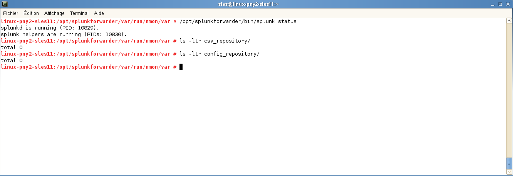
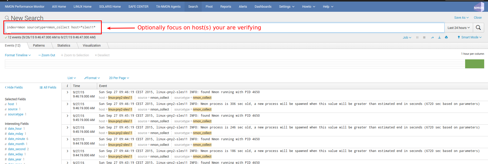
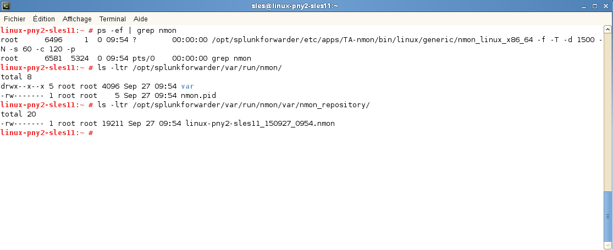

===================
Reference Materials
===================

------------------------------------------------------------------
nmon2csv.sh / nmon2csv.py / nmon2csv.pl - Nmon raw data converters
------------------------------------------------------------------

**nmon2csv converters: Csv conversion of Nmon Performance and Configuration data**

Since the major release V1.7, all data generation pieces were migrated to the TA-nmon and PA-nmon add-on, these information are only valid for these add-on and the core application does not implement any input anymore

Formerly nmon2csv, these are Nmon converters which will translate Nmon structured data into data Splunk will index and be able to manage.

**2 different version of the nmon2csv are provided:**

* Python : nmon2csv.py
* Perl : nmon2csv.pl

Since the release 1.6.0, the Application uses by default the "nmon2csv.sh" which is shell wrapper for nmon2csv converters, it will automatically choose between Python and Perl depending on their availability on systems, such that you don't have to care about about that.

Both Python and Perl versions only uses core modules, such that they can be executed without having to install anything specifically.

These script are automatically Invoked by the Splunk Archive Processor whenever required, and reads data from standard input (stdin).

**Here is how things will work:**

* An input file monitor watches for any file with the ".nmon" extension (see inputs.conf)
* The input file uses the "nmon_processing" sourcetype
* This sourcetype (see documentation:configuration-files:propsconf) will tell Spluk to automatically call the shell wrapper and finally the Python or Perl converter, depending on the configuration
* Splunk will read the entire nmon file, and will send to the converter (like a "cat <my file>" would)
* Converters will read data coming from standard input (stdin)
* Converters will proceed to various analysis of the file: Has it been already proceeded (Splunk reads the file twice), is the nmon file consistent, is the nmon currently updated (real time mode)
* Converters will identify if the file must be considered in real time mode (the nmon instance that holds this file is currently running) or cold data mode (the nmon instance has terminated)

**Depending on the mode:**

* In real time mode, generates csv data older than last saved iteration
* In cold data mode, generates csv data for all available data

*csv data is automatically indexed, then deleted*

**Manually running Nmon processing:**

Every time the nmon raw data file is updated, Splunk automatically streams the content of the file to the "nmon2csv.sh" shell wrapper

The "nmon2csv.sh" shell wrapper will stream the data to the Python "nmon2csv.py" converter or the Perl "nmon2csv.pl" converter

This will generate required data into $SPLUNK_HOME/var/run/nmon/var

*The output of nmon processing is logged within the sourcetype=nmon_processing:*

::

    eventtype=nmon:processing

.. image:: img/reference_material1.png
   :alt: reference_material1.png
   :align: center

**Search for host(s) you are troubleshooting:**

.. image:: img/reference_material2.png
   :alt: reference_material2.png
   :align: center

*Many useful information are automatically logged to inform about the nmon processing step, such like sections processed and number of events generated per monitor*

**Related internal events can also be very useful for troubleshooting purposes, if the nmon processing steps fails for some reasons (such as unsatisfied Perl dependencies or interpreter incompatibility) these information will be automatically logged by splunkd in Splunk internal events:**

.. image:: img/reference_material3.png
   :alt: reference_material3.png
   :align: center

*Notice that every time the nmon raw file is read by Splunk, each step of data processing is logged*

**Manual processing for debugging purposes:**

**You can easily manually debug the nmon processing step by running following commands:**

::

    cat <raw data file> | /opt/splunkforwarder/bin/splunk cmd /opt/splunkforwarder/etc/apps/TA-nmon/bin/nmon2csv.sh

*Note that as csv files generated by the Nmon processing step are automatically consumed, the easiest way to troubleshoot is stopping Splunk and running the above command*

**Example of debug operation stopping Splunk:**

.. image:: img/reference_material4.png
   :alt: reference_material4.png
   :align: center

.. image:: img/reference_material5.png
   :alt: reference_material5.png
   :align: center

**After this manual troubleshoot verification, start Splunk and notice that csv files generated are automatically deleted by Splunk (batch mode indexing):**

----------------------------------------------------------------------------
nmon_cleaner.sh / nmon_cleaner.py / nmon_cleaner.pl - Nmon raw data cleaners
----------------------------------------------------------------------------

**nmon_cleaner.sh / nmon_cleaner.py / nmon_cleaner.pl:**

Since the major release V1.7, all data generation pieces were migrated to the TA-nmon and PA-nmon add-on, these information are only valid for these add-on and the core application does not implement any input anymore

These scripts will be used by the App to manage the retention of raw Nmon data files.

**In default configuration, raw Nmon files will be locally kept during 7 days.**

Note that these scripts can be used to ensure csv data will always automatically purged on your forwarders, in case of unexpected error (such as batch mode non working), this can prevent from blocking the Universal Forwarder (running ouf of file handle)

The shell script "nmon_cleaner.sh" is now called in default configuration, if Python 2.7.x is found, then the Python version will be used. If no Python 2.7.x interpreter could locally be found, the Perl version will be automatically launched. Please see inputs.conf for more information.

--------------------------------------
nmon_helper.sh - Nmon binaries starter
--------------------------------------

**nmon_helper.sh**

Since the major release V1.7, all data generation pieces were migrated to the TA-nmon and PA-nmon add-on, these information are only valid for these add-on and the core application does not implement any input anymore

This is a third party Shell script used to collect the NMON performance data for AIX / Linux / Solaris hosts.
Written in sh, it does not have any specific requirements and should work with any Operating System.
At starting time, the script will operate a few verifications and will start the Nmon binary if required.

Since the version 1.5.0 of the Nmon App, main Nmon options can be controlled by the nmon.conf file (located in default directory), for customization purposes you can create your own version of the nmon.conf file in your local directory, changes will be permanent and upgrade resilient.

**The output of nmon_helper.sh script is logged within the sourcetype=nmon_collect:**

::

    eventtype=nmon:collect

.. image:: img/reference_material7.png
   :alt: reference_material7.png
   :align: center

**Search for ho(s) you are troubleshooting:**

**The nmon process must be visible on the remote host, example:**

*The nmon_helper.sh generates directory structure under $SPLUNK_HOME/var/run/nmon - The nmon raw data file is stored under nmon_repository - the nmon.pid file contains the PID number of the current running Nmon binary*

**For debugging purposes, the nmon_helper.sh can be run manually using the following command:**

::

    /opt/splunkforwarder/bin/splunk cmd /opt/splunkforwarder/etc/apps/TA-nmon/bin/nmon_helper.sh

*Example:*

.. image:: img/reference_material10.png
   :alt: reference_material10.png
   :align: center

