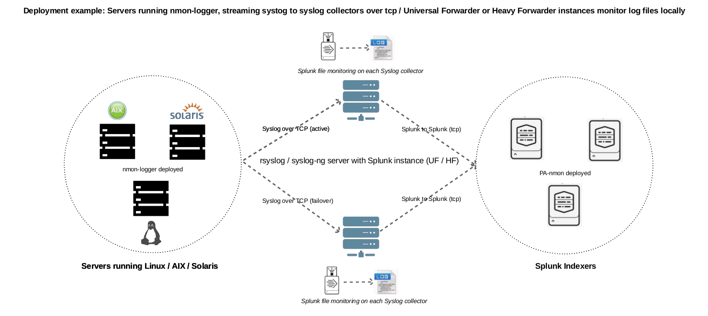
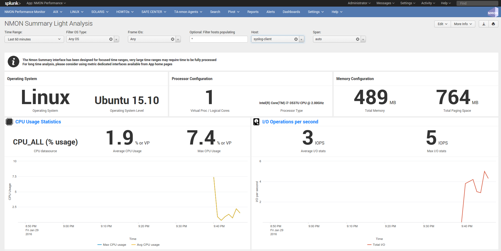

================================
rsyslog / nmon-logger deployment
================================

.. _rsyslog_deployment:

**Syslog deployment topology - Generate and forward Nmon performance data from rsyslog clients to your centralized rsyslog servers**

Introduced with the Nmon Performance Monitor 1.6.14, you can now get real time Nmon data from end servers without any Splunk Universal Forwarders deployment.

**This will be achieved using:**

* The nmon-logger package to be deployed on servers: https://github.com/guilhemmarchand/nmon-logger

* rsyslog locally available on servers and configured to send data to central syslog servers

* Splunk Universal or Heavy Forwarder instance installed in rsyslog servers (collector or additional relays) that will monitor and send data in a "key=value" format to Splunk

* Optionally, a deployment tool manager like (Ansible, Chef…) is recommended, note that Playbooks for Ansible are provided with the nmon-logger package

*Please review requirements in the above section.

**Fast testing using Vagrant and Ansible:**

If you are interested in a very fast and automated way to test the Nmon Performance Application with an rsyslog deployment, checkout the provided configuration using the excellent Vagrant (https://www.vagrantup.com/) and Ansible configuration management (http://docs.ansible.com/ansible/index.html)

* Checkout: https://github.com/guilhemmarchand/nmon-logger/tree/master/vagrant-ansible-demo-rsyslog

In about 5 minutes, have a running and automated deployment working !

Key concepts of an rsyslog deployment
"""""""""""""""""""""""""""""""""""""

**Why an rsyslog topology versus Universal Forwarders deployment ?:**

At first, this provides a powerful and resilient alternative way to deploy the Nmon Performance monitor
Syslog is a Unix / Linux standard, and available on many servers
Because you may already have an rsyslog centralization available and you do not want to deploy any additional software on servers
Because sometimes companies want to rely on standard tools, deploying Universal Forwarders is not an option

**Key concepts :**

100% of Application functionality over a traditional Universal Forwarders deployment
In a standard deployment of the TA-nmon and the Nmon Performance application, hosts generates Nmon Performance in csv structured data
To be transported over syslog, csv data are being transformed in a key=value format
While csv structured data is known in Splunk as "an indexing field structure", key=value format will be extracted on the fly (parsing at extraction time)
csv structured data has an higher disk space cost but offers a very low level of volume of data to index (and so a low level of licence cost), and offers best performances at search time in SPL (Search Language Processing)
key=value format generates an higher volume of data and requires more power at extraction time, but it does not generate indexed fields, this also represents less disk space
Nmon Performance massively uses data model acceleration, key=value searching performance versus csv structured data will not be different from standard deployment

**Can i send data directory from rsyslog to Splunk ? Why is not a recommended scenario:**

Yes it is possible, but this is not the deployment topology i would recommend for multiple reasons, as exposed above:

You cannot guarantee that rsyslog will send data in the order it should, this is especially true with multi-line events that could be mixed between hosts
rsyslog can easily identify the host origin of the incoming data and generate per host files, which guarantees management of Nmon data (like large multi-line configuration data)
For resilient reasons, once it is configured, you will few often restart rsyslog. (most often while rebooting the machine)
This is less true with Splunk as you will want to upgrade it from time to time, or deploy new configuration or application to manage new data
Finally rsyslog speaks to rsyslog, with the same native implementation and functionalities

**What about the nmon-logger deployment management ?:**

In standard Universal Forwarder management, you can easily rely on native Splunk deployment servers to push and maintain the TA-nmon package
This is not true in a syslog deployment, and you will need to deploy manually, or much most probably using your deployment management tools (Pupper, Chef, Ansible, custom scripts…)
The nmon-logger comes with Ansible Playbooks example you can easily adapt to your context, and use for auto deployments !

**Topology: Examples of possible implementations:**

**Example 1: Splunk Universal or Heavy forwarder installed on main rsyslog collectors:**

**Example 2: Splunk Universal or Heavy forwarder installed third party servers running rsyslog:**

.. image:: img/rsyslog2.png
   :alt: rsyslog2.png
   :align: center

+++++++++++++++
PRE-REQUISITES:
+++++++++++++++

**Splunk + Nmon Performance app:**

First of all, have a Splunk working installation, and the Nmon Performance up and running ! (yeah, songs like an evidence :-)

Some specific requirements must be respected to achieve a deployment that uses rsyslog as the transport layer:

**RSYSLOG V8.x:**

For obvious reasons, Rsyslog v8.x is required to forward Nmon Performance data to centralized rsyslog servers, see:

http://www.rsyslog.com/

On end servers, the "imfile" plugin will be used to read and collect Nmon Performance data.

**PYTHON 2.7.x or PERL with the module Time::HiRes:**

The nmon-logger will by default search for a Python 2.7.x environment.
If it is not available, scripts will use Perl, when using Perl note that the Time::HiRes module is required.

+++++++++++++++++++++++++++++++++++++++++++++++++++++
STEP 1 : Rsyslog configuration for central collectors
+++++++++++++++++++++++++++++++++++++++++++++++++++++

A minimal configuration is required on Syslog collectors, this will make rsyslog to listen on a dedicated TCP port to receive incoming data from end servers.

In the following example, rsyslog will listen to the TCP / 514 port:

**Let's create a central configuration:**

NOTE: Ensure the prefix value is always higher than the prefix value for your nmon_performance logging config file (20 in the example above) to prevent data duplication

::

    /etc/rsyslog/rsyslog.d/99-central_logging.conf

    # rsyslog configuration for central logging
    # Note: 'rsyslog-central' must be replaced to match your hostname
    # 'localhost' is expected to work, but some persistent cases shown that only
    # setting to the real value of the host name prevents from logging local log duplicated
    # in remote location

    # provides TCP syslog reception
    $ModLoad imtcp
    $InputTCPServerRun 514

    # Set the global dynamic file
    $template PerHost, "/var/log/remote-hosts/%HOSTNAME%/%HOSTNAME%.log"

    if ($hostname != 'syslog-central') then ?PerHost
    & stop

**Create the directory and correctly set permissions for syslog user:**

::

    mkdir /var/log/remote-hosts

    chown syslog:syslog /var/log/remote-hosts

**Finally, create a configuration file that catch Nmon Performance events and log it in dedicated files:**

::

    /etc/rsyslog/rsyslog.d/20-nmon-performance.conf

    # Nmon Performance configuration (validated over rsyslog 8.15)

    # Turn off non printable chars replacing
    $EscapeControlCharactersOnReceive off

    # Set the global dynamic file
    $template DynFile,"/var/log/nmon-performance/%HOSTNAME%/%programname%.log"

    if $programname startswith 'nmon_performance' then ?DynFile
    & stop

    if $programname startswith 'nmon_config' then ?DynFile
    & stop

    if $programname startswith 'nmon_collect' then ?DynFile
    & stop

    if $programname startswith 'nmon_processing' then ?DynFile
    & stop

    if $programname startswith 'nmon_clean' then ?DynFile
    & stop

**Create the directory and correctly set permissions for syslog user:**

::

    mkdir /var/log/nmon-performance

    chown syslog:syslog /var/log/nmon-performance

**Restart Rsyslog:**

::

    sudo service rsyslogd restart

++++++++++++++++++++++++++++++++++++++++++++++
STEP 2 : Rsyslog configuration for end servers
++++++++++++++++++++++++++++++++++++++++++++++

Each of your end servers must be configured to send its syslog data to the central rsyslog server.

Having a deployment tool in place like Ansible is a very good idea :-)

**First, let's activate the imfile module that will be used to read and send Nmon Performance data:**

::

    /etc/rsyslog.conf

In the MODULES section, add:

::

    module(load="imfile")    # if you want to tail files

**Now, create the central client configuration that forwards local log to rsyslog central servers:**

::

    /etc/rsyslog.d/01-central-syslog.conf

    *.* @@syslog-central:514

rsyslog has native support for fail over data forwarding, if you have a backup rsyslog collectors:

If the first rsyslog server is unavailable, data will be forwarded to the backup server, if none are available, data is being temporily stored until one of remote servers is up again:

See: http://wiki.rsyslog.com/index.php/FailoverSyslogServer

::

    *.* @@syslog-central:514
    $ActionExecOnlyWhenPreviousIsSuspended on
    *.* @@syslog-central:514
    *.* @@syslog-central2:514
    & /var/log/localbuffer
    $ActionExecOnlyWhenPreviousIsSuspended off

**Restart Rsyslog:**

::

    sudo service rsyslogd restart

Immediately after the restart, rsyslog starts to forward data to central rsyslog servers.

+++++++++++++++++++++++++++++++++++++++++++++++++++
STEP 3 : Deploy the nmon-logger to your end servers
+++++++++++++++++++++++++++++++++++++++++++++++++++

On each end server, you must deploy the "nmon-looger" package:

https://github.com/guilhemmarchand/nmon-logger

Ansible Playbooks are available in the Git repository, with Ansible the nmon-logger package is being totally deployed, up and running in a few seconds !!!

**Deploying manually must be achieve the following way:**

**If not existing, create a system account for the non privilege "nmon" user:**

::

    useradd -r -m -c "system account for nmon-logger" nmon

Copy each file and directory to its destination by respecting the files and directories structure from the package

**Package content description:**

::

    ###################################
    ### Content:                    ###
    ###################################

    ### nmon-logger-rsyslog: ###

    etc/
        cron.d/nmon-logger
        logrotate.d/nmon-logger
        nmon-logger/
            bin/(various)
            default/nmon.conf
        rsyslog.d/20-nmon-logger.conf

**Set correct permissions for each piece of the package:**

**Execute these commands as root:**

::

    mkdir /var/log/nmon-logger; chown nmon:nmon /var/log/nmon-logger; chmod 0755 /var/log/nmon-logger

    chown -R nmon:nmon /etc/nmon-logger; chmod -R 0755 /etc/nmon-logger

    chown nmon:nmon /etc/cron.d/nmon-logger; chmod 0644 /etc/cron.d/nmon-logger

    chown nmon:nmon /etc/logrotate.d/nmon-logger; chmod 0644 /etc/logrotate.d/nmon-logger

    chown nmon:nmon /etc/rsyslog.d/20-nmon-logger.conf; chmod 0644 /etc/rsyslog.d/20-nmon-logger.conf

++++++++++++++++++++++++++++++++++++++++
OPTIONAL : Verification on end server(s)
++++++++++++++++++++++++++++++++++++++++

For trouble shooting or verification purposes, you may want to verify that things are working fine on the server where the nmon-logger has been deployed.

Nmon processes:

After a few minutes upon the deployment, a new nmon process must be running:

::

    root@syslog-client:/var/log/nmon-logger# ps -ef | grep nmon
    nmon      7029     1  0 22:07 ?        00:00:00 /etc/nmon-logger/bin/linux/generic/nmon_linux_x86_64 -f -T -d 1500 -s 60 -c 120 -p

Various log will be generated about nmon data management:

::

    root@syslog-client:/var/log/nmon-logger# ls -ltr /var/log/nmon-logger/
    total 156
    -rw-rw-r-- 1 nmon nmon   3441 janv. 26 21:15 nmon_clean.log
    drwxrwxr-x 6 nmon nmon   4096 janv. 27 22:07 var
    -rw-rw-r-- 1 nmon nmon  18719 janv. 27 22:10 nmon_collect.log
    -rw-rw-r-- 1 nmon nmon 122781 janv. 27 22:10 nmon_processing.log

And Nmon Performance data:

::

    root@syslog-client:/var/log/nmon-logger# ls -ltr /var/log/nmon-logger/var/*
    -rw-rw-r-- 1 nmon nmon    5 janv. 27 22:07 /var/log/nmon-logger/var/nmon.pid

    /var/log/nmon-logger/var/config_repository:

    total 112
    -rw-rw-r-- 1 nmon nmon 111509 janv. 27 22:07 nmon_configdata.log

    /var/log/nmon-logger/var/perf_repository:
    total 6068
    -rw-rw-r-- 1 nmon nmon 6206333 janv. 27 22:12 nmon_perfdata.log

Et voila !

+++++++++++++++++++++++++++++++++++++++++++++
OPTIONAL : Verifications on syslog collectors
+++++++++++++++++++++++++++++++++++++++++++++

On active rsyslog collectors, a directory with the name of the server will host Nmon logs:

::

    root@syslog-central:~# ls -ltr /var/log/nmon_performance/*/*
    -rw-r----- 1 syslog adm   670272 janv. 27 22:07 /var/log/nmon_performance/syslog-client/nmon_config.log
    -rw-r----- 1 syslog adm    74711 janv. 27 22:55 /var/log/nmon_performance/syslog-client/nmon_clean.log
    -rw-r----- 1 syslog adm   299929 janv. 27 22:56 /var/log/nmon_performance/syslog-client/nmon_collect.log
    -rw-r----- 1 syslog adm 35814228 janv. 27 22:56 /var/log/nmon_performance/syslog-client/nmon_performance.log
    -rw-r----- 1 syslog adm  2554165 janv. 27 22:56 /var/log/nmon_performance/syslog-client/nmon_processing.log

++++++++++++++++++++
STEP 4 : Splunk it !
++++++++++++++++++++

The last step is getting the data indexed in Splunk:

Have Splunk forwarding data to your indexer(s)
Deploy the TA-nmon to your instance

**Create a local/inputs.conf to index Nmon Performance data, example:**

::

    # inputs.conf

    [monitor:///var/log/nmon_performance/.../nmon_performance.log]
    disabled = false
    index = nmon
    sourcetype = nmon_data:fromsyslog
    source = perfdata:syslog

    [monitor:///var/log/nmon-performance/.../nmon_config.log]
    disabled = false
    index = nmon
    sourcetype = nmon_config:fromsyslog
    source = configdata:syslog

    [monitor:///var/log/nmon-performance/.../nmon_collect.log]
    disabled = false
    index = nmon
    sourcetype = nmon_collect:fromsyslog
    source = nmon_collect:syslog

    [monitor:///var/log/nmon-performance/.../nmon_clean.log]
    disabled = false
    index = nmon
    sourcetype = nmon_clean:fromsyslog
    source = nmon_cleaner:syslog

    [monitor:///var/log/nmon-performance/.../nmon_processing.log]
    disabled = false
    index = nmon
    sourcetype = nmon_processing:fromsyslog
    source = nmon_processing:syslog

**Restart Splunk**

Et voilà !

If everything is fine in your configuration, you should start to receive incoming data in Nmon Performance monitor application.

++++++++++++++++++++++++++++
OPTIONAL : Check your work !
++++++++++++++++++++++++++++

Running a search over the hostname of the end server:

.. image:: img/rsyslog_result1.png
   :alt: rsyslog_result1.png
   :align: center

Interface example:

