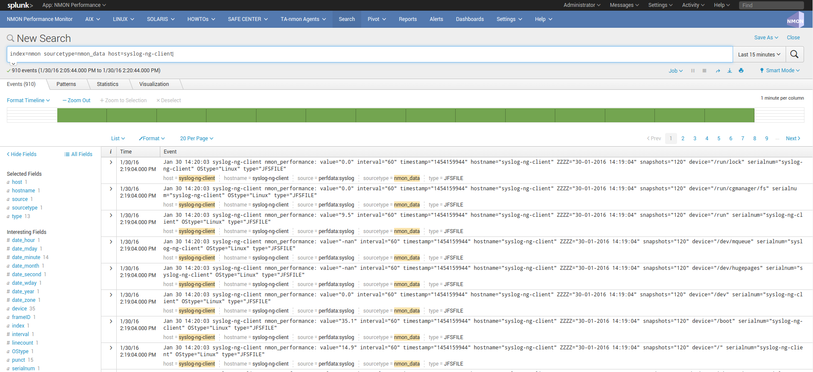
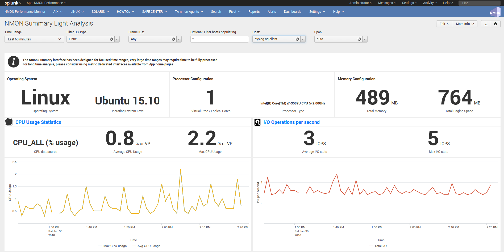

==================================
syslog-ng / nmon-logger deployment
==================================

.. _syslogng_deployment:

**Syslog deployment topology - Generate and forward Nmon performance data from syslog-ng clients to your centralized syslog-ng servers**

Introduced with the Nmon Performance Monitor 1.6.14, you can now get real time Nmon data from end servers even without any Splunk Universal Forwarders deployment.

**This will be achieved using:**

* The nmon-logger package to be deployed on servers: https://github.com/guilhemmarchand/nmon-logger
* syslog-ng locally available on servers and configured to send data to central syslog servers
* Splunk Universal or Heavy Forwarder instance installed in syslog-ng servers (collector or additional relays) that will monitor and send data in a "key=value" format to Splunk

*Optionally, a deployment tool manager like (Ansible, Chef…) is recommended, note that Playbooks for Ansible are provided with the nmon-logger package*

**Please review requirements in the above section.**

**Fast testing using Vagrant and Ansible:**

If you are interested in a very fast and automated way to test the Nmon Performance Application with an rsyslog deployment, checkout the provided configuration using the excellent Vagrant (https://www.vagrantup.com/) and Ansible configuration management (http://docs.ansible.com/ansible/index.html)

* Checkout: https://github.com/guilhemmarchand/nmon-logger/tree/master/vagrant-ansible-demo-syslog-ng

In about 5 minutes, have a running and automated deployment working !

**Key concepts of an syslog-ng deployment:**

**Why an syslog topology versus Universal Forwarders deployment ?:**

* At first, this provides a powerful and resilient alternative way to deploy the Nmon Performance monitor
* Syslog is a Unix / Linux standard, and available on many servers
* Because you may already have an syslog-ng centralization available and you do not want to deploy any additional software on servers
* Because sometimes companies want to rely on standard tools, deploying Universal Forwarders is not an option

**Key concepts :**

* 100% of Application functionalities over a traditional Universal Forwarders deployment
* In a standard deployment of the TA-nmon and the Nmon Performance application, hosts generates Nmon Performance in csv structured data
* To be transported over syslog, csv data are being transformed in a key=value format
* While csv structured data is known in Splunk as "an indexing field structure", key=value format will be extracted on the fly (parsing at extraction time)
* csv structured data has an higher disk space cost but offers a very low level of volume of data to index (and so a low level of licence cost), and offers best performances at search time in SPL (Search Language Processing)
* key=value format generates an higher volume of data and requires more power at extraction time, but it does not generate indexed fields, this also represents less disk space
* Nmon Performance massively uses data model acceleration, key=value searching performance versus csv structured data will not be different from standard deployment

**Can i send data directory from syslog-ng to Splunk ? Why is not a recommended scenario:**

*Yes it is possible, but this is not the deployment topology i would recommend for multiple reasons, as exposed above:*

* You cannot guarantee that syslog-ng will send data in the order it should, this is especially true with multi-line events that could be mixed between hosts
* syslog-ng can easily identify the host origin of the incoming data and generate per host files, which guarantees management of Nmon data (like large multi-line configuration data)
* For resilient reasons, once it is configured, you will few often restart syslog-ng. (most often while rebooting the machine)
* This is less true with Splunk as you will want to upgrade it from time to time, or deploy new configuration or application to manage new data
* Finally syslog speaks to syslog, with the same native implementation and functionalities

**What about the nmon-logger deployment management ?:**

* In standard Universal Forwarder management, you can easily rely on native Splunk deployment servers to push and maintain the TA-nmon package
* This is not true in a syslog deployment, and you will need to deploy manually, or much most probably using your deployment management tools (Pupper, Chef, Ansible, custom scripts…)
* The nmon-logger comes with Ansible Playbooks example you can easily adapt to your context, and use for auto deployments !

**Topology: Examples of possible implementations:**

**Example 1: Splunk Universal or Heavy forwarder installed on main syslog-ng collectors:**

.. image:: img/syslogng1.png
   :alt: syslogng1.png
   :align: center

**Example 2: Splunk Universal or Heavy forwarder installed third party servers running syslog-ng:**

.. image:: img/syslogng2.png
   :alt: syslogng2.png
   :align: center

+++++++++++++++
PRE-REQUISITES:
+++++++++++++++

**Splunk + Nmon Performance app:**

First of all, have a Splunk working installation, and the Nmon Performance up and running ! (yeah, songs like an evidence :-)

Some specific requirements must be respected to achieve a deployment that uses syslog-ng as the transport layer:

**SYSLOG-NG (V3.x minimal recommended):**

Syslog-ng is required to forward Nmon Performance data to centralized syslog-ng servers, see:

https://syslog-ng.org/

**PYTHON 2.7.x or PERL with the module Time::HiRes:**

The nmon-logger will by default search for a Python 2.7.x environment.
If it is not available, scripts will use Perl, when using Perl note that the Time::HiRes module is required.

++++++++++++++++++++++++++++++++++++++++++++++++++++++++
STEP 1 : Syslog-ng configuration for central collectors:
++++++++++++++++++++++++++++++++++++++++++++++++++++++++

A minimal configuration is required on Syslog collectors, this will make syslog-ng to listen on a dedicated TCP port to receive incoming data from end servers.

In the following example, syslog-ng will listen to the TCP / 514 port:

**Let's create a central configuration that will both log remote hosts messages and nmon-logger data (without duplicating them in both locations):**

*/etc/syslog-ng/conf.d/central.conf*

::

    # syslog-ng configuration for central logging

    options {
            time-reap(30);
            mark-freq(10);
            keep-hostname(yes);
            create-dirs(yes);
    };

    source s_tcp {
            tcp(port(514));
    };

    destination d_host-specific {
            file("/var/log/remote-hosts/$HOST/$HOST.log");
    };

    log {
           source(s_tcp);
           filter(f_nmon_performance); destination(d_nmon_performance); flags(final);
    };

    log {
           source(s_tcp);
           filter(f_nmon_config); destination(d_nmon_config); flags(final);
    };

    log {
           source(s_tcp);
           filter(f_nmon_collect); destination(d_nmon_collect); flags(final);
    };

    log {
           source(s_tcp);
           filter(f_nmon_processing); destination(d_nmon_processing); flags(final);
    };

    log {
           source(s_tcp);
           filter(f_nmon_clean); destination(d_nmon_clean); flags(final);
    };

    log {
            source(s_tcp);
            destination(d_host-specific);
    };

**Now create the nmon-logger configuration file:**

::

    */etc/syslog-ng/conf.d/nmon-logger.conf*

    # nmon-logger.conf

    # Generic options
    options {
            keep-hostname(yes);
            create-dirs(yes);
    };

    # setup destination for Nmon performance data
    destination d_nmon_performance {
            file("/var/log/nmon-performance/$HOST/nmon_performance.log" );
    };
    destination d_nmon_config {
            file("/var/log/nmon-performance/$HOST/nmon_config.log" );
    };
    destination d_nmon_collect {
            file("/var/log/nmon-performance/$HOST/nmon_collect.log" );
    };
    destination d_nmon_processing {
            file("/var/log/nmon-performance/$HOST/nmon_processing.log" );
    };
    destination d_nmon_clean {
            file("/var/log/nmon-performance/$HOST/nmon_clean.log" );
    };

    # filter all messages, on the "program" field.
    filter f_nmon_performance {
            program("nmon_performance");
    };
    filter f_nmon_config {
            program("nmon_config");
    };
    filter f_nmon_collect {
            program("nmon_collect");
    };
    filter f_nmon_processing {
            program("nmon_processing");
    };

    filter f_nmon_clean {
            program("nmon_clean");
    };

**Restart syslog-ng:**

::

    sudo service syslog-ng restart

+++++++++++++++++++++++++++++++++++++++++++++++++
STEP 2 : syslog-ng configuration for end servers:
+++++++++++++++++++++++++++++++++++++++++++++++++

Each of your end servers must be configured to send its syslog data to the central syslog-ng server.

Having a deployment tool in place like Ansible is a very good idea :-)

**Create the central client configuration that forwards local log to central servers:**

*/etc/syslog-ng/conf.d/client.conf*

::

    # Client configuration for central logging
    # log all syslog messages to remote syslog-ng server

    destination d_net { tcp("syslog-ng-central" port(514) log_fifo_size(1000)); };
    log { source(s_src); destination(d_net); };

*IMPORTANT: syslog-ng does not natively support fail over mechanism, such mechanism must be operating on Operating system level (OS cluster) or using third party software such as HA-proxy.*

**Restart syslog-ng:**

::

    sudo service syslog-ng restart

Immediately after the restart, syslog-ng starts to forward data to central syslog-ng server.

+++++++++++++++++++++++++++++++++++++++++++++++++++
STEP 3 : Deploy the nmon-logger to your end servers
+++++++++++++++++++++++++++++++++++++++++++++++++++

On each end server, you must deploy the "nmon-logger" package:

https://github.com/guilhemmarchand/nmon-logger

Ansible Playbooks are available in the Git repository, with Ansible the nmon-logger package is being totally deployed, up and running in a few seconds !!!

**Deploying manually must be achieve the following way:**

* If not existing, create a system account for the non privilege "nmon" user:

::

    useradd -r -m -c "system account for nmon-logger" nmon

* Copy each file and directory to its destination by respecting the files and directories structure from the package

*Package content description:*

::

    ###################################
    ### Content:                    ###
    ###################################

    ### nmon-logger-syslog-ng: ###

    etc/
        cron.d/nmon-logger
        logrotate.d/nmon-logger
        nmon-logger/
                    bin/(various)
                    default/nmon.conf
        syslog-ng/conf.d/nmon-logger.conf

* Set correct permissions for each piece of the package:

*Execute these commands as root:*

::

    mkdir /var/log/nmon-logger; chown nmon:nmon /var/log/nmon-logger; chmod 0755 /var/log/nmon-logger

    chown -R nmon:nmon /etc/nmon-logger; chmod -R 0755 /etc/nmon-logger

    chown nmon:nmon /etc/cron.d/nmon-logger; chmod 0644 /etc/cron.d/nmon-logger

    chown nmon:nmon /etc/logrotate.d/nmon-logger; chmod 0644 /etc/logrotate.d/nmon-logger

    chown nmon:nmon /etc/syslog-ng/conf.d/nmon-logger.conf; chmod 0644 /etc/syslog-ng/conf.d/nmon-logger.conf

++++++++++++++++++++++++++++++++++++++++
OPTIONAL : Verification on end server(s)
++++++++++++++++++++++++++++++++++++++++

For trouble shooting or verification purposes, you may want to verify that things are working fine on the server where the nmon-logger has been deployed.

**Nmon processes:**

After a few minutes upon the deployment, a new nmon process must be running:

::

    root@syslog-client:/var/log/nmon-logger# ps -ef | grep nmon
    nmon      7029     1  0 22:07 ?        00:00:00 /etc/nmon-logger/bin/linux/generic/nmon_linux_x86_64 -f -T -d 1500 -s 60 -c 120 -p

**Various log will be generated about nmon data management:**

::

    root@syslog-client:/var/log/nmon-logger# ls -ltr /var/log/nmon-logger/
    total 156
    -rw-rw-r-- 1 nmon nmon   3441 janv. 26 21:15 nmon_clean.log
    drwxrwxr-x 6 nmon nmon   4096 janv. 27 22:07 var
    -rw-rw-r-- 1 nmon nmon  18719 janv. 27 22:10 nmon_collect.log
    -rw-rw-r-- 1 nmon nmon 122781 janv. 27 22:10 nmon_processing.log

**And Nmon Performance data:**

::

    root@syslog-client:/var/log/nmon-logger# ls -ltr /var/log/nmon-logger/var/*
    -rw-rw-r-- 1 nmon nmon    5 janv. 27 22:07 /var/log/nmon-logger/var/nmon.pid

    /var/log/nmon-logger/var/config_repository:
    total 112
    -rw-rw-r-- 1 nmon nmon 111509 janv. 27 22:07 nmon_configdata.log

    /var/log/nmon-logger/var/perf_repository:
    total 6068
    -rw-rw-r-- 1 nmon nmon 6206333 janv. 27 22:12 nmon_perfdata.log

**Et voila !**

++++++++++++++++++++++++++++++++++++++++++++++++++
OPTIONAL : Verifications on syslog-ng collector(s)
++++++++++++++++++++++++++++++++++++++++++++++++++

**On syslog-ng collector(s), a directory with the name of the server will host Nmon logs:**

::

    root@syslog-ng-central:~# ls -ltr /var/log/nmon_performance/syslog-ng-client/
    total 1960
    -rw-r----- 1 root adm   35220 janv. 30 12:54 nmon_config.log
    -rw-r----- 1 root adm    5604 janv. 30 13:50 nmon_clean.log
    -rw-r----- 1 root adm   23343 janv. 30 13:53 nmon_collect.log
    -rw-r----- 1 root adm  193058 janv. 30 13:53 nmon_processing.log
    -rw-r----- 1 root adm 1724814 janv. 30 13:53 nmon_performance.log

++++++++++++++++++++
STEP 4 : Splunk it !
++++++++++++++++++++

**The last step is getting the data indexed in Splunk:**

* Have Splunk forwarding data to your indexer(s)
* Deploy the TA-nmon to your instance
* Create a local/inputs.conf to index Nmon Performance data, example:

::

    # inputs.conf

    [monitor:///var/log/nmon-performance/.../nmon_performance.log]
    disabled = false
    index = nmon
    sourcetype = nmon_data:fromsyslog
    source = perfdata:syslog

    [monitor:///var/log/nmon-performance/.../nmon_config.log]
    disabled = false
    index = nmon
    sourcetype = nmon_config:fromsyslog
    source = configdata:syslog

    [monitor:///var/log/nmon-performance/.../nmon_collect.log]
    disabled = false
    index = nmon
    sourcetype = nmon_collect:fromsyslog
    source = nmon_collect:syslog

    [monitor:///var/log/nmon-performance/.../nmon_clean.log]
    disabled = false
    index = nmon
    sourcetype = nmon_clean:fromsyslog
    source = nmon_cleaner:syslog

    [monitor:///var/log/nmon-performance/.../nmon_processing.log]
    disabled = false
    index = nmon
    sourcetype = nmon_processing:fromsyslog
    source = nmon_processing:syslog

**Restart Splunk**

Et voilà !

*If everything is fine in your configuration, you should start to receive incoming data in Nmon Performance monitor application.*

++++++++++++++++++++++++++++
OPTIONAL : Check your work !
++++++++++++++++++++++++++++

**Running a search over the hostname of the end server:**

**Interface example:**

