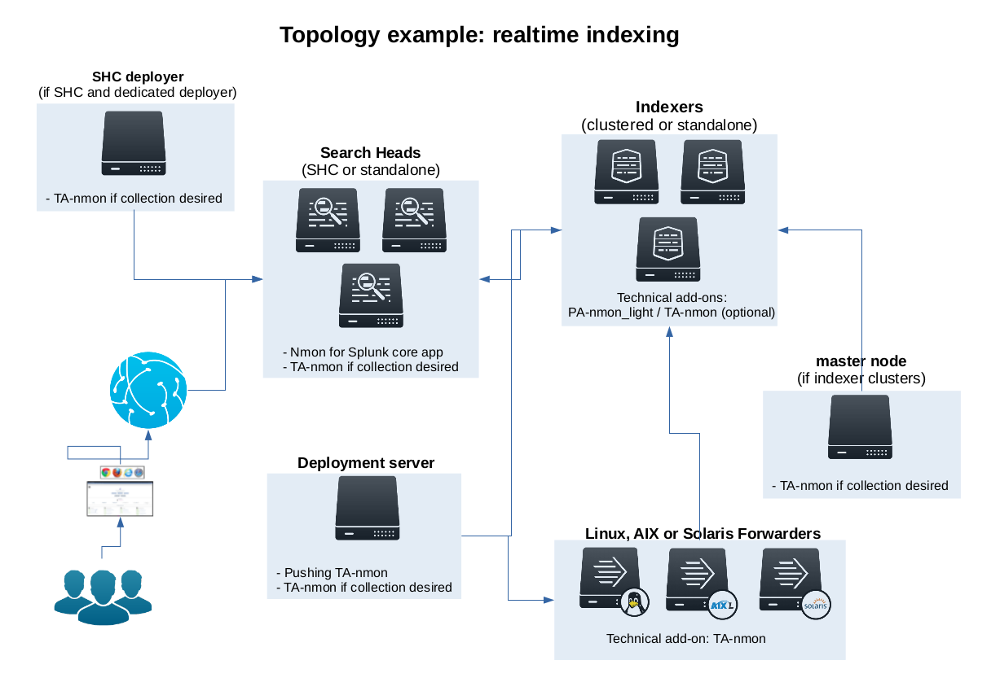

=====================
Deployment topologies
=====================

---------------------------
1. Splunk native deployment
---------------------------

**There are different ways to deploy and use the Nmon for Splunk App, basically the application works in 2 modes:**

* Real Time: An nmon process runs on the server and generates performance and configuration for the host, Splunk retrieves, transforms and indexes the data using the TA-nmon

* Cold Mode: The Application is being used to manage collection of nmon raw files generated out of Splunk (nmon instances have terminated and files are closed)

These deployment scenarios are detailed in the deployment section, as in an introduction, here are some deployment scenarios.

**Real time deployment scenarios:**

This is an example of deployment for standard scenario with multiple *nix clients running the addon "TA-nmon", managed trough a deployment server, indexing Nmon data into a Splunk indexer cluser running the addon "PA-nmon_light" and optionally the "TA-nmon", exploiting Nmon data in a Search Head cluster running the core "nmon" application and optionally the "TA-nmon" addon.

This is an example of deployment for standard scenario with multiple *nix clients running the addon "TA-nmon" and sending data to intermediate Heavy or Universal Forwarders, all managed trough a deployment server, indexing Nmon data into a Splunk indexer cluser running the addon "PA-nmon_light" and optionally the "TA-nmon", exploiting Nmon data in a Search Head cluster running the core "nmon" application and optionally the "TA-nmon" addon.

.. image:: img/topology2_realtime_example.png
   :alt: topology2_realtime_example.png
   :align: center

**Cold data deployment scenario:**

This is an example of deployment for standard scenario with a single Splunk forwarder instance (Universal or Heavy) running the addon "TA-nmon", indexing Nmon data from central NFS repositories into a Splunk indexer cluser running the addon "PA-nmon_light" and optionally the "TA-nmon", exploiting Nmon data in a Search Head cluster running the core "nmon" application and optionally the TA-nmon addon.

.. image:: img/topology3_colddata_example.png
   :alt: topology3_colddata_example.png
   :align: center

--------------------
2. Syslog deployment
--------------------

**Additionally and since the version 1.6.14, it is possible to use Syslog as the transport layer associated with a third party package called "nmon-logger"**

This deployment topology provides all of application functionality without any deployment of Universal Forwarders on end servers, using rsyslog or syslog-ng.
Such a deployment answers the need for people that cannot or do not want to install any third party agent.

**The nmon-logger package is available for download in GitHub:** https://github.com/guilhemmarchand/nmon-logger

The deployment will use and require and/or recommended:

* nmon-logger

* rsyslog or syslog-ng

* cron

* logrotate

Note that this deployment scenario would be recommended mostly with a modern Linux deployment.
Although all pieces of software should work fine too on AIX and Solaris, this requires quite up to date versions (for rsyslog / syslog-ng), which could be complex on older OS.

**Example 1: Splunk Universal or Heavy forwarder installed on main syslog-ng collectors:**

.. image:: img/syslog_topology1.png
   :alt: syslog_topology1.png
   :align: center

**Example 2: Splunk Universal or Heavy forwarder installed third party servers running syslog-ng:**

.. image:: img/syslog_topology2.png
   :alt: syslog_topology2.png
   :align: center

