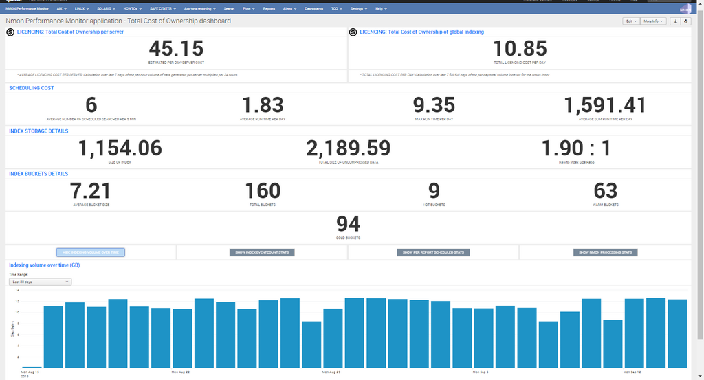
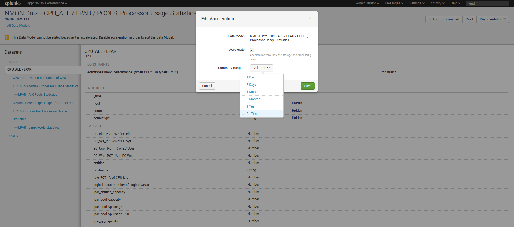

.. _total_cost_of_ownership:

=======================
Total cost of Ownership
=======================

Nmon Performance monitor application is a global solution for Splunk, as such this is a rich and complete application that implies some costs you will want to control and monitor.

The following documentation will help you understanding and managing each part of the application.

This great piece of software is an open source application, as such nothing will ever be hidden and you will always have the complete control.

------------------------------------
1. Total Cost of Ownership dashboard
------------------------------------

The application provides a builtin dashboard "Total Cost Of Ownership dashboard" to help you understanding better what the real costs can be:

**As builtin reporting, this dashboard will expose:**

* The average cost of Splunk licence per server / per day in Megabytes
* The average cost of Splunk licence of the global deployment per day in Megabytes
* Various metrics about the cost of scheduled reports associated with the application (specially run time metrics of reports)
* Index storage details (storage size, repartition of buckets, compression data rate...)
* Indexing volume in Megabytes over time
* Fist and last events per data sources
* Detailed information of scheduled reports
* Detailed technical metrics of nmon files processing tasks

-------------------------
2. Managing storage costs
-------------------------

**Following items will influence costs related to data storage:**

* Data retention
* Acceleration period of data models: the period of time Splunk will use to accelerate application data models

**Data retention:**

By default when you create an index without any custo; configuration, Splunk will keep all events for 5 years, you can off course set custom retention for your data and decide how the data will be managed and removed.

*For more information, read official related documentation:*
http://docs.splunk.com/Documentation/Splunk/latest/Indexer/Setaretirementandarchivingpolicy

**Data model acceleration:**

In the default configuration of the Nmon Performance application, every data models will be accelerated over all time.

With large set of data (large number of servers and/or large set of historical data), the accelerated data storage can become important, hopefully you can easily configure you own period of acceleration for each data model.

When you will analyse period of time out the accelerated period, interfaces will continue to work but at the price of much lower performances. (raw searches will not be affected at any time)

Configuring custom accelerated periods will be recommended depending on your configuration, needs and requirements.

*For more information, read official related documentation:*
http://docs.splunk.com/Documentation/Splunk/latest/Knowledge/Acceleratedatamodels

---------------------------
3. Managing licencing costs
---------------------------

**Each server that will be reporting performance and configuration generates data to be indexed in Splunk, which implies a level of utilization of your Splunk core licence.**

The way the Nmon Performance application generates is specially performing and optimized from both performance and licensing perspective.

Most of the data generated within the application uses a comma separated format which implies an high level of performance, and the lowest level of data to be generated. (there are no redundant fields name definitions wich slightly reduce the volume of data to be generated)

However, it is also very easy to influence the volume of data to be generated by machine using builtin custom nmon.conf.

Using the function allows increasing the time in minute between performance measures, by default this value is set to 1 minute can be set to whatever you like.

*For more information see:* :ref:`manage_volume_per_server`

Basically, the volume of data per server can be estimated between 15 and 50 MB per day, but this may slightly vary depending on the system. (number of CPU, disks...)

------------------------------
4. Splunk core resources usage
------------------------------

Following items may influence how the application may impact your Splunk infrastructure: (CPU, memory, disks IOPS...)

* Number of servers to be managed
* Acceleration period of data models / size of indexes
* scheduling of reports (alerting reports, inventory data generation...)

By default, every piece of the application has been designed to be as optimized as possible, and will strictly respect best practices and the highest level of code quality.

Most of all and this is a global requirement, your Splunk deployment must be correctly designed and sized.
If you have poor performances due to undersized servers or unadapted configurations (non distributed configuration, overcharged servers...), this is clearly where you need to start investigating.

**How deploying Nmon performance can influence resources utilization of your Splunk deployment:**

You can easily manage multiple thousands of servers from the same Splunk deployment, but obviously the more servers you will manage, the more you will:

* require storage capacity
* impact your Splunk licence
* require storage and physical memory on your search heads for the baseline KVstores
* require CPU and memory for data model acceleration building phase and maintenance operations (specially after indexers restart)

**As such, you can control:**

* The activation / deactivation and scheduling configuration of alerting reports (See Alerts within the application)
* The activation / deactivation and scheduling configuration of baseline KVstore (See Generate NMON baseline * reports within the application)
* The scheduling configuration of the nmon innventory KVstore generation (See Generate NMON Inventory Lookup Table, by default runs every hour)
* The volume of data to be generated per server (see section 3 of this document)
* Configure your data retirement policy (see section 2 of this document)
* Configure custom values for the acceleration period of the application data models (see section 2 of this document)

