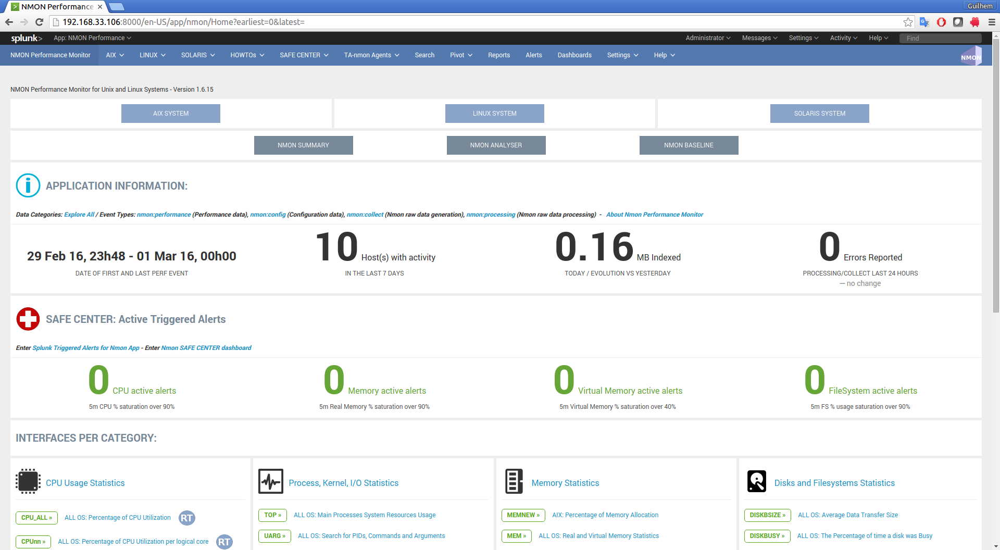
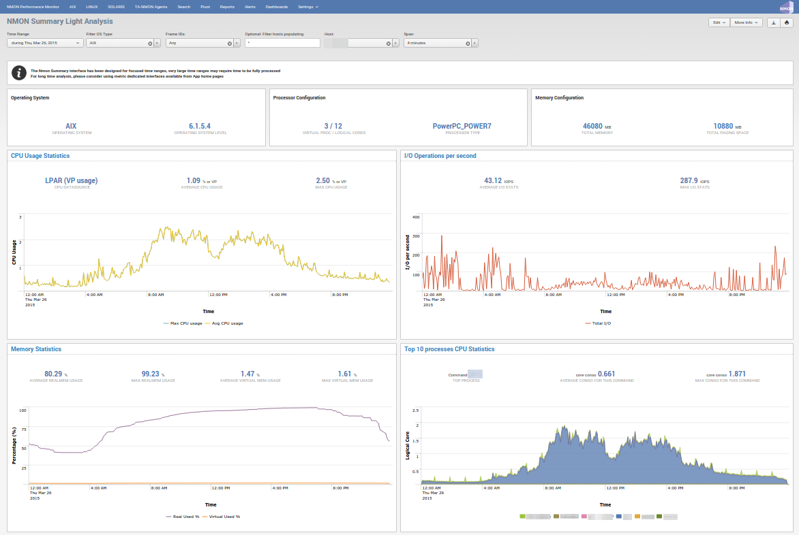
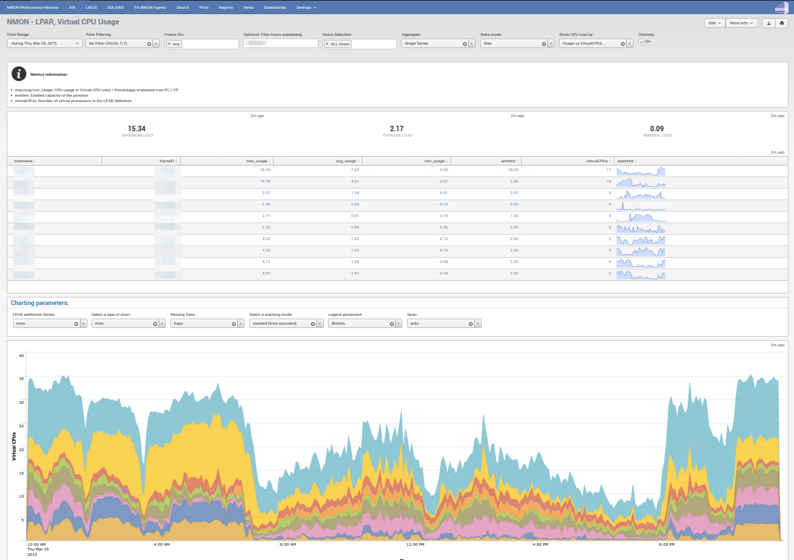
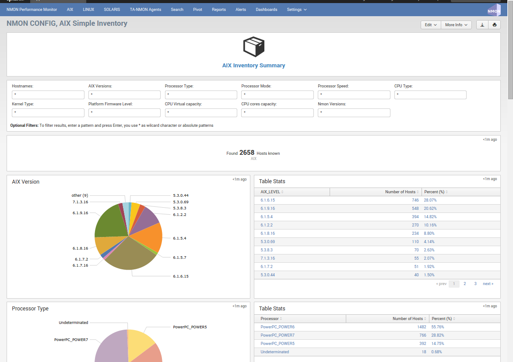
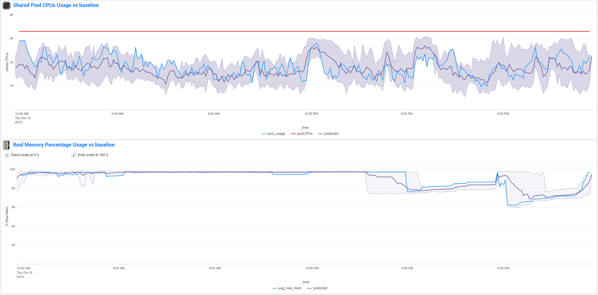

# Performance Monitor for Unix and Linux Systems

Copyright 2014 Guilhem Marchand	

Licensed under the Apache License, Version 2.0 (the "License");
you may not use this file except in compliance with the License.
You may obtain a copy of the License at

http://www.apache.org/licenses/LICENSE-2.0

Unless required by applicable law or agreed to in writing, software
distributed under the License is distributed on an "AS IS" BASIS,
WITHOUT WARRANTIES OR CONDITIONS OF ANY KIND, either express or implied.
See the License for the specific language governing permissions and
limitations under the License.

## Welcome in Splunk for NMON, Performance Monitor for Unix and Linux Systems

#### This application is also officially available on Splunk Base:

https://splunkbase.splunk.com/app/1753

#### The documentation for Nmon Performance Monitor is available online at:

http://nmon-for-splunk.readthedocs.io

#### Video available in the Nmon Performance app youtube channel:
https://www.youtube.com/channel/UCGWHd40x0A7wjk8qskyHQcQ

#### To get support:

http://nmon-for-splunk.readthedocs.io/en/latest/support.html

#### NMON is short for Nigel's Performance Monitor and is available on AIX, Solaris (With Sarmon), Linux and ARM Systems.

#### NMON Splunk App has been designed to massively collect, convert, index and analyse NMON Metrics Data, providing an Enterprise class Application. 

* AIX / Linux / Solaris hosts can Collect (local or Forwarders) / Convert / Index / Analyse.
* Mac OS X and Windows hosts can Collect (Forwarders only) Convert / Index / Analyse.

#### NMON Performance does Global / Summary Analysis per Host, Analysis per type of metric (CPU usage, Memory, I/O...), Predictive, Comparison Analysis, Inventory Collect and Analysis, and more.

**Link to the last main release youtube video presentation:** https://www.youtube.com/watch?v=yHlo0idH3is

